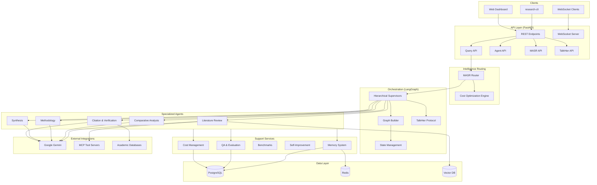
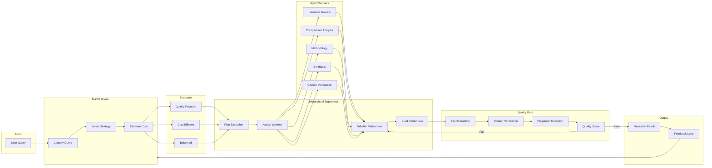

# Multi-Agent Graduate-Level Research Platform

A sophisticated AI-powered research platform that orchestrates multiple specialized agents to conduct comprehensive, graduate-level research on any given topic.

## 🚀 Features

- **Multi-Agent System** with specialized agents for different research tasks
- **LangGraph Orchestration** for sophisticated workflow coordination
- **Google Gemini Integration** for advanced AI capabilities
- **Temporal Workflows** for robust distributed task execution
- **Docker & Kubernetes Ready** for scalable deployment
- **Comprehensive CLI** for complete API interaction
- **Real-time Progress Tracking** with WebSocket support
- **MCP Protocol Support** for tool integration

## 📋 Table of Contents

- [Quick Start](#quick-start)
- [Installation](#installation)
- [CLI Documentation](#cli-documentation)
- [API Documentation](#api-documentation)
- [Development](#development)
- [Deployment](#deployment)
- [Architecture](#architecture)
- [Contributing](#contributing)

## Quick Start

### Prerequisites
- Python 3.11+
- Docker & Docker Compose
- uv package manager

### Installation

1. **Clone the repository:**
```bash
git clone https://github.com/jsogarro/cerebro.git
cd cerebro
```

2. **Install dependencies:**
```bash
uv pip install -e ".[dev]"
```

3. **Set up environment:**
```bash
cp .env.example .env
cp .env.cli.example .env.cli
# Edit .env files with your configuration
```

4. **Start services:**
```bash
# Using Docker Compose
docker-compose up -d

# Or start API server directly
uvicorn src.api.main:app --host 0.0.0.0 --port 8000
```

5. **Verify installation:**
```bash
research-cli health
```

## 📚 CLI Documentation

The Research Platform CLI (`research-cli`) provides a comprehensive command-line interface for interacting with the Research Platform API. It supports multiple output formats, interactive modes, and batch operations.

👉 **For full documentation on configuration, commands, and scriptable use cases, please see the [CLI Documentation Guide](docs/CLI.md).**

## 📊 API Documentation

### Base URL
```
http://localhost:8000
```

### Endpoints

#### Health & Status

| Endpoint | Method | Description |
|----------|--------|-------------|
| `/health` | GET | Basic health check |
| `/ready` | GET | Readiness check with service status |
| `/live` | GET | Liveness check |
| `/metrics` | GET | Prometheus metrics |

#### Research Projects

| Endpoint | Method | Description |
|----------|--------|-------------|
| `/api/v1/research/projects` | POST | Create new research project |
| `/api/v1/research/projects/{id}` | GET | Get project details |
| `/api/v1/research/projects` | GET | List all projects |
| `/api/v1/research/projects/{id}/progress` | GET | Get project progress |
| `/api/v1/research/projects/{id}/cancel` | POST | Cancel project |
| `/api/v1/research/projects/{id}/refine` | POST | Refine project scope |
| `/api/v1/research/projects/{id}/results` | GET | Get project results |

#### Core Services

| Endpoint | Method | Description |
|----------|--------|-------------|
| `/api/routes/memory` | * | Memory & Context Management |
| `/api/routes/qa` | * | Quality Assurance & Evaluation Suite |
| `/api/routes/improvement` | * | Self-Improving Agent System |
| `/api/routes/benchmarks` | * | Research Replication & Benchmarking |
| `/api/routes/costs` | * | Cost Management & Budgeting |

### Request/Response Examples

#### Create Project
```http
POST /api/v1/research/projects
Content-Type: application/json

{
  "title": "AI Impact Research",
  "query": {
    "text": "What are the impacts of AI on society?",
    "domains": ["AI", "Ethics", "Sociology"],
    "depth_level": "comprehensive"
  },
  "user_id": "researcher-001",
  "scope": {
    "max_sources": 100,
    "languages": ["en", "es"]
  }
}
```

#### Response
```json
{
  "id": "550e8400-e29b-41d4-a716-446655440000",
  "title": "AI Impact Research",
  "status": "pending",
  "created_at": "2024-01-15T10:30:00Z",
  "query": {...},
  "scope": {...}
}
```

## 🛠️ Development

### Project Structure

```
research-platform/
├── src/
│   ├── agents/           # Agent implementations
│   ├── api/              # FastAPI application
│   ├── benchmarks/       # Replication & Benchmark classes
│   ├── cli/              # CLI implementation
│   ├── core/             # Core business logic
│   ├── costs/            # Cost tracking & optimization
│   ├── improvement/      # RLHF & Auto-optimization
│   ├── mcp/              # MCP protocol servers
│   ├── memory/           # Context & Memory management
│   ├── models/           # Data models
│   ├── orchestration/    # LangGraph workflows
│   ├── qa/               # Quality Assurance & Evaluation
│   ├── services/         # Service layer
│   └── temporal/         # Temporal workflows
├── tests/                # Test files
├── docker/               # Docker configurations
├── k8s/                  # Kubernetes manifests
├── helm/                 # Helm charts
├── examples/             # Example files
└── docs/                 # Documentation
```

### Running Tests

```bash
# Run all tests
pytest

# Run with coverage
pytest --cov=src --cov-report=html

# Run specific test file
pytest tests/test_cli.py -v

# Run tests in watch mode
pytest-watch
```

### Code Quality

```bash
# Format code
black src tests

# Lint code
ruff check src tests

# Type checking
mypy src

# All quality checks
make quality
```

### Local Development

1. **Set up pre-commit hooks:**
```bash
pre-commit install
```

2. **Run API locally:**
```bash
uvicorn src.api.main:app --reload --port 8000
```

3. **Run with Docker:**
```bash
docker-compose up
```

4. **Access services:**
- API: http://localhost:8000
- API Docs: http://localhost:8000/docs
- Temporal UI: http://localhost:8080
- pgAdmin: http://localhost:5050 (with --profile dev-tools)

## 🚀 Deployment

### Docker Deployment

Build and run with Docker:
```bash
# Build images
docker build -t research-platform-api .
docker build -f docker/Dockerfile.worker -t research-platform-worker .

# Run with Docker Compose
docker-compose up -d

# View logs
docker-compose logs -f api worker
```

### Kubernetes (GKE) Deployment

1. **Build and push images:**
```bash
export PROJECT_ID=your-gcp-project
docker build -t gcr.io/$PROJECT_ID/research-platform-api:latest .
docker push gcr.io/$PROJECT_ID/research-platform-api:latest
```

2. **Deploy to GKE:**
```bash
# Create cluster
gcloud container clusters create research-platform \
  --num-nodes=3 \
  --zone=us-central1-a

# Apply manifests
kubectl apply -k k8s/

# Or use Helm
helm install research-platform helm/research-platform/
```

3. **Monitor deployment:**
```bash
kubectl get pods -n research-platform
kubectl logs -f deployment/research-api -n research-platform
```

### Environment Variables

Key configuration variables:

| Variable | Description | Default |
|----------|-------------|---------|
| `GEMINI_API_KEY` | Google Gemini API key | Required |
| `DATABASE_URL` | PostgreSQL connection string | Required |
| `REDIS_URL` | Redis connection string | Required |
| `TEMPORAL_HOST` | Temporal server address | localhost:7233 |
| `ENVIRONMENT` | Deployment environment | development |
| `LOG_LEVEL` | Logging level | INFO |

## 🏗️ Architecture

### System Overview



### Agent Framework



### Technology Stack

- **Language**: Python 3.11+
- **API Framework**: FastAPI
- **CLI Framework**: Click + Rich
- **LLM**: Google Gemini
- **Orchestration**: LangGraph
- **Database**: PostgreSQL + Redis
- **Container**: Docker
- **Deployment**: Kubernetes (GKE)
- **Package Management**: uv

## 🤝 Contributing

### Development Workflow

1. Fork the repository
2. Create a feature branch
3. Follow TDD principles - write tests first
4. Ensure all tests pass
5. Update documentation
6. Submit a pull request

### Code Standards

- Follow PEP 8 style guide
- Use type hints
- Write docstrings for all public functions
- Maintain >80% test coverage
- Use semantic commit messages

### Commit Message Format

```
type(scope): description

[optional body]

[optional footer]
```

Types: feat, fix, docs, style, refactor, test, chore

Example:
```
feat(cli): add interactive mode for project creation

- Add prompts for all required fields
- Support scope configuration
- Add validation for user inputs

Closes #123
```

## 📄 License

[Your License Here]

## 🙏 Acknowledgments

- Built with FastAPI, LangGraph, and Temporal
- Uses Google Gemini for AI capabilities
- Implements Anthropic's MCP protocol for tool integration
- CLI powered by Click and Rich

## 📞 Support

- GitHub Issues: [Report bugs or request features](https://github.com/your-org/research-platform/issues)
- Documentation: [Full documentation](https://docs.research-platform.ai)
- Email: support@research-platform.ai

## 🔄 Roadmap

### Phase 1 (Complete)
- ✅ Core platform & basic API setup
- ✅ CLI tool & documentation extraction
- ✅ Docker containerization & K8s manifests
- ✅ Advanced Memory & Context Management
- ✅ Quality Assurance & Evaluation Suite
- ✅ Self-Improving Agent System infrastructure
- ✅ Research Replication & Benchmarking
- ✅ Cost Management & Budgeting

### Phase 2 (In Progress)
- ⏳ Temporal workflow implementation
- ⏳ Gemini integration
- ⏳ Agent implementations
- ⏳ LangGraph orchestration
- ⏳ Cross-domain research

### Phase 3 (Planned)
- 📅 MCP tool servers
- 📅 WebSocket real-time updates
- 📅 Advanced report generation
- 📅 Authentication & Large-scale deployment

### Phase 4 (Deferred)
- 📅 Collaborative research features
- 📅 Agent Marketplace & Plugin System
- 📅 Visual Workflow Builder