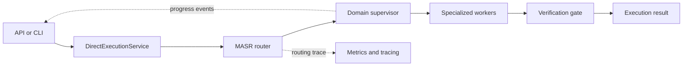
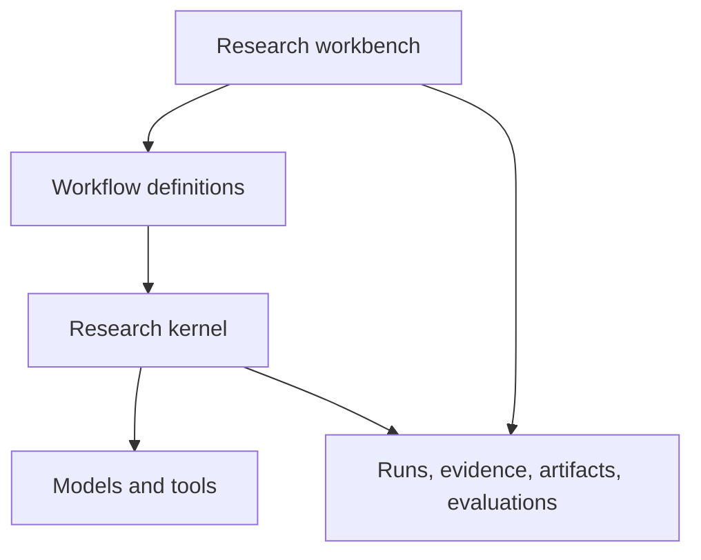

# Cerebro

> An open-source workbench for building, running, and evaluating
> source-grounded AI research workflows.

Cerebro explores how multi-agent research systems can be made inspectable,
testable, and useful. It turns a research objective into an explicit execution
run, routes work to specialized agents, checks the result, and records the
operational signals needed to understand how the workflow behaved.

The project is intentionally broader than any single subject area. Finance,
academic research, analytics, and content are currently implemented as agent
domains. Finance is a bundled example of domain specialization, not the product
boundary and not an institutional financial-data product.

## Project Status

Cerebro has a substantial backend runtime and an early web scaffold. The target
workbench experience is not complete yet.

| Area | Status | Current reality |
| --- | --- | --- |
| Multi-agent execution | Implemented | MASR routes queries to domain supervisors and workers |
| Verification | Implemented | Supervisor results pass through a bounded verification gate |
| Multi-domain decomposition | Implemented | Eligible subqueries can execute concurrently |
| Provider routing | Implemented, feature-gated | Gemini is the default; OpenRouter requires explicit configuration |
| API and CLI | Implemented | Existing surfaces retain legacy research-oriented names |
| Evidence model | Partial | Citation and QA components exist, but claim-level provenance is not yet consistent end to end |
| Workflow definitions | Embedded | Workflows are currently encoded across supervisors, factories, and routing maps |
| Visual workbench | Early scaffold | The React application is not yet a complete product experience |
| Fixture-backed execution | Not available | The current runtime does not include a deterministic no-key execution mode |

This distinction matters: documentation under `docs/` includes detailed
implementation references and historical design material. Start with the
[documentation index](docs/README.md) before treating an older document as a
statement of current product direction.

## Why Cerebro

Most agent systems emphasize the final answer. Cerebro emphasizes making the
research process inspectable:

- explicit workflow plans instead of an opaque chat response;
- visible task delegation, status, latency, and cost;
- evidence and provenance attached to claims and artifacts;
- bounded verification with inspectable outcomes;
- evaluation cases that make quality changes measurable.

The current runtime combines reusable agent infrastructure with concrete domain
implementations.

## Current Capabilities

### Runtime

- **MASR routing** analyzes a query and selects a domain, collaboration mode,
  routing strategy, and execution path.
- **Hierarchical supervisors** coordinate workers across Research, Content,
  Analytics, and Finance domains.
- **Multi-domain execution** decomposes eligible requests and dispatches
  bounded concurrent subqueries.
- **Verification** applies a PASS/REVISE quality gate to supervisor results.
- **Direct execution** keeps the primary path in process:
  `API -> DirectExecutionService -> MASR -> Supervisor -> Workers -> Verifier`.

### Engineering Surface

- FastAPI endpoints for routed queries, direct agent execution, routing
  inspection, research projects, reports, and WebSocket updates.
- A Click/Rich CLI for health checks, routed queries, routing estimates, direct
  agent calls, chains, and legacy research-project operations.
- Optional Langfuse tracing, Prometheus metrics, structured logging, PostgreSQL,
  and Redis integration.
- Docker Compose and Kubernetes assets for local and deployed environments.

### Included Domains

| Domain | Workers | Intended role |
| --- | --- | --- |
| Research | literature review, comparative analysis, methodology, synthesis, citation | General research decomposition and synthesis |
| Analytics | data analysis, statistical modeling, insight synthesis | Analysis of user-provided data and context |
| Content | planning, drafting, editing, optimization | Structured content production |
| Finance | financial analysis, valuation, risk assessment | Example specialization over user-provided figures and assumptions |

The Finance domain does not currently retrieve live market data, filings, news,
or transcripts. Its deterministic calculator handles a small set of financial
math operations; LLM workers provide narrative analysis.

## Quick Start

### Prerequisites

- Python 3.11+
- Docker and Docker Compose
- `uv`, or a standard Python virtual environment

### Install

```bash
git clone https://github.com/jsogarro/cerebro.git
cd cerebro
uv pip install -e ".[dev]"
```

If `uv` is unavailable:

```bash
./scripts/setup-python-env.sh
. .venv/bin/activate
```

Create local configuration:

```bash
cp .env.example .env
cp .env.cli.example .env.cli
```

`GEMINI_API_KEY` enables live model-backed execution. The API can start without
it, but agent results may use limited fallback behavior.

### Run

Start the supporting services:

```bash
docker-compose up -d
```

Or run the API directly:

```bash
uvicorn src.api.main:app --host 0.0.0.0 --port 8000
```

Check health:

```bash
research-cli health
```

Run the repository smoke test:

```bash
./scripts/smoke_test.sh
```

### Submit a Routed Query

```bash
research-cli agents query \
  "Compare the strongest arguments for and against retrieval-augmented generation"
```

Equivalent API request:

```bash
curl -X POST "http://localhost:8000/api/v1/query/research" \
  -H "Content-Type: application/json" \
  -d '{
    "query": "Compare the strongest arguments for and against retrieval-augmented generation",
    "domains": ["research"]
  }'
```

The current query endpoint starts execution asynchronously and returns execution
metadata. Its response contract still contains legacy research terminology and
some placeholder estimates; replacing that contract with a neutral run model is
part of the workbench roadmap.

## Architecture

### Current Runtime


```mermaid
flowchart LR
    Client[API or CLI] --> Execution[DirectExecutionService]
    Execution --> Router[MASR router]
    Router --> Supervisor[Domain supervisor]
    Supervisor --> Workers[Specialized workers]
    Workers --> Verify[Verification gate]
    Verify --> Result[Execution result]
    Router -. routing trace .-> Observe[Metrics and tracing]
    Supervisor -. progress events .-> Client
```

### Target Product Boundary


```mermaid
flowchart TB
    Workbench[Research workbench]
    Definitions[Workflow definitions]
    Kernel[Research kernel]
    Providers[Models and tools]
    Store[Runs, evidence, artifacts, evaluations]

    Workbench --> Definitions
    Workbench --> Store
    Definitions --> Kernel
    Kernel --> Providers
    Kernel --> Store
```

The target vocabulary is:

- **Workflow**: a versioned definition of steps, tools, policies, and outputs.
- **Run**: one execution of a workflow against an objective and input set.
- **Task**: a schedulable unit of work within a run.
- **Evidence**: source material with provenance and retrieval metadata.
- **Artifact**: a durable output such as a report, matrix, or evidence bundle.
- **Evaluator**: a deterministic or model-assisted quality check.

These are target product concepts. The current code still uses
`ResearchProject`, `ResearchQuery`, agent registries, and supervisor-specific
workflow definitions.

See:

- [Documentation index](docs/README.md)
- [Agent domains](docs/agent-domains.md)
- [Runtime architecture](docs/multi-agent-architecture.md)
- [Configuration reference](docs/configuration-reference.md)
- [CLI guide](docs/CLI.md)
- [API reference](docs/api-documentation.md)

## Repository Layout

```text
cerebro/
├── src/
│   ├── agents/            # Workers, supervisors, verification
│   ├── ai_brain/          # MASR, query analysis, provider routing
│   ├── api/               # FastAPI routes and execution services
│   ├── cli/               # Click/Rich command-line client
│   ├── core/              # Configuration and shared runtime services
│   ├── mcp/               # MCP servers and tool definitions
│   ├── models/            # API, domain, and persistence models
│   ├── repositories/      # Data access
│   └── services/          # Model, report, and supporting services
├── cerebro/web/           # React workbench scaffold
├── tests/                 # Unit, integration, E2E, and evaluation tests
├── docs/                  # Public technical documentation
├── docker/                # Container configuration
└── k8s/                   # Kubernetes manifests
```

## Development

Run targeted tests while iterating:

```bash
pytest tests/test_query_analyzer_decomposition.py -q
pytest tests/test_multi_domain_execution.py -q
pytest tests/test_direct_execution_service.py -q
```

Run the standard checks:

```bash
pytest
ruff format --check src tests
ruff check src tests
mypy src
```

The codebase contains several large, mature subsystems and some historical
scaffolding. Keep changes focused, verify claims against the implementation, and
do not describe planned behavior as shipped.

## Scope

Cerebro is a developer-focused open-source project. It is not:

- an investment-advice or trading system;
- an institutional financial-data product;
- a general autonomous-agent framework for arbitrary computer use;
- a production SaaS with billing and enterprise administration;
- evidence that additional agents automatically improve answer quality.

## Legacy Names

Several concrete identifiers still use the original `research-platform` naming,
including package metadata, database and deployment resources, the
`research-cli` executable, and portions of the API. They remain supported until
the workbench contract can replace them through compatibility aliases rather
than a disruptive rename.

## Support

Use [GitHub Issues](https://github.com/jsogarro/cerebro/issues) for bugs and
feature proposals. Include the workflow, provider configuration, execution ID,
and relevant trace details when reporting runtime failures.
