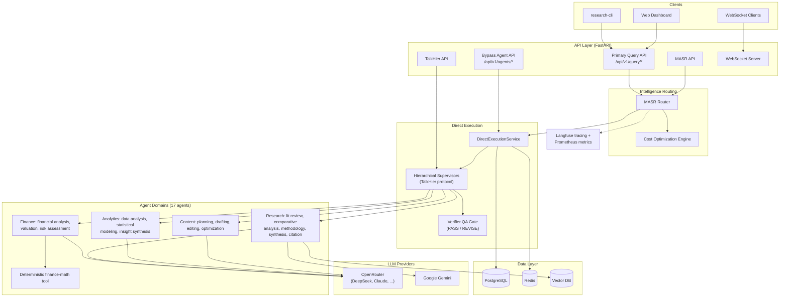
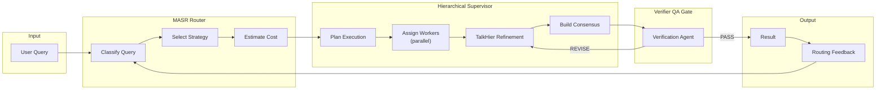

# Cerebro — Multi-Agent Financial Research Platform

Cerebro is a multi-agent LLM intelligence platform focused on **financial research for US equities**. It routes queries through an intelligent cost-optimizing router (MASR) to hierarchical supervisor/worker agent teams across four domains — **Finance, Research, Analytics, and Content** — with multi-provider LLM support, deterministic financial math, and a verification quality gate on every result.

Cerebro began as a graduate-level research platform; research is now one domain inside a broader financial-research brain.

## Features

- **Financial research agents** — financial analysis, valuation, and risk assessment workers backed by a deterministic finance-math tool (pure functions for the arithmetic, LLMs only for narrative)
- **MASR intelligent routing** — cost/quality/latency-optimized query routing with strategy selection (`cost_efficient`, `quality_focused`, `balanced`) and per-query cost estimation
- **17 specialized agents across 4 domains** — Finance, Research (literature review, comparative analysis, methodology, synthesis, citation), Analytics (data analysis, statistical modeling, insight synthesis), and Content, plus cross-cutting verification and financial-calculator agents
- **Direct execution architecture** — `API → MASR → Supervisor → Workers → Response`, with hierarchical supervisors coordinating parallel workers via the TalkHier multi-round refinement protocol
- **Verifier QA gate** — every supervisor result passes through a verification agent (PASS keeps the score; REVISE triggers bounded revision)
- **Multi-provider LLMs** — OpenRouter integration routes simple queries to cost-efficient models (e.g., DeepSeek) and complex ones to frontier models (e.g., Claude), with Gemini support and multi-provider fallback
- **Observability** — optional Langfuse tracing for routing decisions, plus Prometheus metrics and structured logging
- **Comprehensive CLI** — `research-cli` mirrors the API 1:1 with table/JSON/YAML/CSV output
- **Real-time progress** — WebSocket updates for long-running research sessions
- **Docker & Kubernetes ready** — Docker Compose for local development, K8s manifests and Helm charts for deployment

## Table of Contents

- [Quick Start](#quick-start)
- [CLI Documentation](#cli-documentation)
- [API Documentation](#api-documentation)
- [Architecture](#architecture)
- [Development](#development)
- [Deployment](#deployment)
- [Contributing](#contributing)

## Quick Start

### Prerequisites
- Python 3.11+
- Docker & Docker Compose
- uv package manager

### Installation

1. **Clone the repository:**
```bash
git clone https://github.com/jsogarro/cerebro.git
cd cerebro
```

2. **Install dependencies:**
```bash
uv pip install -e ".[dev]"
```

If `uv` is unavailable, use the pip/venv fallback:
```bash
./scripts/setup-python-env.sh
. .venv/bin/activate
```

3. **Set up environment:**
```bash
cp .env.example .env
cp .env.cli.example .env.cli
# Edit .env files with your configuration
```

4. **Start services:**
```bash
# Using Docker Compose
docker-compose up -d

# Or start API server directly
uvicorn src.api.main:app --host 0.0.0.0 --port 8000
```

5. **Verify installation:**
```bash
research-cli health

# Or run the comprehensive smoke test
./scripts/smoke_test.sh
```

The smoke test boots the API against SQLite with ephemeral RSA keys, exercises 9 endpoint checks (health, research project CRUD, query), and reports pass/fail. Requires tmux, jq, curl, and openssl.

## CLI Documentation

The Cerebro CLI (`research-cli`) provides a comprehensive command-line interface for the API. It supports multiple output formats, interactive modes, and batch operations.

**For full documentation on configuration, commands, and scriptable use cases, see the [CLI Documentation Guide](docs/CLI.md).**

## API Documentation

### Base URL
```
http://localhost:8000
```

The API is two-tier:

- **Primary API (~90% of usage)** — `/api/v1/query/*` endpoints route through MASR for intelligent supervisor selection and cost optimization.
- **Bypass API (~10% of usage)** — `/api/v1/agents/*` endpoints give direct agent access for testing, debugging, and experimentation.

### Endpoints

#### Health & Status

| Endpoint | Method | Description |
|----------|--------|-------------|
| `/health` | GET | Basic health check |
| `/ready` | GET | Readiness check with service status |
| `/live` | GET | Liveness check |
| `/metrics` | GET | Prometheus metrics |

#### Primary Query API (MASR-routed)

| Endpoint | Method | Description |
|----------|--------|-------------|
| `/api/v1/query/research` | POST | Research queries with automatic routing and optimization |
| `/api/v1/query/analyze` | POST | Analysis-focused queries (financial/statistical emphasis) |
| `/api/v1/query/synthesize` | POST | Synthesis-optimized queries with smart coordination |

#### MASR Routing Intelligence

| Endpoint | Method | Description |
|----------|--------|-------------|
| `/api/v1/masr/route` | POST | Get a routing decision with cost optimization |
| `/api/v1/masr/estimate-cost` | POST | Estimate execution cost with detailed breakdown |
| `/api/v1/masr/evaluate-strategies` | POST | Compare routing strategies for a query |
| `/api/v1/masr/feedback` | POST | Submit outcome feedback for continuous learning |
| `/api/v1/masr/status` | GET | Router health and performance metrics |

#### Bypass Agent API (direct access)

| Endpoint | Method | Description |
|----------|--------|-------------|
| `/api/v1/agents/{type}/execute` | POST | Execute a single agent directly |
| `/api/v1/agents/chain` | POST | Manual Chain-of-Agents execution |

#### Research Projects

| Endpoint | Method | Description |
|----------|--------|-------------|
| `/api/v1/research/projects` | POST | Create new research project |
| `/api/v1/research/projects/{id}` | GET | Get project details |
| `/api/v1/research/projects` | GET | List all projects |
| `/api/v1/research/projects/{id}/progress` | GET | Get project progress |
| `/api/v1/research/projects/{id}/cancel` | POST | Cancel project |
| `/api/v1/research/projects/{id}/refine` | POST | Refine project scope |
| `/api/v1/research/projects/{id}/results` | GET | Get project results |

Additional routes cover TalkHier refinement sessions (`/api/v1/talkhier/*`), reports, users/auth, and WebSocket progress updates. Interactive docs are at `http://localhost:8000/docs`.

### Request/Response Examples

#### Financial research query (Primary API)
```http
POST /api/v1/query/research
Content-Type: application/json

{
  "query": "Assess NVDA's valuation relative to its semiconductor peers",
  "domains": ["finance", "equities"]
}
```

#### Direct agent execution (Bypass API)
```http
POST /api/v1/agents/financial-analysis/execute
Content-Type: application/json

{
  "query": "Compute and interpret gross margin trends from these figures",
  "parameters": {"depth": "comprehensive"}
}
```

## Architecture

### System Overview


```mermaid
graph TB
    subgraph Clients
        CLI["research-cli"]
        Web["Web Dashboard"]
        WS["WebSocket Clients"]
    end

    subgraph API["API Layer (FastAPI)"]
        Primary["Primary Query API<br/>/api/v1/query/*"]
        Bypass["Bypass Agent API<br/>/api/v1/agents/*"]
        MASRAPI["MASR API"]
        TalkHierAPI["TalkHier API"]
        WSS["WebSocket Server"]
    end

    subgraph Routing["Intelligence Routing"]
        MASR["MASR Router"]
        CostOpt["Cost Optimization Engine"]
    end

    subgraph Execution["Direct Execution"]
        DES["DirectExecutionService"]
        Supervisors["Hierarchical Supervisors<br/>(TalkHier protocol)"]
        Verifier["Verifier QA Gate<br/>(PASS / REVISE)"]
    end

    subgraph Agents["Agent Domains (17 agents)"]
        Finance["Finance: financial analysis,<br/>valuation, risk assessment"]
        Research["Research: lit review, comparative<br/>analysis, methodology, synthesis, citation"]
        Analytics["Analytics: data analysis, statistical<br/>modeling, insight synthesis"]
        Content["Content: planning, drafting,<br/>editing, optimization"]
        FinMath["Deterministic finance-math tool"]
    end

    subgraph Providers["LLM Providers"]
        OpenRouter["OpenRouter<br/>(DeepSeek, Claude, ...)"]
        Gemini["Google Gemini"]
    end

    subgraph Data["Data Layer"]
        PG[("PostgreSQL")]
        Redis[("Redis")]
        VectorDB[("Vector DB")]
    end

    Obs["Langfuse tracing +<br/>Prometheus metrics"]

    CLI --> Primary
    Web --> Primary
    WS --> WSS
    Primary --> MASR
    Bypass --> DES
    MASRAPI --> MASR
    TalkHierAPI --> Supervisors

    MASR --> CostOpt
    MASR --> DES
    DES --> Supervisors
    Supervisors --> Verifier

    Supervisors --> Finance
    Supervisors --> Research
    Supervisors --> Analytics
    Supervisors --> Content
    Finance --> FinMath

    Finance --> OpenRouter
    Research --> OpenRouter
    Analytics --> OpenRouter
    Content --> OpenRouter
    Research --> Gemini

    DES --> PG
    DES --> Redis
    Research --> VectorDB
    MASR -.-> Obs
```

### Query Lifecycle


```mermaid
graph LR
    subgraph Input
        Query["User Query"]
    end

    subgraph MASR["MASR Router"]
        Classify["Classify Query"]
        Strategy["Select Strategy"]
        CostEst["Estimate Cost"]
    end

    subgraph Supervisor["Hierarchical Supervisor"]
        Plan["Plan Execution"]
        Assign["Assign Workers<br/>(parallel)"]
        Refine["TalkHier Refinement"]
        Consensus["Build Consensus"]
    end

    subgraph QA["Verifier QA Gate"]
        Verify["Verification Agent"]
    end

    subgraph Output
        Result["Result"]
        Feedback["Routing Feedback"]
    end

    Query --> Classify --> Strategy --> CostEst --> Plan
    Plan --> Assign --> Refine --> Consensus --> Verify
    Verify -->|PASS| Result
    Verify -->|REVISE| Refine
    Result --> Feedback --> Classify
```

More diagrams: [system architecture](docs/system-architecture-diagrams.md), [data flow](docs/data-flow-diagrams.md), [agent flowcharts](docs/agent-flowcharts.md), [agent domains](docs/agent-domains.md).

### Key Design Decisions

- **Direct execution, no workflow engine** — the execution path is `DirectExecutionService → MASR → supervisors → workers`. Temporal and the top-level LangGraph graph orchestrator were both removed; LangGraph remains only in residual per-supervisor use.
- **Credential-free finance domain** — a deterministic finance-math tool (pure functions, no API keys or market-data dependencies) handles arithmetic; LLMs handle narrative. This is the template for new domain extensions.
- **Verification on every result** — supervisors gate output through a verification agent before returning it.
- **Repository pattern** for all data access; async I/O throughout (asyncpg, httpx).

### Technology Stack

- **Language**: Python 3.11+
- **API Framework**: FastAPI (with WebSocket support)
- **CLI Framework**: Click + Rich
- **LLM Providers**: OpenRouter (DeepSeek, Claude, and others), Google Gemini
- **Database**: PostgreSQL + Redis + vector embeddings
- **Observability**: Langfuse (optional), Prometheus, structlog
- **Container**: Docker / Docker Compose
- **Deployment**: Kubernetes (GKE), Helm
- **Package Management**: uv

## Development

### Project Structure

```
cerebro/
├── src/
│   ├── agents/           # Agent implementations (4 domains + cross-cutting)
│   ├── ai_brain/         # MASR router, query analysis, model routing
│   ├── api/              # FastAPI application & DirectExecutionService
│   ├── auth/             # Authentication & password services
│   ├── benchmarks/       # Replication & benchmark classes
│   ├── cli/              # CLI implementation
│   ├── core/             # Core business logic & configuration
│   ├── costs/            # Cost tracking & optimization
│   ├── improvement/      # Self-improvement & feedback loops
│   ├── mcp/              # MCP protocol servers
│   ├── memory/           # Multi-tier memory & context management
│   ├── models/           # Data models
│   ├── qa/               # Quality assurance & evaluation
│   ├── repositories/     # Repository-pattern data access
│   └── services/         # Service layer
├── tests/                # Test files
├── docker/               # Docker configurations
├── k8s/                  # Kubernetes manifests
├── helm/                 # Helm charts
├── examples/             # Example files
└── docs/                 # Documentation
```

### Running Tests

```bash
# Run all tests
pytest

# Run with coverage
pytest --cov=src --cov-report=html

# Run specific test file
pytest tests/test_cli.py -v
```

### Code Quality

```bash
# Format code
ruff format src tests

# Lint code
ruff check src tests

# Type checking
mypy src
```

### Local Development

1. **Set up pre-commit hooks:**
```bash
pre-commit install
```

2. **Run API locally:**
```bash
uvicorn src.api.main:app --reload --port 8000
```

3. **Run with Docker:**
```bash
docker-compose up
```

4. **Access services:**
- API: http://localhost:8000
- API Docs: http://localhost:8000/docs
- MASR Router: http://localhost:9100
- MCP Server: http://localhost:9000
- pgAdmin: http://localhost:5050 (with `--profile dev-tools`)

## Deployment

### Docker Deployment

```bash
# Build and run with Docker Compose
docker-compose up -d

# View logs
docker-compose logs -f api
```

### Kubernetes (GKE) Deployment

```bash
# Build and push images
export PROJECT_ID=your-gcp-project
docker build -t gcr.io/$PROJECT_ID/cerebro-api:latest .
docker push gcr.io/$PROJECT_ID/cerebro-api:latest

# Apply manifests
kubectl apply -k k8s/

# Or use Helm
helm install cerebro helm/research-platform/
```

### Environment Variables

Key configuration variables:

| Variable | Description | Default |
|----------|-------------|---------|
| `DATABASE_URL` | PostgreSQL connection string | Required |
| `REDIS_URL` | Redis connection string | Required |
| `SECRET_KEY` | Application secret key | Required |
| `GEMINI_API_KEY` | Google Gemini API key | Required |
| `OPENROUTER_ENABLED` | Enable multi-provider routing via OpenRouter | `false` |
| `OPENROUTER_API_KEY` | OpenRouter API key | Required if enabled |
| `LANGFUSE_ENABLED` | Enable Langfuse routing observability | `false` |
| `ENVIRONMENT` | Deployment environment | `development` |
| `LOG_LEVEL` | Logging level | `INFO` |
| `JWT_PRIVATE_KEY_PATH` | Path to RSA private key (PEM) | Auto-generated |
| `JWT_PUBLIC_KEY_PATH` | Path to RSA public key (PEM) | Auto-generated |

See [docs/configuration-reference.md](docs/configuration-reference.md) for the full list.

## Contributing

### Development Workflow

1. Fork the repository
2. Create a feature branch
3. Follow TDD principles — write tests first
4. Ensure all tests pass
5. Update documentation
6. Submit a pull request

### Code Standards

- Follow PEP 8 style guide with type hints
- Write docstrings for all public functions
- Maintain test coverage (target: 80%, enforced in CI)
- Use semantic commit messages (`feat`, `fix`, `docs`, `style`, `refactor`, `test`, `chore`)

## Support

- GitHub Issues: [Report bugs or request features](https://github.com/jsogarro/cerebro/issues)
