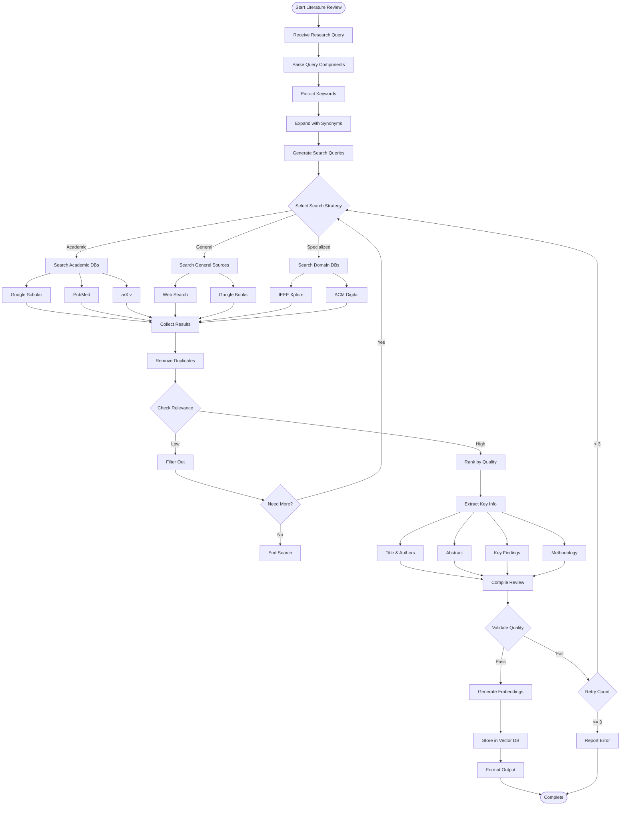
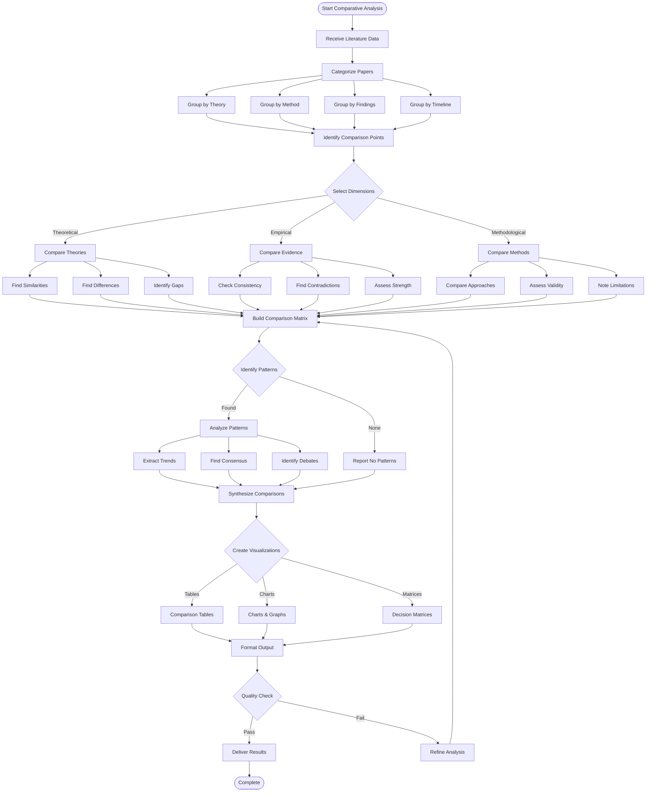
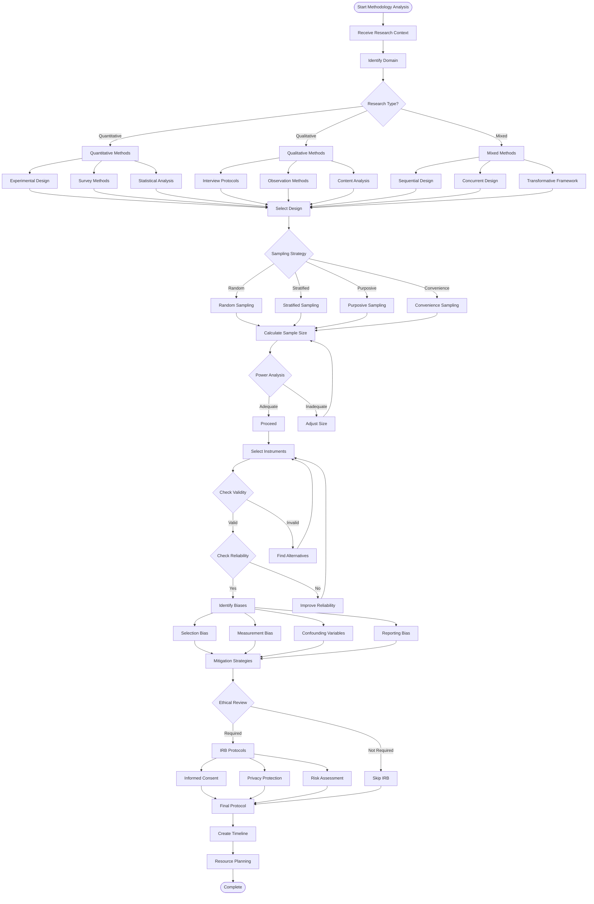
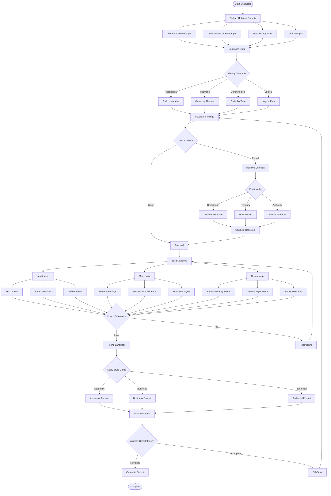
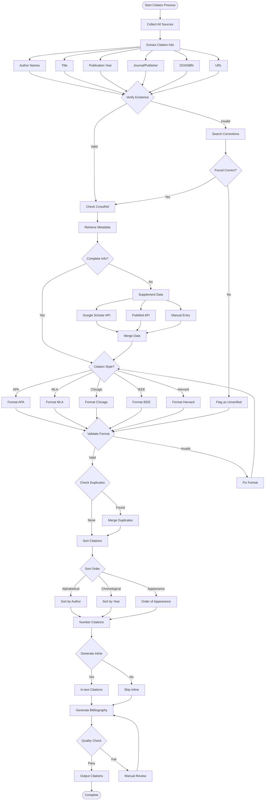
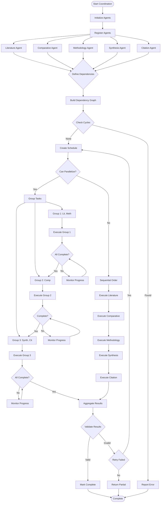
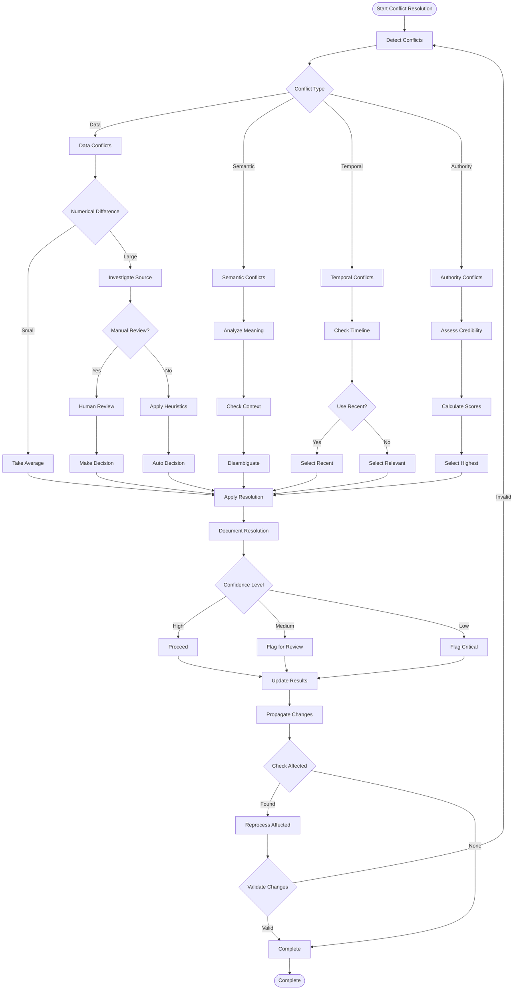

# Agent Decision Process Flowcharts

This document contains detailed flowcharts for each agent's decision-making process in the Multi-Agent Research Platform.

## Table of Contents
- [Literature Review Agent Flow](#literature-review-agent-flow)
- [Comparative Analysis Agent Flow](#comparative-analysis-agent-flow)
- [Methodology Agent Flow](#methodology-agent-flow)
- [Synthesis Agent Flow](#synthesis-agent-flow)
- [Citation & Verification Agent Flow](#citation--verification-agent-flow)
- [Agent Coordination Flow](#agent-coordination-flow)
- [Conflict Resolution Flow](#conflict-resolution-flow)
- [Quality Assurance Flow](#quality-assurance-flow)

## Literature Review Agent Flow

## Comparative Analysis Agent Flow

## Methodology Agent Flow

## Synthesis Agent Flow

## Citation & Verification Agent Flow

## Agent Coordination Flow

## Conflict Resolution Flow

## Quality Assurance Flow

```mermaid
flowchart TD
    START([Start QA Process]) --> INPUT[Receive Agent Output]
    
    INPUT --> STRUCTURAL{Structural Check}
    
    STRUCTURAL -->|Pass| CONTENT[Content Check]
    STRUCTURAL -->|Fail| FIX_STRUCT[Fix Structure]
    
    FIX_STRUCT --> RETRY_STRUCT{Retry?}
    RETRY_STRUCT -->|Yes| INPUT
    RETRY_STRUCT -->|No| REJECT[Reject Output]
    
    CONTENT --> COMPLETENESS{Completeness Check}
    
    COMPLETENESS -->|Complete| ACCURACY[Accuracy Check]
    COMPLETENESS -->|Incomplete| IDENTIFY_GAPS[Identify Gaps]
    
    IDENTIFY_GAPS --> FILL{Can Fill?}
    FILL -->|Yes| SUPPLEMENT[Supplement Data]
    FILL -->|No| FLAG_INCOMPLETE[Flag Incomplete]
    
    SUPPLEMENT --> ACCURACY
    FLAG_INCOMPLETE --> ACCURACY
    
    ACCURACY --> FACTUAL{Fact Check}
    FACTUAL -->|Verified| CONSISTENCY[Consistency Check]
    FACTUAL -->|Unverified| VERIFY_FACTS[Verify Facts]
    
    VERIFY_FACTS --> SOURCES{Check Sources}
    SOURCES -->|Valid| CONSISTENCY
    SOURCES -->|Invalid| CORRECT[Correct Facts]
    
    CORRECT --> CONSISTENCY
    
    CONSISTENCY --> INTERNAL{Internal Consistency}
    INTERNAL -->|Consistent| EXTERNAL[External Consistency]
    INTERNAL -->|Inconsistent| RESOLVE_INT[Resolve Internal]
    
    RESOLVE_INT --> EXTERNAL
    
    EXTERNAL -->|Consistent| RELEVANCE[Relevance Check]
    EXTERNAL -->|Inconsistent| RESOLVE_EXT[Resolve External]
    
    RESOLVE_EXT --> RELEVANCE
    
    RELEVANCE --> SCORE_REL{Relevance Score}
    SCORE_REL -->|High| CLARITY[Clarity Check]
    SCORE_REL -->|Medium| IMPROVE_REL[Improve Relevance]
    SCORE_REL -->|Low| REJECT
    
    IMPROVE_REL --> CLARITY
    
    CLARITY --> READABILITY{Readability Score}
    READABILITY -->|Good| FINAL_CHECK[Final Check]
    READABILITY -->|Poor| SIMPLIFY[Simplify Language]
    
    SIMPLIFY --> FINAL_CHECK
    
    FINAL_CHECK --> OVERALL{Overall Quality}
    OVERALL -->|Excellent| APPROVE[Approve]
    OVERALL -->|Good| APPROVE_NOTES[Approve with Notes]
    OVERALL -->|Poor| REWORK[Request Rework]
    
    APPROVE --> STAMP[Quality Stamp]
    APPROVE_NOTES --> STAMP
    REWORK --> INPUT
    REJECT --> LOG[Log Issues]
    
    STAMP --> OUTPUT[Output Result]
    LOG --> OUTPUT
    
    OUTPUT --> END([Complete])
```

