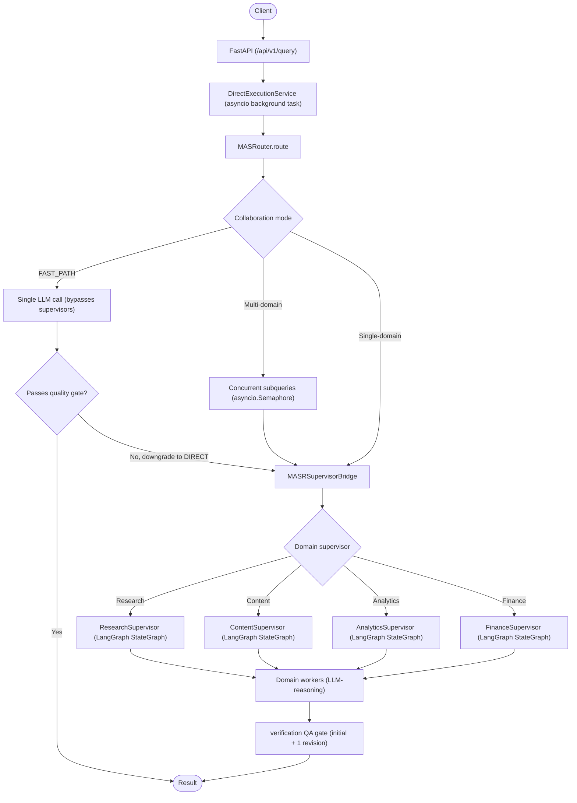

# Agent Coordination & Roles

This document describes how Cerebro coordinates its agents and what each agent
actually does. Current product focus: **financial research (US equities)**.

> Earlier versions of this file drew per-agent branch-node state machines and a
> dependency-graph scheduler. Those diagrams described an aspirational design
> that the code never implemented and are removed. The workers are
> LLM-reasoning agents whose behavior is prompt-driven — there is no coded
> decision engine to flowchart. The single diagram below reflects the real
> execution path.

## Coordination

A query enters through FastAPI, is dispatched to an in-process asyncio engine
(`DirectExecutionService`), routed by the in-process `MASRouter`, mapped to
domain supervisors by `MASRSupervisorBridge`, and executed by workers inside
each supervisor's own LangGraph `StateGraph`. LangGraph exists **only** inside
supervisors; the former top-level `src/orchestration/` subsystem was deleted.

Routing produces one of three branches:

- **FAST_PATH** — a single LLM call that bypasses supervisors entirely. If the
  response fails a minimal quality gate, the routing decision is downgraded to
  `DIRECT` and re-executed through the supervisor path.
- **Multi-domain** — subqueries for each detected domain run concurrently under
  an `asyncio.Semaphore`, then results are merged.
- **Single-domain** — one supervisor executes the query.

Four domain supervisors (Research, Content, Analytics, Finance) coordinate 15
domain workers. A cross-cutting **verification** agent runs as a QA gate over
supervisor output (initial attempt plus at most one revision) and is not a
member of any supervisor's worker team. Research is one of the four domains.

```mermaid
flowchart TD
    CLIENT([Client]) --> API["FastAPI (/api/v1/query)"]
    API --> DES["DirectExecutionService (asyncio background task)"]
    DES --> MASR["MASRouter.route"]
    MASR --> BRANCH{Collaboration mode}

    BRANCH -->|FAST_PATH| FP["Single LLM call (bypasses supervisors)"]
    FP --> GATE{Passes quality gate?}
    GATE -->|Yes| DONE([Result])
    GATE -->|No, downgrade to DIRECT| BRIDGE

    BRANCH -->|Multi-domain| SEM["Concurrent subqueries (asyncio.Semaphore)"]
    SEM --> BRIDGE["MASRSupervisorBridge"]

    BRANCH -->|Single-domain| BRIDGE

    BRIDGE --> SUP{Domain supervisor}
    SUP -->|Research| RS["ResearchSupervisor (LangGraph StateGraph)"]
    SUP -->|Content| CS["ContentSupervisor (LangGraph StateGraph)"]
    SUP -->|Analytics| AS["AnalyticsSupervisor (LangGraph StateGraph)"]
    SUP -->|Finance| FS["FinanceSupervisor (LangGraph StateGraph)"]

    RS --> WORKERS["Domain workers (LLM-reasoning)"]
    CS --> WORKERS
    AS --> WORKERS
    FS --> WORKERS

    WORKERS --> VERIFY["verification QA gate (initial + 1 revision)"]
    VERIFY --> DONE
```

## Agent roles

All domain workers subclass `LLMWorkerAgentBase` and are **LLM-reasoning agents
whose behavior is prompt-driven** — not deterministic coded decision engines.
Confidence scores they report are hardcoded heuristics (0.85 success, 0.3 empty,
0.8 fast-path), not measured quality signals.

### Research domain (5 workers)

- **LiteratureReviewAgent** — a single structured Gemini call
  (`_search_and_analyze_structured`) that identifies and analyzes sources from
  the model's own knowledge (`databases_searched: ["gemini_knowledge"]`). There
  is **no** federated academic search (no Google Scholar, PubMed, arXiv, Web
  Search, Google Books, IEEE Xplore, or ACM), **no** embeddings, and **no**
  vector store. `src/memory` is a stub, and the Qdrant semantic-memory tier is
  config-only.
- **ComparativeAnalysisAgent** — prompt-driven comparison of the inputs it is
  given.
- **MethodologyAgent** — prompt-driven methodology discussion.
- **SynthesisAgent** — prompt-driven integration of upstream outputs into a
  narrative; also used as the optional `'llm'` multi-domain merge strategy.
- **CitationAgent** — formats and organizes citations via prompts. Its CrossRef
  check is an **explicit stub** (`citation_agent.py:485` returns mock data); no
  PubMed or Google Scholar APIs are called.

### Content domain (4 workers)

- **ContentPlanningAgent**, **DraftingAgent**, **EditingAgent**,
  **OptimizationAgent** — prompt-driven content generation and refinement. Not
  reachable through the bypass agent API.

### Analytics domain (3 workers)

- **DataAnalysisAgent**, **StatisticalModelingAgent**,
  **InsightSynthesisAgent** — prompt-driven analysis and interpretation. Not
  reachable through the bypass agent API.

### Finance domain (3 workers)

- **FinancialAnalysisAgent** and **ValuationAgent** — LLM-reasoning agents that
  inject exact precomputed values from the deterministic `finance_math` tool
  (financial ratios, DCF) into their prompts before reasoning.
- **RiskAssessmentAgent** — prompt-driven risk analysis.

The finance workers operate on inputs provided to them; there is no external
market-data feed on this path.

### Cross-cutting

- **verification** — a QA gate over supervisor output, applying rule-based MAST
  failure labels. It runs the initial attempt plus at most one revision and is
  not part of any supervisor's worker roster.
- **financial_calculator** — a fully deterministic wrapper over the
  `finance_math` pure functions (no LLM, no API keys, no external data),
  reachable only via the bypass agent API or internal calls.
