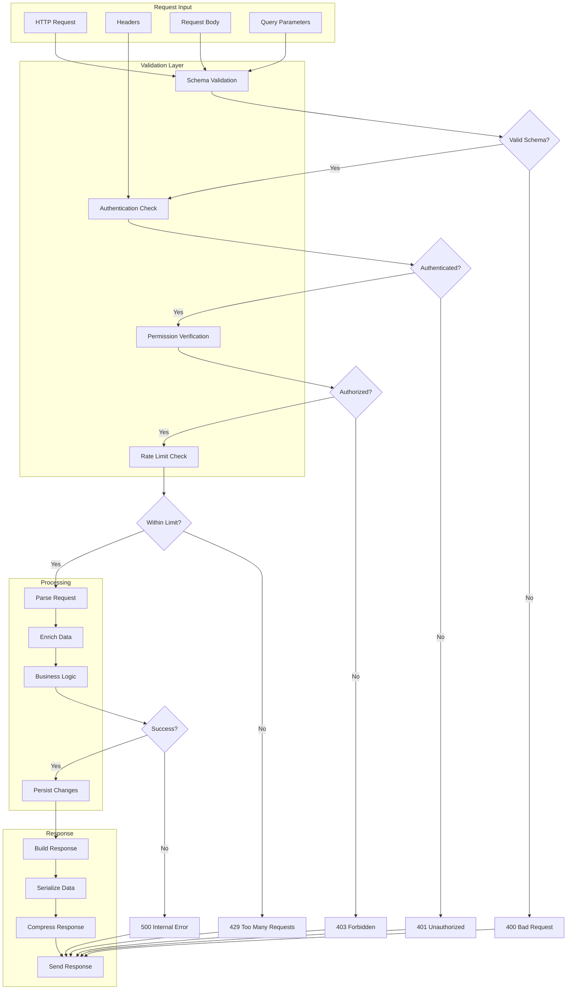
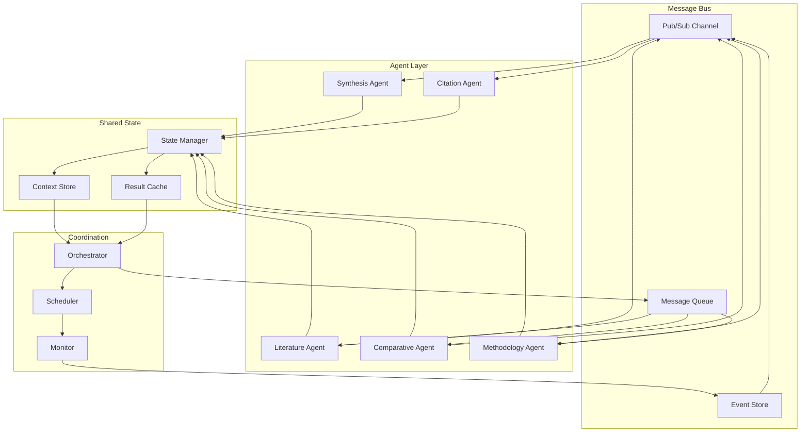
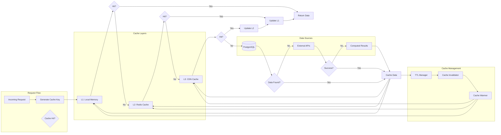
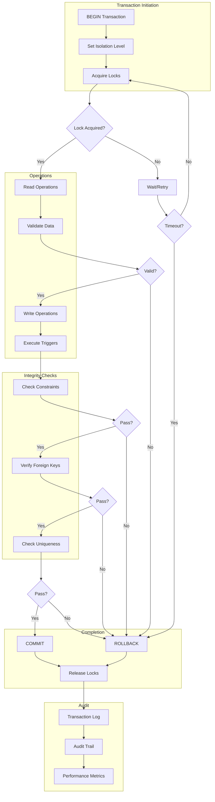
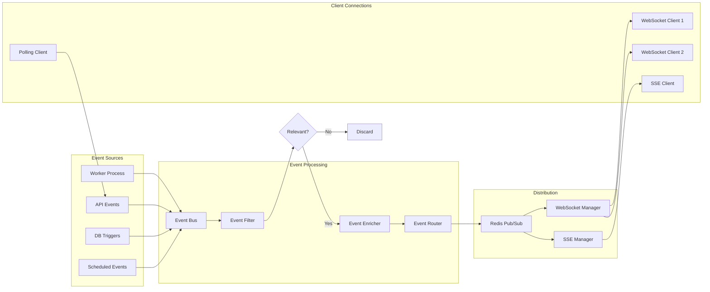
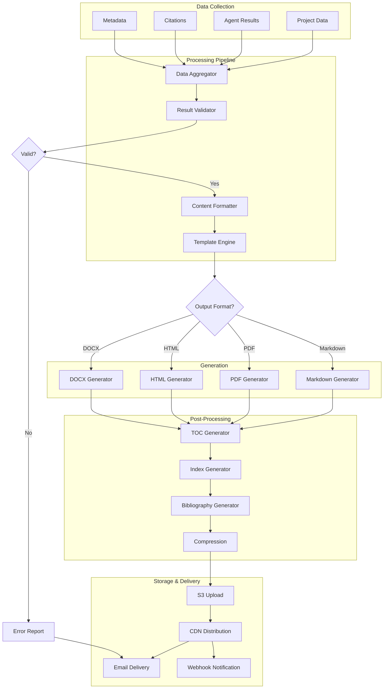
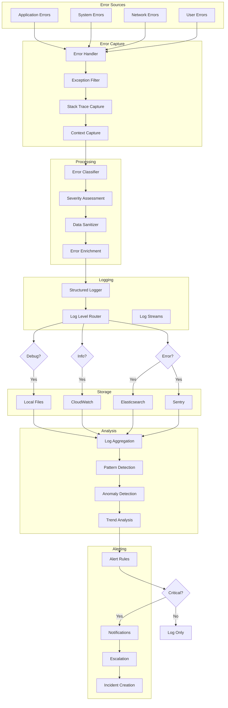
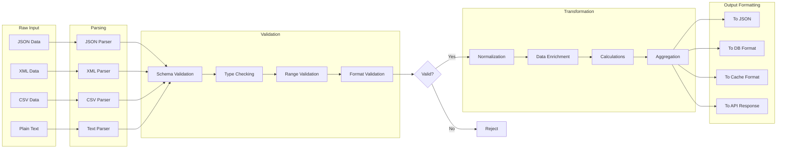

# Data Flow Diagrams

This document contains comprehensive data flow diagrams showing how information moves through the Multi-Agent Research Platform.

## Table of Contents
- [System-Wide Data Flow](#system-wide-data-flow)
- [Request Processing Flow](#request-processing-flow)
- [Agent Communication Data Flow](#agent-communication-data-flow)
- [Caching Strategy Data Flow](#caching-strategy-data-flow)
- [Database Transaction Flow](#database-transaction-flow)
- [Real-time Update Data Flow](#real-time-update-data-flow)
- [Report Generation Data Flow](#report-generation-data-flow)
- [Error and Logging Data Flow](#error-and-logging-data-flow)

## System-Wide Data Flow

```mermaid
graph LR
    subgraph "Input Sources"
        CLI_INPUT[CLI Commands]
        API_INPUT[API Requests]
        WS_INPUT[WebSocket Messages]
        SCHEDULE[Scheduled Tasks]
    end
    
    subgraph "Entry Layer"
        LOAD_BALANCER[Load Balancer]
        RATE_LIMITER[Rate Limiter]
        AUTH_GATEWAY[Auth Gateway]
    end
    
    subgraph "Processing Layer"
        REQUEST_QUEUE[Request Queue]
        VALIDATOR[Request Validator]
        ROUTER[Request Router]
        TRANSFORMER[Data Transformer]
    end
    
    subgraph "Business Logic"
        PROJECT_SERVICE[Project Service]
        WORKFLOW_ENGINE[Workflow Engine]
        AGENT_ORCHESTRATOR[Agent Orchestrator]
        RESULT_PROCESSOR[Result Processor]
    end
    
    subgraph "Data Storage"
        CACHE_LAYER[Redis Cache]
        PRIMARY_DB[(PostgreSQL)]
        VECTOR_STORE[(Vector DB)]
        OBJECT_STORE[S3 Storage]
    end
    
    subgraph "Output Layer"
        RESPONSE_FORMATTER[Response Formatter]
        STREAM_HANDLER[Stream Handler]
        NOTIFICATION_SERVICE[Notification Service]
    end
    
    CLI_INPUT --> LOAD_BALANCER
    API_INPUT --> LOAD_BALANCER
    WS_INPUT --> LOAD_BALANCER
    SCHEDULE --> REQUEST_QUEUE
    
    LOAD_BALANCER --> RATE_LIMITER
    RATE_LIMITER --> AUTH_GATEWAY
    AUTH_GATEWAY --> REQUEST_QUEUE
    
    REQUEST_QUEUE --> VALIDATOR
    VALIDATOR --> ROUTER
    ROUTER --> TRANSFORMER
    
    TRANSFORMER --> PROJECT_SERVICE
    TRANSFORMER --> WORKFLOW_ENGINE
    
    PROJECT_SERVICE --> PRIMARY_DB
    PROJECT_SERVICE --> CACHE_LAYER
    
    WORKFLOW_ENGINE --> AGENT_ORCHESTRATOR
    AGENT_ORCHESTRATOR --> RESULT_PROCESSOR
    
    RESULT_PROCESSOR --> PRIMARY_DB
    RESULT_PROCESSOR --> VECTOR_STORE
    RESULT_PROCESSOR --> OBJECT_STORE
    
    PRIMARY_DB --> RESPONSE_FORMATTER
    CACHE_LAYER --> RESPONSE_FORMATTER
    
    RESPONSE_FORMATTER --> STREAM_HANDLER
    STREAM_HANDLER --> NOTIFICATION_SERVICE
```

## Request Processing Flow

## Agent Communication Data Flow

## Caching Strategy Data Flow

## Database Transaction Flow

## Real-time Update Data Flow

## Report Generation Data Flow

## Error and Logging Data Flow

## Data Transformation Pipeline

