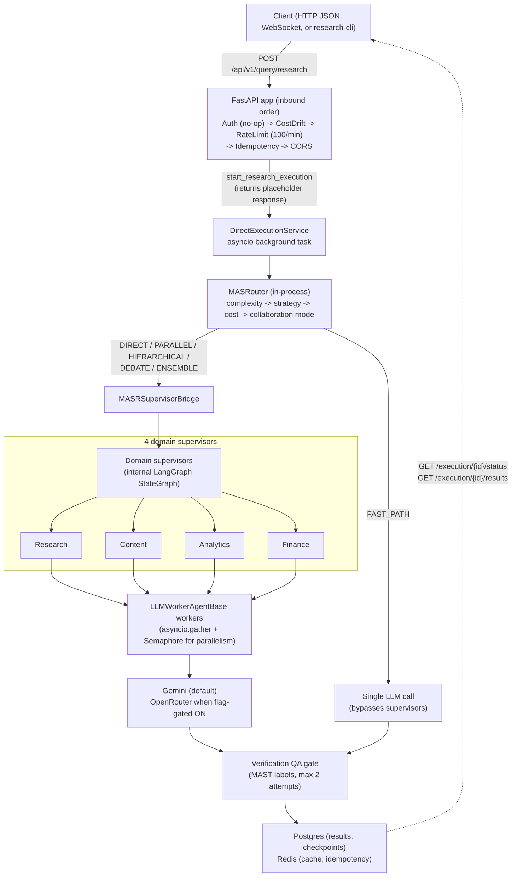
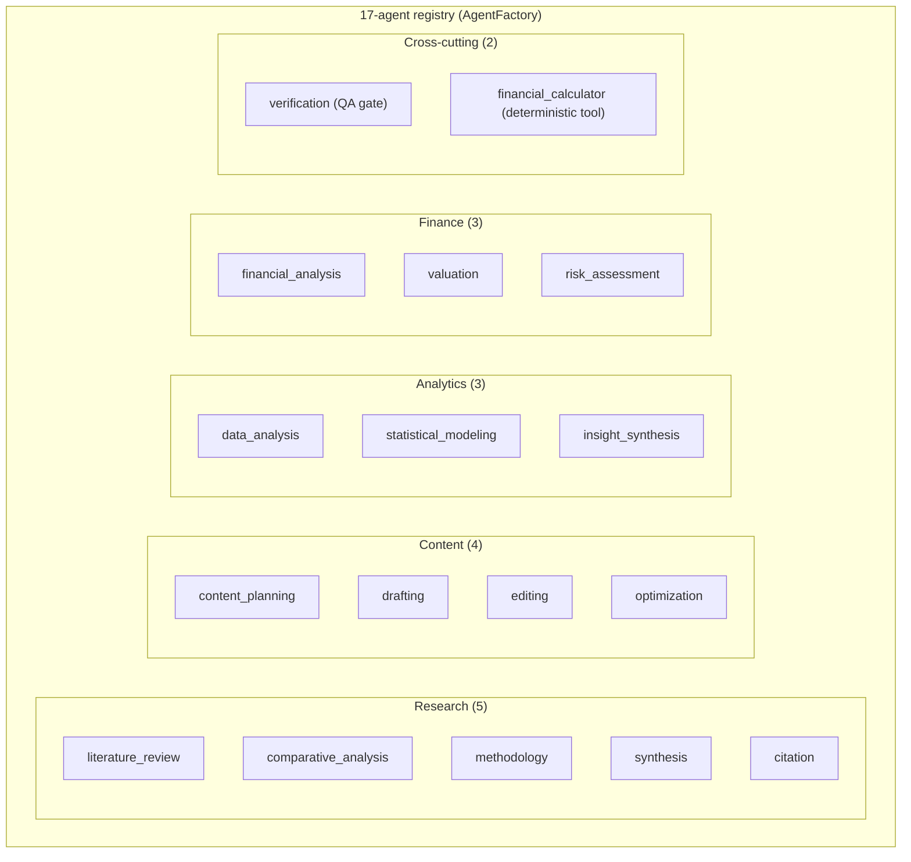
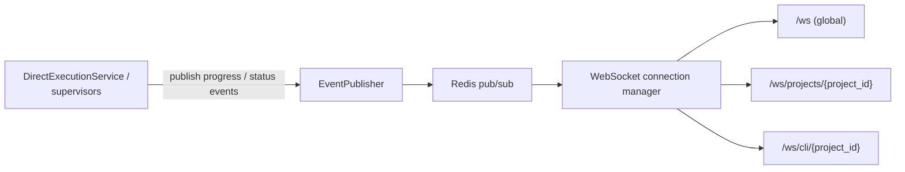
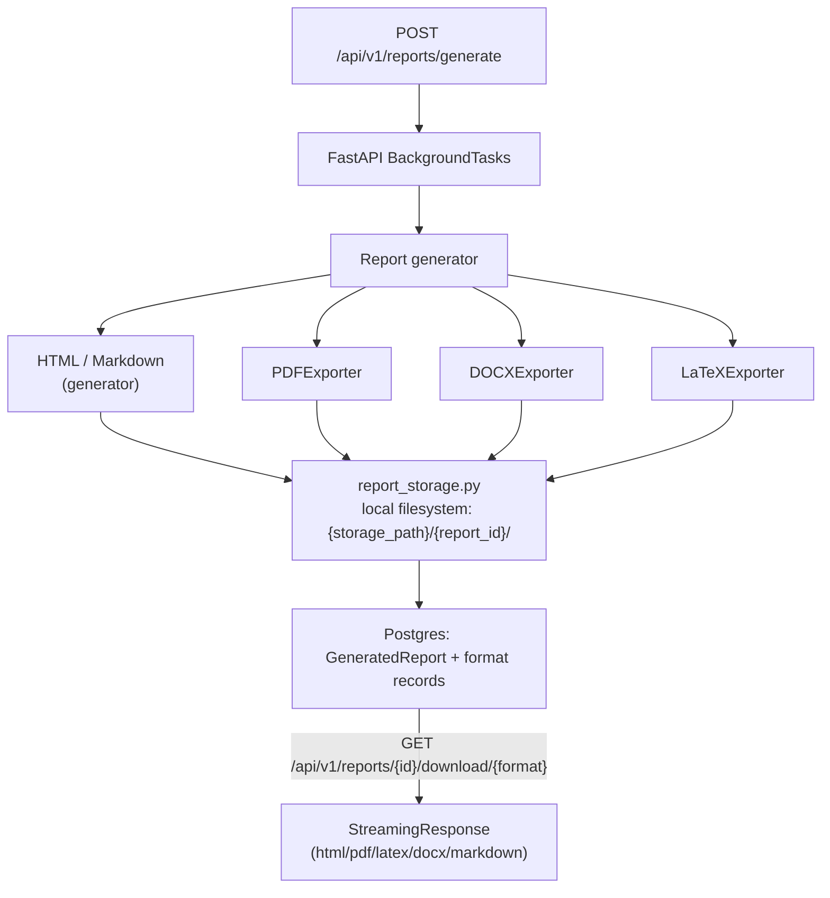
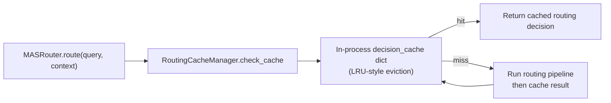
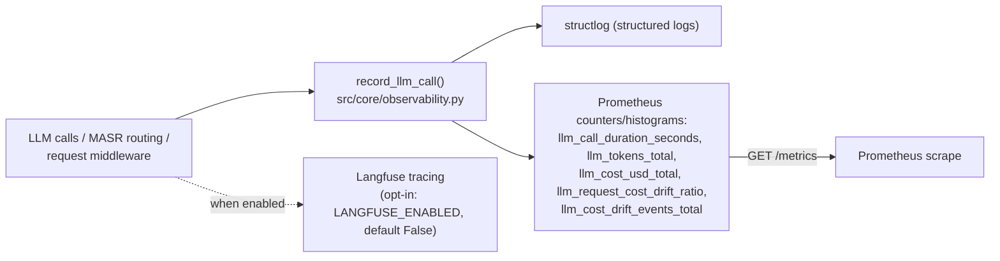

# Data Flow Diagrams

This document shows how data moves through **Cerebro**, the multi-agent LLM research
platform (current focus: financial research, US equities). Each diagram is drawn from the
actual code paths; it deliberately omits infrastructure Cerebro does not run.

> Naming note: the deployment artifacts still carry the pre-rebrand **research-platform**
> identity (FastAPI title "Research Platform API", `research_db`, `research-cli`,
> `gcr.io/PROJECT_ID/research-platform-api`). The product is Cerebro; the infra names are legacy.

## Table of Contents
- [Request Execution Flow](#request-execution-flow)
- [Agent Registry and Domains](#agent-registry-and-domains)
- [Real-time Update Flow](#real-time-update-flow)
- [Report Generation Flow](#report-generation-flow)
- [Caching Flow](#caching-flow)
- [Observability Flow](#observability-flow)

## Request Execution Flow

A query enters FastAPI (JSON only — Pydantic-validated), and `DirectExecutionService`
spawns an asyncio background task that runs the real pipeline. The immediate HTTP response
to `POST /api/v1/query/research` contains hardcoded placeholders
(`selected_agents=[]`, `estimated_cost=0.015`, `estimated_quality=0.85`, `confidence=0.85`,
`routing_time_ms=50.0`); real routing data is fetched later via
`GET /api/v1/query/execution/{id}/status` and `/results`.

`MASRouter` runs in-process (`src/ai_brain/router/masr.py`) — the standalone
`masr-router` container (:9100) is legacy and not on this path. `MASRSupervisorBridge`
maps the routing decision to one of four domain supervisors, each of which runs an
internal LangGraph `StateGraph`. Workers subclass `LLMWorkerAgentBase` and call Gemini
(`GEMINI_DEFAULT_MODEL=gemini-pro`) by default; OpenRouter multi-provider routing
(DeepSeek / Claude Sonnet tiers) only engages when both `MULTI_PROVIDER_ROUTING_ENABLED`
and `OPENROUTER_API_KEY` are set.

```mermaid
flowchart TD
    CLIENT["Client (HTTP JSON, WebSocket, or research-cli)"]
    FASTAPI["FastAPI app (inbound order)<br/>Auth (no-op) -> CostDrift -> RateLimit (100/min)<br/>-> Idempotency -> CORS"]
    DES["DirectExecutionService<br/>asyncio background task"]
    MASR["MASRouter (in-process)<br/>complexity -> strategy -> cost -> collaboration mode"]

    CLIENT -->|"POST /api/v1/query/research"| FASTAPI
    FASTAPI -->|"start_research_execution<br/>(returns placeholder response)"| DES
    DES --> MASR

    MASR -->|"FAST_PATH"| FAST["Single LLM call<br/>(bypasses supervisors)"]
    MASR -->|"DIRECT / PARALLEL / HIERARCHICAL /<br/>DEBATE / ENSEMBLE"| BRIDGE["MASRSupervisorBridge"]

    BRIDGE --> SUP["Domain supervisors<br/>(internal LangGraph StateGraph)"]

    subgraph SUPS["4 domain supervisors"]
        SUP --> RS["Research"]
        SUP --> CS["Content"]
        SUP --> AS["Analytics"]
        SUP --> FS["Finance"]
    end

    RS --> WORKERS["LLMWorkerAgentBase workers<br/>(asyncio.gather + Semaphore for parallelism)"]
    CS --> WORKERS
    AS --> WORKERS
    FS --> WORKERS

    WORKERS --> LLM["Gemini (default)<br/>OpenRouter when flag-gated ON"]
    LLM --> VERIFY["Verification QA gate<br/>(MAST labels, max 2 attempts)"]
    FAST --> VERIFY
    VERIFY --> PERSIST["Postgres (results, checkpoints)<br/>Redis (cache, idempotency)"]

    PERSIST -.->|"GET /execution/{id}/status<br/>GET /execution/{id}/results"| CLIENT
```

Notes:
- **FAST_PATH** is a single LLM call that skips supervisors. If its response fails the
  quality gate, the routing decision is mutated to `DIRECT` and re-run through supervisors —
  so one request can incur two LLM executions.
- **Multi-domain** queries fan out per-domain under `asyncio.Semaphore` (default 4),
  gathered with `return_exceptions=True`, then merged (`concat` by default).
- Confidence scores (0.85 success / 0.3 empty / 0.8 fast-path) are hardcoded heuristics,
  not model-reported quality signals.

## Agent Registry and Domains

`AgentFactory._agent_registry` (`src/agents/factory.py:48-66`) catalogs **17 agent types**:
15 domain workers across four domains plus two cross-cutting agents. The factory is the
catalog for the bypass API — supervisors instantiate their own worker teams at runtime.

```mermaid
graph TB
    subgraph REG["17-agent registry (AgentFactory)"]
        subgraph R["Research (5)"]
            R1["literature_review"]
            R2["comparative_analysis"]
            R3["methodology"]
            R4["synthesis"]
            R5["citation"]
        end
        subgraph C["Content (4)"]
            C1["content_planning"]
            C2["drafting"]
            C3["editing"]
            C4["optimization"]
        end
        subgraph A["Analytics (3)"]
            A1["data_analysis"]
            A2["statistical_modeling"]
            A3["insight_synthesis"]
        end
        subgraph F["Finance (3)"]
            F1["financial_analysis"]
            F2["valuation"]
            F3["risk_assessment"]
        end
        subgraph X["Cross-cutting (2)"]
            X1["verification (QA gate)"]
            X2["financial_calculator (deterministic tool)"]
        end
    end
```

Counts differ by scope, all correct:
- **17** — factory registry (above).
- **15** — domain workers actually attached to supervisor teams (verification and
  financial_calculator are not on any team; verification is invoked as a QA gate).
- **10** — bypass `AgentType` values callable via `POST /api/v1/agents/{type}/execute`:
  literature-review, citation, methodology, comparative-analysis, synthesis,
  financial-analysis, valuation, risk-assessment, financial-calculator, verification.
  Content and Analytics workers are not bypass-callable.

`financial_calculator` and the finance workers' `_precompute` step use the pure-Python
finance-math tool (`src/agents/tools/finance_math.py`) — no LLM, no external data.
A `service` domain is detected by the router but has no supervisor class, so it falls
back to the Research supervisor.

## Real-time Update Flow

Progress updates reach the browser and CLI over **WebSocket only** — there is no SSE and
no polling channel. `EventPublisher` (`src/api/services/event_publisher.py`) publishes
events onto Redis pub/sub; the connection manager fans them out to connected sockets.

```mermaid
graph LR
    EXEC["DirectExecutionService /<br/>supervisors"]
    EP["EventPublisher"]
    REDIS["Redis pub/sub"]
    WSM["WebSocket connection manager"]

    EXEC -->|"publish progress / status events"| EP
    EP --> REDIS
    REDIS --> WSM

    WSM --> WS1["/ws (global)"]
    WSM --> WS2["/ws/projects/{project_id}"]
    WSM --> WS3["/ws/cli/{project_id}"]
```

Additional WebSocket surfaces exist under the supervisor and TalkHier routers
(`/api/v1/supervisors/coordination/ws`, `/api/v1/supervisors/{type}/ws`,
`/api/v1/talkhier/sessions/{id}/live`, `/interactive`, `/coordination`) plus a
`GET /ws/health` probe. WebSocket connections are anonymous in `ENVIRONMENT=development`.

## Report Generation Flow

Report generation runs off FastAPI `BackgroundTasks`. Format exporters live in
`src/services/exporters/` (PDF, DOCX, LaTeX); HTML and Markdown are produced by the
report generator directly. Rendered files are written to the **local filesystem**
(`report_storage.py`, `report_storage_path`) — not object storage — and served on demand.

```mermaid
flowchart TD
    CREATE["POST /api/v1/reports/generate"]
    BG["FastAPI BackgroundTasks"]
    GEN["Report generator"]

    CREATE --> BG --> GEN

    GEN --> HTML["HTML / Markdown<br/>(generator)"]
    GEN --> PDF["PDFExporter"]
    GEN --> DOCX["DOCXExporter"]
    GEN --> TEX["LaTeXExporter"]

    HTML --> STORE["report_storage.py<br/>local filesystem: {storage_path}/{report_id}/"]
    PDF --> STORE
    DOCX --> STORE
    TEX --> STORE

    STORE --> META["Postgres: GeneratedReport + format records"]
    META -->|"GET /api/v1/reports/{id}/download/{format}"| DL["StreamingResponse<br/>(html/pdf/latex/docx/markdown)"]
```

## Caching Flow

The MASR routing cache is an **in-process Python dict**
(`RoutingCacheManager.decision_cache` in `src/ai_brain/router/routing_cache.py`) with
LRU-style eviction — not Redis. Redis is used separately to back the idempotency and
rate-limit middleware, and a Redis-backed `CacheManager`
(`src/services/cache/cache_manager.py`) exists for other application caching. There is no
CDN cache tier.

```mermaid
flowchart LR
    ROUTE["MASRouter.route(query, context)"]
    CM["RoutingCacheManager.check_cache"]
    DICT["In-process decision_cache dict<br/>(LRU-style eviction)"]

    ROUTE --> CM
    CM --> DICT
    DICT -->|"hit"| RETURN["Return cached routing decision"]
    DICT -->|"miss"| COMPUTE["Run routing pipeline<br/>then cache result"]
    COMPUTE --> DICT
```

## Observability Flow

LLM telemetry is Prometheus plus structlog, with optional Langfuse tracing. There is no
CloudWatch, Elasticsearch, Sentry, or level-based log fan-out.

```mermaid
flowchart LR
    CALLS["LLM calls / MASR routing /<br/>request middleware"]
    REC["record_llm_call()<br/>src/core/observability.py"]
    LOG["structlog (structured logs)"]
    PROM["Prometheus counters/histograms:<br/>llm_call_duration_seconds, llm_tokens_total,<br/>llm_cost_usd_total, llm_request_cost_drift_ratio,<br/>llm_cost_drift_events_total"]
    LF["Langfuse tracing<br/>(opt-in: LANGFUSE_ENABLED, default False)"]

    CALLS --> REC
    REC --> LOG
    REC --> PROM
    CALLS -.->|"when enabled"| LF
    PROM -->|"GET /metrics"| SCRAPE["Prometheus scrape"]
```

`LLMCostDriftMiddleware` compares MASR-estimated cost against actual provider cost and
emits a drift histogram/counter, warning when drift exceeds 0.2.
