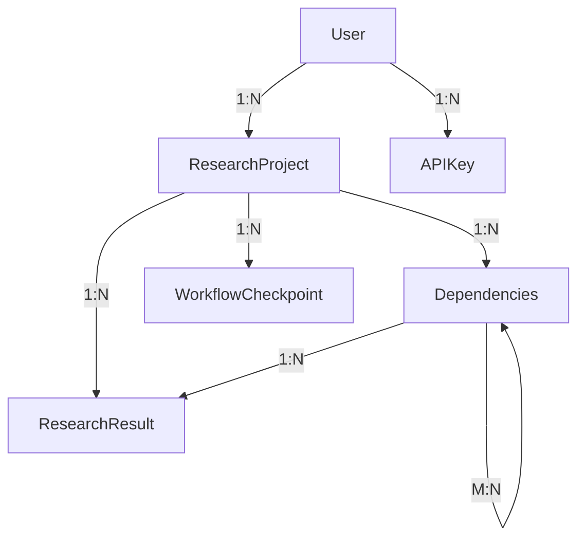

# Database Architecture and Implementation

## Overview

The Multi-Agent Research Platform uses a sophisticated database layer built with SQLAlchemy 2.0+ and PostgreSQL, implementing modern patterns for scalability, maintainability, and performance. The architecture follows Domain-Driven Design (DDD) principles with a clean separation between the domain models, database models, and data access layers.

## Key Design Decisions

### 1. Asynchronous Operations
All database operations use async/await patterns for optimal performance:
- **AsyncSession** for database connections
- **asyncpg** driver for PostgreSQL
- Non-blocking I/O throughout the application

### 2. Repository Pattern
Clean separation of data access logic from business logic:
- Generic base repository with full CRUD operations
- Specialized repositories for domain-specific operations
- Type-safe implementations using Python generics

### 3. Soft Delete Pattern
All models support soft deletion for data recovery and audit trails:
- `deleted_at` timestamp field on all tables
- Automatic filtering of deleted records in queries
- Ability to restore soft-deleted records

### 4. UUID Primary Keys
All tables use UUIDs as primary keys for:
- Global uniqueness across distributed systems
- Better security (no sequential ID enumeration)
- Easier data migration and replication

## Database Schema

### Core Models

#### 1. ResearchProject
Central entity representing a research investigation:
```python
- id: UUID (primary key)
- title: String(500) (indexed) 
- query: Text
- domains: JSON (list of research domains)
- status: Enum (draft, in_progress, completed, failed, cancelled) (indexed)
- quality_score: Float (0.0 to 1.0)
- user_id: UUID (foreign key to users.id) (indexed)
- workflow_id: String(255) (Temporal/LangGraph workflow ID) (indexed)
- project_metadata: JSON (additional project metadata)
- timestamps: created_at, updated_at, deleted_at (from BaseModel)
```

#### 2. AgentTask
Individual tasks assigned to AI agents:
```python
- id: UUID (primary key)
- project_id: UUID (foreign key to research_projects.id) (indexed)
- agent_type: String(100) (indexed) (e.g., literature_review, synthesis)
- status: Enum (pending, queued, in_progress, completed, failed, cancelled, retrying) (indexed)
- input_data: JSON (input data for the agent)
- output_data: JSON (output data from the agent)
- error_message: Text (error message if task failed)
- retry_count: Integer (number of retry attempts)
- execution_start: DateTime (when task execution started)
- execution_end: DateTime (when task execution finished)
- task_metadata: JSON (additional task metadata)
- timestamps: created_at, updated_at, deleted_at (from BaseModel)
```

**Relationships:**
- project: Many-to-One with ResearchProject
- Supports cascade deletion when project is deleted

#### 3. ResearchResult
Findings and outputs from research activities:
```python
- id: UUID (primary key)
- project_id: UUID (foreign key to research_projects.id) (indexed)
- result_type: String(50) (indexed) (finding, source, citation, methodology, comparison, synthesis, etc.)
- content: JSON (result content, structure varies by type)
- confidence_score: Float (0.0 to 1.0)
- agent_type: String(100) (indexed) (agent that produced this result)
- result_metadata: JSON (additional metadata)
- timestamps: created_at, updated_at, deleted_at (from BaseModel)
```

**Relationships:**
- project: Many-to-One with ResearchProject
- Supports cascade deletion when project is deleted

#### 4. User
System users with authentication:
```python
- id: UUID (primary key)
- email: String(255) (unique, indexed)
- username: String(100) (unique, indexed)
- hashed_password: String(255)
- full_name: String(255)
- organization: String(255)
- role: String(50) (researcher, admin, etc.)
- is_active: Boolean (indexed)
- is_superuser: Boolean
- is_verified: Boolean (email verification status)
- last_login: DateTime (timezone aware)
- login_count: Integer
- max_projects: Integer (concurrent project limit)
- api_rate_limit: Integer (API calls per hour limit)
- timestamps: created_at, updated_at, deleted_at (from BaseModel)
```

**Relationships:**
- research_projects: One-to-Many with ResearchProject
- api_keys: One-to-Many with APIKey
- password_history: One-to-Many with PasswordHistory
- sessions: One-to-Many with UserSession
- audit_logs: One-to-Many with AuditLog
- oauth_accounts: One-to-Many with OAuthAccount

#### 5. WorkflowCheckpoint
State snapshots for workflow recovery:
```python
- id: UUID (primary key)
- workflow_id: String(255) (indexed) (Temporal or LangGraph workflow ID)
- project_id: UUID (foreign key to research_projects.id) (indexed)
- checkpoint_data: JSON (serialized workflow state)
- phase: String(100) (indexed) (workflow phase at checkpoint)
- checkpoint_type: String(50) (automatic, manual, error)
- checkpoint_version: String(50) (version of checkpoint format)
- is_recoverable: Boolean (whether checkpoint can be used for recovery)
- recovery_metadata: JSON (additional data needed for recovery)
- execution_metrics: JSON (performance metrics at checkpoint time)
- timestamps: created_at, updated_at, deleted_at (from BaseModel)
```

**Relationships:**
- project: Many-to-One with ResearchProject

**Indexes:**
- idx_checkpoint_workflow: (workflow_id, created_at)
- idx_checkpoint_project_phase: (project_id, phase)
- idx_checkpoint_recoverable: (is_recoverable, workflow_id)

#### 6. GeneratedReport
Generated research reports:
```python
- id: UUID (primary key)
- project_id: UUID (foreign key to research_projects.id) (indexed)
- title: String(500)
- report_type: String(50) (comprehensive, executive_summary, etc.)
- format_type: String(50) (html, pdf, markdown, etc.)
- content: Text (report content)
- generation_status: String(50) (generating, completed, failed)
- word_count: Integer
- page_count: Integer
- quality_score: Float (0.0 to 1.0)
- confidence_score: Float (0.0 to 1.0)
- generation_time_seconds: Float
- report_metadata: JSON (additional metadata)
- timestamps: created_at, updated_at, deleted_at (from BaseModel)
```

**Relationships:**
- project: Many-to-One with ResearchProject

#### 7. APIKey
Secure API key management:
```python
- id: UUID (primary key)
- key_hash: String (unique, indexed) - SHA256 hash
- user_id: UUID (foreign key)
- name: String
- permissions: Array[String]
- rate_limit: Integer
- allowed_ips: Array[String]
- expires_at: Timestamp (indexed)
- use_count: Integer
- last_used_at: Timestamp
```

### Relationships



## Repository Layer

### Base Repository

The generic base repository provides standard CRUD operations with type safety:

```python
class BaseRepository(Generic[ModelType]):
    async def create(**kwargs) -> ModelType
    async def get(id: UUID) -> Optional[ModelType]
    async def get_many(filters, limit, offset, order_by) -> List[ModelType]
    async def update(id, data, updated_by) -> Optional[ModelType]
    async def delete(id, soft=True) -> bool
    async def exists(id) -> bool
    async def count(filters) -> int
    async def bulk_create(items) -> List[ModelType]
    async def bulk_update(updates) -> int
```

### Specialized Repositories

Each domain entity has a specialized repository with domain-specific operations:

#### ResearchRepository
```python
- get_by_user(user_id, status, limit, offset)
- get_active_projects(limit)
- update_status(project_id, status, updated_by)
- get_with_tasks(project_id)
- search_projects(query, domains, status)
- get_statistics(project_id)
```

#### TaskRepository
```python
- get_pending_tasks(agent_type, limit)
- get_by_project(project_id, agent_type, status)
- get_dependencies(task_id)
- update_status(task_id, status, output_data, error)
- retry_task(task_id)
- get_task_metrics(project_id)
```

#### ResultRepository
```python
- get_by_project(project_id, result_type, limit)
- get_by_agent(project_id, agent_type)
- bulk_create(results)
- get_high_confidence(project_id, min_confidence)
- aggregate_by_type(project_id)
- search_content(search_term, project_id, result_types)
- get_citations(project_id)
- get_sources(project_id, unique)
- merge_duplicates(project_id)
```

#### CheckpointRepository
```python
- get_latest(workflow_id)
- get_by_phase(workflow_id, phase)
- cleanup_old(workflow_id, keep_count)
- get_recovery_point(project_id)
- create_checkpoint(workflow_id, project_id, data, phase)
- restore_from_checkpoint(checkpoint_id)
- mark_error_checkpoint(workflow_id, project_id, data, error)
```

#### APIKeyRepository
```python
- get_by_key_hash(key_hash)
- get_by_user(user_id, active_only)
- create_key(user_id, name, permissions, expires_in_days)
- validate_key(raw_key, required_permission, ip_address)
- record_usage(key_id, ip_address)
- revoke_key(key_id, reason)
- cleanup_expired()
- extend_expiration(key_id, days)
```

## Database Migrations

### Alembic Configuration

The project uses Alembic for database schema versioning with async support:

```python
# alembic/env.py
async def run_async_migrations():
    async with engine.begin() as conn:
        await conn.run_sync(do_run_migrations)
```

### Migration Best Practices

1. **Auto-generation**: Use `alembic revision --autogenerate` to detect model changes
2. **Review migrations**: Always review auto-generated migrations before applying
3. **Backward compatibility**: Ensure migrations can be rolled back safely
4. **Data migrations**: Handle data transformations in separate migration scripts
5. **Testing**: Test migrations on a copy of production data

### Migration Commands

```bash
# Generate new migration
alembic revision --autogenerate -m "Description"

# Apply migrations
alembic upgrade head

# Rollback one migration
alembic downgrade -1

# View migration history
alembic history

# Check current version
alembic current
```

## Performance Optimizations

### 1. Indexes
The database includes 47 carefully designed indexes for optimal query performance:

- **Primary indexes**: UUID primary keys on all tables
- **Foreign key indexes**: All foreign key relationships
- **Query optimization indexes**: 
  - `status` fields for filtering active records
  - `deleted_at` for soft delete filtering
  - `created_at` for temporal queries
  - Composite indexes for common query patterns

### 2. Connection Pooling

```python
# Database connection pool configuration
DATABASE_POOL_SIZE = 20
DATABASE_MAX_OVERFLOW = 10
DATABASE_POOL_TIMEOUT = 30
DATABASE_POOL_RECYCLE = 3600

create_async_engine(
    DATABASE_URL,
    pool_size=DATABASE_POOL_SIZE,
    max_overflow=DATABASE_MAX_OVERFLOW,
    pool_timeout=DATABASE_POOL_TIMEOUT,
    pool_recycle=DATABASE_POOL_RECYCLE,
    pool_pre_ping=True  # Verify connections before use
)
```

### 3. Query Optimization Strategies

- **Eager loading**: Use `selectinload` for related data
- **Batch operations**: Bulk insert/update for multiple records
- **Query result caching**: Redis caching for frequently accessed data
- **Pagination**: Limit/offset for large result sets
- **Database-specific features**: PostgreSQL DISTINCT ON, JSON operators

### 4. Transaction Management

```python
# Automatic transaction management
async with get_session() as session:
    async with session.begin():
        # All operations in transaction
        await repository.create(...)
        await repository.update(...)
        # Automatic commit on success, rollback on error
```

## Security Implementation

### 1. API Key Security

**Never store raw API keys** - only SHA256 hashes:

```python
def generate_api_key() -> tuple[str, str]:
    raw_key = f"gar_{secrets.token_urlsafe(32)}"
    hashed_key = hashlib.sha256(raw_key.encode()).hexdigest()
    return raw_key, hashed_key  # Return raw key once, store only hash

def validate_api_key(raw_key: str) -> bool:
    key_hash = hashlib.sha256(raw_key.encode()).hexdigest()
    return await repository.get_by_key_hash(key_hash)
```

### 2. Password Security

Bcrypt hashing with automatic salt:

```python
def hash_password(password: str) -> str:
    return bcrypt.hashpw(
        password.encode('utf-8'), 
        bcrypt.gensalt()
    ).decode('utf-8')

def verify_password(password: str, hashed: str) -> bool:
    return bcrypt.checkpw(
        password.encode('utf-8'), 
        hashed.encode('utf-8')
    )
```

### 3. SQL Injection Prevention

- **Parameterized queries**: All queries use SQLAlchemy's parameter binding
- **Input validation**: Pydantic models validate all input
- **No raw SQL**: Avoid string concatenation for queries

## Monitoring and Health Checks

### Database Health Monitoring

```python
async def check_database_health() -> HealthStatus:
    try:
        # Test connection
        async with get_session() as session:
            result = await session.execute(select(1))
            
        # Check connection pool
        pool_status = engine.pool.status()
        
        # Check table accessibility
        await session.execute(select(func.count(User.id)))
        
        return HealthStatus(
            healthy=True,
            latency_ms=response_time,
            pool_size=pool_status.size,
            pool_available=pool_status.available
        )
    except Exception as e:
        return HealthStatus(healthy=False, error=str(e))
```

### Metrics Collection

Key metrics tracked:
- Query execution time
- Connection pool utilization
- Transaction success/failure rates
- Slow query logging
- Database size and growth

## Testing Strategy

### 1. Unit Tests
Test repositories with in-memory SQLite:

```python
@pytest.fixture
async def test_db():
    # Create in-memory database
    engine = create_async_engine("sqlite+aiosqlite:///:memory:")
    async with engine.begin() as conn:
        await conn.run_sync(Base.metadata.create_all)
    
    async with AsyncSession(engine) as session:
        yield session
```

### 2. Integration Tests
Test with real PostgreSQL using Docker:

```python
@pytest.fixture
async def postgres_db():
    # Start PostgreSQL container
    async with AsyncDockerClient() as docker:
        container = await docker.containers.run(
            "postgres:15",
            environment={"POSTGRES_PASSWORD": "test"},
            detach=True
        )
        # Run tests
        yield connection
        # Cleanup
        await container.stop()
```

### 3. Performance Tests
Benchmark critical operations:

```python
@pytest.mark.benchmark
async def test_bulk_insert_performance():
    items = [generate_item() for _ in range(10000)]
    
    start = time.time()
    await repository.bulk_create(items)
    elapsed = time.time() - start
    
    assert elapsed < 2.0  # Should complete in under 2 seconds
```

## Best Practices

### 1. Session Management
- Use context managers for automatic session cleanup
- One session per request/operation
- Avoid long-running sessions

### 2. Error Handling
- Graceful degradation on database errors
- Automatic retry with exponential backoff
- Circuit breaker for database failures

### 3. Data Validation
- Validate at model level (SQLAlchemy)
- Validate at API level (Pydantic)
- Database constraints as last defense

### 4. Audit Trail
- Track created_by/updated_by on all modifications
- Maintain change history for critical entities
- Log all deletion operations

## Migration Guide

### Setting Up the Database

1. **Install PostgreSQL**:
```bash
docker-compose up -d db
```

2. **Create database and user**:
```bash
docker exec db psql -U postgres -c "CREATE USER research WITH PASSWORD 'research123';"
docker exec db psql -U postgres -c "CREATE DATABASE research_db OWNER research;"
```

3. **Run migrations**:
```bash
alembic upgrade head
```

### Adding New Models

1. Create model in `src/models/db/`
2. Import model in `src/models/db/__init__.py`
3. Generate migration: `alembic revision --autogenerate -m "Add new model"`
4. Review and apply migration: `alembic upgrade head`
5. Create repository in `src/repositories/`
6. Add repository tests

### Modifying Existing Models

1. Update model definition
2. Generate migration with descriptive message
3. Test migration on development database
4. Test rollback procedure
5. Apply to staging, then production

## Troubleshooting

### Common Issues

1. **Connection Pool Exhaustion**
   - Increase pool_size in configuration
   - Check for connection leaks
   - Review long-running queries

2. **Slow Queries**
   - Check EXPLAIN ANALYZE output
   - Add appropriate indexes
   - Consider query restructuring

3. **Migration Failures**
   - Check for data conflicts
   - Ensure backward compatibility
   - Test on production data copy

4. **Lock Contention**
   - Review transaction scope
   - Use SELECT ... FOR UPDATE carefully
   - Consider optimistic locking

## Future Enhancements

### Planned Improvements

1. **Read Replicas**: Distribute read queries across replicas
2. **Partitioning**: Partition large tables by date/project
3. **Caching Layer**: Implement Redis caching for hot data
4. **Event Sourcing**: Track all state changes as events
5. **Graph Database**: Neo4j for knowledge graph storage
6. **Time-series Data**: TimescaleDB for metrics
7. **Full-text Search**: PostgreSQL FTS or Elasticsearch
8. **Data Archival**: Move old data to cold storage