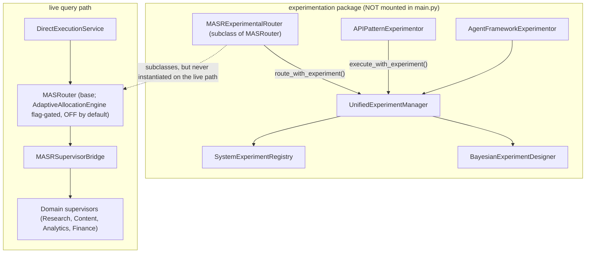

# Experiment Integration Patterns

## Status: not on the live execution path

> **This subsystem is real code but unreachable over HTTP.** The FastAPI router
> that would expose it — `src/api/routes/experiment_agent_api.py` (whose imports
> at lines 17-25 pull in `AgentFrameworkExperimentor`, `real_time_dashboard`, and
> `feedback_loop_optimizer` from `src/ai_brain/experimentation/`) — is **never
> `include_router`'d in `src/api/main.py`** (the mounted routers are listed at
> `main.py:211-230`). (A second router, `src/api/routes/experiments.py`, is also
> unmounted, but it is a **separate, disconnected DB-backed A/B CRUD API** — its
> imports at lines 17-29 are only ORM models from `src/models/db/experiment`; it
> imports nothing from `src/ai_brain/experimentation/`, and the experimentation
> package likewise never imports `src/models/db`, so mounting it would surface
> none of the classes described here.) One core module of the package **is**
> flag-gated into the live base router: `MASRouter` imports
> `AdaptiveAllocationEngine` (`masr.py:36-39`) and, when
> `adaptive_routing_enabled` is set, constructs it (`masr.py:221-235`) and
> consults it inside `route()` (`masr.py:367`, via the Thompson-sampling
> `_get_adaptive_allocation_adjustment` at `masr.py:649+`). That flag defaults
> **off** (`masr.py:208-210`) and `DirectExecutionService` builds `MASRouter()`
> with no config (`direct_execution_service.py:103`), so on the live path the
> engine is dormant and no query served by Cerebro exercises it today. The rest
> of the classes below exist under `src/ai_brain/experimentation/` and can be
> imported and unit-tested but are not wired into any live flow. Treat this
> document as a map of an in-tree, mostly-dormant capability — not of production
> behavior.

This document describes how the experimentation package under
`src/ai_brain/experimentation/` is intended to hook into Cerebro's routing and
agent-execution components. Cerebro is a multi-agent LLM platform whose current
focus is financial research (US equities); its infra artifacts still carry the
legacy `research-platform` identity (FastAPI title "Research Platform API", the
`research-platform` k8s namespace, `research_db`), which is unrelated to the
experimentation code.

## Package layout (what actually exists)

```
src/ai_brain/experimentation/
├── core/
│   ├── unified_experiment_manager.py    # UnifiedExperimentManager (:199)
│   ├── system_experiment_registry.py    # SystemExperimentRegistry (:64)
│   └── adaptive_allocation_engine.py    # AdaptiveAllocationEngine
├── integration/
│   ├── masr_experiment_integration.py   # MASRExperimentalRouter (:89)
│   ├── api_pattern_experiments.py       # APIPatternExperimentor (:82)
│   └── agent_framework_integration.py   # AgentFrameworkExperimentor (:147)
├── statistical/
│   ├── bayesian_experiment_design.py    # BayesianExperimentDesigner (:114)
│   ├── enhanced_statistical_engine.py
│   └── multi_variate_analysis.py
├── optimization/
│   └── feedback_loop_optimizer.py
├── monitoring/
│   └── real_time_dashboard.py
└── eval/
    └── adaptive_routing_eval.py
```

There is **no** `execution_pattern_experiments.py`, `memory_experiments.py`, or
`talkhier_experiments.py`, and no `ExperimentLifecycleManager`,
`ExperimentAnalyzer`, `ExperimentDashboard`, or `ExperimentSafetyMonitor`.
Earlier drafts of this document referenced those files and classes; they do not
exist in the tree.

## MASR routing-strategy experiments

### Integration approach: subclass, not composition

`MASRExperimentalRouter` (`integration/masr_experiment_integration.py:89`)
**subclasses** the real `MASRouter` (`src/ai_brain/router/masr.py:107`, single
`R` — there is no `MASRRouter`). It is not a composition wrapper that holds a
router plus a manager; it *is* a MASRouter with experimentation state attached in
`__init__`:

```python
# src/ai_brain/experimentation/integration/masr_experiment_integration.py

from src.ai_brain.router.masr import MASRouter
from src.ai_brain.experimentation.core.unified_experiment_manager import (
    UnifiedExperimentManager,
)
from src.ai_brain.experimentation.core.adaptive_allocation_engine import (
    AdaptiveAllocationEngine,
)
from src.ai_brain.experimentation.core.system_experiment_registry import (
    SystemExperimentRegistry,
)


class MASRExperimentalRouter(MASRouter):
    """Extended MASR router with integrated experimentation capabilities."""

    def __init__(self, *args: Any, **kwargs: Any) -> None:
        super().__init__(*args, **kwargs)  # inherits the full MASRouter pipeline
        self.experiment_manager = UnifiedExperimentManager()
        self.allocation_engine = AdaptiveAllocationEngine()
        self.registry = SystemExperimentRegistry()
        self.active_experiments: dict[str, MASRExperimentConfig] = {}
        self.results_buffer: list[MASRExperimentResult] = []
```

Because it inherits from `MASRouter`, it can call the base `route()` directly.
The base `MASRouter.route()` accepts a `strategy=` keyword
(`masr.py:252-258`):

```python
async def route(
    self,
    query: str,
    context: dict[str, Any] | None = None,
    strategy: RoutingStrategy | None = None,
    constraints: dict[str, Any] | None = None,
) -> RoutingDecision: ...
```

### The experimental route method

`route_with_experiment(query, context)`
(`masr_experiment_integration.py:248`) is the experiment-aware entry point. It
analyzes complexity, asks `AdaptiveAllocationEngine` for a variant, applies the
variant's `RoutingStrategy`, then falls back to the inherited
`self.route(query, context)` when no experimental decision is produced:

```python
async def route_with_experiment(
    self, query: str, context: dict[str, Any] | None = None
) -> RoutingDecision:
    context = context or {}
    complexity_analysis = await self.complexity_analyzer.analyze(query, context)

    routing_decision = None
    variant_used = "control"

    if "routing_strategy_test" in self.active_experiments:
        allocation = await self.allocation_engine.allocate_variant(
            experiment_id="routing_strategy_test",
            user_context={
                "complexity": complexity_analysis.level.value,
                "query_length": len(query),
                "has_context": bool(context),
            },
        )
        variant_used = allocation.variant_id
        config = self.active_experiments["routing_strategy_test"]
        if variant_used in config.variants:
            strategy = config.variants[variant_used]["strategy"]
            routing_decision = await self._route_with_strategy(
                query, context, complexity_analysis, strategy
            )

    # A second experiment can override the collaboration mode in place.
    if "collaboration_mode_test" in self.active_experiments and routing_decision:
        ...
        routing_decision.collaboration_mode = mode

    if not routing_decision:
        routing_decision = await self.route(query, context)  # base MASRouter

    return routing_decision
```

### Valid routing-strategy variants

The `RoutingStrategy` enum (`src/ai_brain/router/routing_types.py:23-32`) has
exactly five members:

| Member | Value |
|---|---|
| `SPEED_FIRST` | `"speed_first"` |
| `COST_EFFICIENT` | `"cost_efficient"` |
| `QUALITY_FOCUSED` | `"quality_focused"` |
| `BALANCED` | `"balanced"` |
| `ADAPTIVE` | `"adaptive"` |

There is **no `ML_OPTIMIZED` member** — referencing `RoutingStrategy.ML_OPTIMIZED`
raises `AttributeError`. The default MASR-experiment seed
(`initialize_experiments`, `masr_experiment_integration.py:112`) uses only
`BALANCED` (control), `COST_EFFICIENT`, `QUALITY_FOCUSED`, and `ADAPTIVE`:

```python
routing_experiment = MASRExperimentConfig(
    experiment_type=MASRExperimentType.ROUTING_STRATEGY,
    variants={
        "control":         {"strategy": RoutingStrategy.BALANCED},
        "cost_efficient":  {"strategy": RoutingStrategy.COST_EFFICIENT},
        "quality_focused": {"strategy": RoutingStrategy.QUALITY_FOCUSED},
        "adaptive":        {"strategy": RoutingStrategy.ADAPTIVE},
    },
)
```

### Collaboration-mode experiments

`MASRExperimentType.COLLABORATION_MODE` overrides
`routing_decision.collaboration_mode` from the `CollaborationMode` enum, whose
members are `FAST_PATH`, `DIRECT`, `PARALLEL`, `HIERARCHICAL`, `DEBATE`, and
`ENSEMBLE`. `FAST_PATH` is a single LLM call that bypasses supervisors entirely;
the seed collaboration experiment exercises `HIERARCHICAL`, `PARALLEL`,
`ENSEMBLE`, and `DEBATE`. Note that live MASR never selects Chain-of-Agents or
Mixture-of-Agents — those exist only as bypass endpoints
(`POST /api/v1/agents/chain`, `POST /api/v1/agents/mixture`).

## UnifiedExperimentManager

`UnifiedExperimentManager` (`core/unified_experiment_manager.py:199`) — not
`ExperimentManager` — owns experiment lifecycle and variant assignment. It is
constructed with an optional prompt-version manager and an optional allocation
strategy (defaulting to a deterministic hash-based allocator):

```python
# core/unified_experiment_manager.py:205
def __init__(
    self,
    prompt_manager: PromptVersionManager | None = None,
    allocation_strategy: ExperimentAllocationStrategy | None = None,
):
    self.allocation_strategy = allocation_strategy or DeterministicAllocationStrategy()
    self.active_experiments: dict[str, SystemExperiment] = {}
    self.experiment_history: list[SystemExperiment] = []
    self.assignment_cache: dict[str, dict[str, ExperimentVariant]] = {}
```

Key async methods:

| Method | Purpose |
|---|---|
| `create_experiment(experiment_config)` (:225) | Parse variants/metrics/statistical config into a `SystemExperiment`, validate, register |
| `start_experiment(experiment_id)` (:266) | Mark running and initialize component tracking |
| `get_variant_for_context(experiment_id, context)` (:278) | Deterministic, cache-backed variant assignment via the allocation strategy |
| `track_assignment(...)` (:314) / `track_metric(...)` (:328) | Record assignment and metric events |
| `check_experiment_status(experiment_id)` (:347) | Return `ExperimentStatus` |
| `stop_experiment(...)` (:366) / `promote_winner(experiment_id, winning_variant_id)` (:390) | Conclude an experiment |

Variant assignment is deterministic and cached per `(experiment_id, context)`
key, so the same context returns the same variant across calls.

## Agent-API pattern experiments

`APIPatternExperimentor` (`integration/api_pattern_experiments.py:82`) — not
`APIPatternExperiment` — tests Primary (MASR-routed) vs Bypass (direct) API usage
and different agent-coordination modes. Its enums live in the same module:

- `APIPattern` (:24): `PRIMARY_API`, `BYPASS_API`, `HYBRID`, `PARALLEL`.
- `ExecutionMode` (:33): `CHAIN`, `MIXTURE`, `PARALLEL`, `HIERARCHICAL`.

The public entry point is `execute_with_experiment(query, query_type, context)`
(:170), which selects an experiment by `query_type`, allocates a variant through
`AdaptiveAllocationEngine`, and dispatches to the matching pattern/mode handler
(`_execute_primary_api` :313, `_execute_bypass_api` :335, `_execute_hybrid`
:360, `_execute_parallel_apis` :397, `_execute_chain_mode` :426,
`_execute_mixture_mode` :450, `_execute_hierarchical_mode` :495), falling back to
`_execute_default` (:522) when no experiment applies:

```python
# api_pattern_experiments.py:170
async def execute_with_experiment(
    self, query: str, query_type: str, context: dict[str, Any] | None = None
) -> dict[str, Any]:
    context = context or {}
    experiment_config = None
    for _exp_id, config in self.active_experiments.items():
        if query_type in config.query_types:
            experiment_config = config
            break
    if not experiment_config:
        return await self._execute_default(query, query_type, context)

    allocation = await self.allocation_engine.allocate_variant(
        experiment_id=experiment_config.experiment_id,
        ...
    )
    ...
```

The "90% Primary / 10% Bypass" split that these experiments probe is a **design
target, not a measured value**.

## Cross-component orchestration

`AgentFrameworkExperimentor`
(`integration/agent_framework_integration.py:147`) coordinates experiments across
the agent framework. It exposes creation helpers
(`create_routing_experiment` :195, `create_api_pattern_experiment` :251,
`create_talkhier_optimization_experiment` :305) and a single
`execute_with_experiment(...)` (:348) dispatcher, and runs background flush/
allocation-update tasks (`_flush_results` :590, `_update_allocations` :643).
`SystemExperimentRegistry` (`core/system_experiment_registry.py:64`) is the
shared registry: it tracks component registrations, experiment lifecycle
(`register_experiment` :111, `start_experiment` :146,
`update_experiment_allocation` :185, `stop_experiment` :206, `promote_winner`
:246), variant-assignment and metric recording, per-component health checks
(:287), and an event log.

## Statistical design

`BayesianExperimentDesigner`
(`statistical/bayesian_experiment_design.py:114`) provides Gaussian-process-based
Bayesian optimization over experiment parameters: acquisition functions
(`AcquisitionFunction` :30), parameter priors (`ParameterPrior` :52 with
`.sample()`), GP model construction (`_create_gp_model` :161), acquisition
optimization (`_optimize_acquisition` :309), convergence checks
(`_check_convergence` :404), posterior updates (`update_posterior` :492), and
uncertainty-region reporting (`get_uncertainty_regions` :516). It depends on
NumPy and scikit-learn Gaussian-process models. Additional statistical machinery
lives in `enhanced_statistical_engine.py` and `multi_variate_analysis.py`.

## Wiring diagram (intended, not live)



The dashed edge is the whole point: `MASRExperimentalRouter` extends the same
`MASRouter` the live path uses, but `DirectExecutionService`
(`src/api/services/direct_execution_service.py`) constructs a plain `MASRouter`,
never the experimental subclass, and no router mounts the experiment endpoints.

## What it would take to make this live

1. `include_router` the experiment router in `src/api/main.py` — the unmounted
   module `experiment_agent_api.py`, which imports the experimentation package's
   `AgentFrameworkExperimentor`, dashboard, and feedback-optimizer entry points.
   (`experiments.py` is also unmounted, but mounting it would not surface this
   subsystem: it is a separate DB-backed A/B CRUD API over `src/models/db` and
   imports nothing from `src/ai_brain/experimentation/`.)
2. Have `DirectExecutionService` construct `MASRExperimentalRouter` in place of
   `MASRouter`, and call `route_with_experiment()` instead of `route()`.
3. Provide real metric sinks — the manager tracks assignments and metrics, but
   Cerebro's live quality/confidence numbers are hardcoded heuristics
   (`0.85` success, `0.3` empty, `0.8` fast-path), not measured signals, so any
   experiment optimizing "quality" today would be optimizing a constant.

Until those steps land, everything above is dormant in-tree code.
