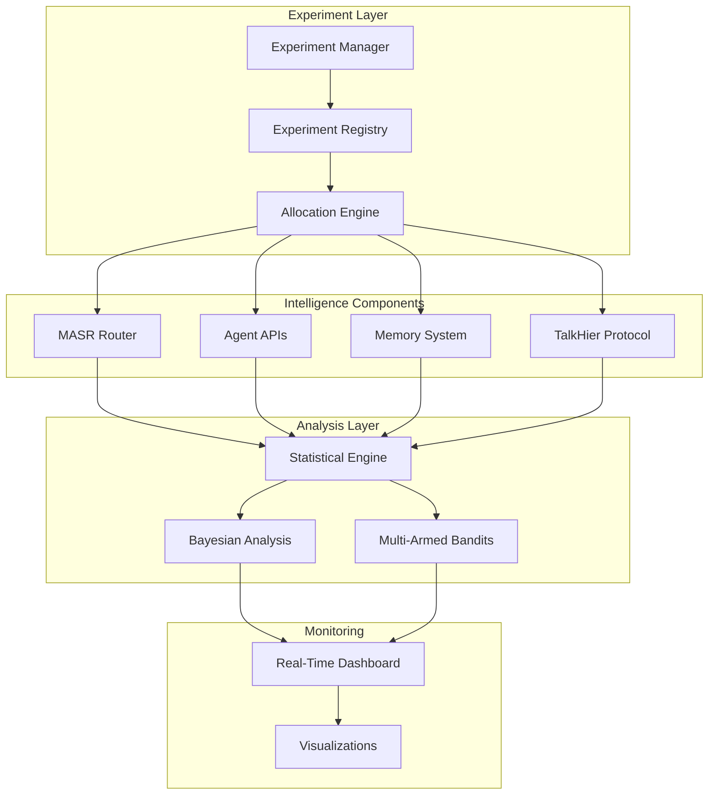

# System-Wide A/B Testing Overview

## Executive Summary

The Enhanced State-of-the-Art A/B Testing System transforms Cerebro from a sophisticated but static AI platform into a continuously self-improving intelligence system. Unlike traditional A/B testing that focuses solely on UI elements or prompts, this system enables experimentation and optimization across ALL intelligence components of the Cerebro AI Brain platform.

## Evolution from Traditional to System-Wide Testing

### Traditional A/B Testing (What We're Moving Beyond)
- Focus on prompt variations and text templates
- Simple binary comparisons (A vs B)
- Static configuration after winner selection
- Limited to surface-level optimizations

### Enhanced System-Wide Testing (Our Approach)
- **MASR Routing Strategies**: Test cost_efficient vs quality_focused vs balanced routing
- **Agent Framework API Patterns**: Optimize Primary (90%) vs Bypass (10%) API usage
- **Memory System Intelligence**: Experiment with tier retrieval and cross-tier integration
- **Hierarchical Coordination**: Test supervisor allocation and TalkHier protocol variations
- **Execution Patterns**: Compare Chain-of-Agents vs Mixture-of-Agents effectiveness

## Research Foundation

Our approach is grounded in cutting-edge research:

### Academic Papers Influencing Design
1. **"MasRouter: Learning to Route LLMs"** (2025)
   - Reinforcement learning for routing optimization
   - 50-60% cost reduction through intelligent model selection
   - Informs our MASR routing experiments

2. **"LLMs Working in Harmony"** (2025)
   - Chain-of-Agents and Mixture-of-Agents patterns
   - Ensemble methods for improved accuracy
   - Guides our execution pattern experiments

3. **"Talk Structurally, Act Hierarchically"** (2025)
   - Hierarchical communication protocols
   - Multi-round refinement strategies
   - Shapes our TalkHier protocol experiments

4. **Anthropic's Production Learnings** (2025)
   - "Evaluation is everything" philosophy
   - Continuous improvement through experimentation
   - Drives our self-improving platform vision

## Architecture Overview

### Core Components

```
src/ai_brain/experimentation/
├── core/                         # Foundation Layer
│   ├── unified_experiment_manager.py
│   ├── system_experiment_registry.py
│   └── adaptive_allocation_engine.py
├── statistical/                  # Analysis Layer
│   ├── enhanced_statistical_engine.py
│   ├── bayesian_experiment_design.py
│   └── multi_variate_analysis.py
├── integration/                  # System Integration
│   ├── masr_experiment_integration.py
│   ├── api_pattern_experiments.py
│   ├── memory_experiments.py
│   └── talkhier_experiments.py
└── monitoring/                   # Observability
    ├── real_time_dashboard.py
    └── experiment_visualization.py
```

### Integration Architecture



## Self-Improving Intelligence Engine

### Continuous Learning Loop

1. **Hypothesis Generation**
   - System performance analysis identifies optimization opportunities
   - Automated hypothesis creation based on patterns

2. **Experiment Design**
   - Bayesian optimization for parameter selection
   - Multi-variate testing for complex interactions
   - Contextual bandits for adaptive allocation

3. **Execution & Monitoring**
   - Real-time performance tracking
   - Statistical significance detection
   - Automated early stopping for failed experiments

4. **Analysis & Decision**
   - Causal inference for impact assessment
   - Cost-benefit analysis including resource usage
   - Automated winner promotion to production

5. **Learning & Adaptation**
   - Update routing strategies based on results
   - Refine experiment design patterns
   - Meta-learning for better future experiments

## Experiment Types and Examples

### 1. MASR Routing Strategy Experiments

**Hypothesis**: Different query types benefit from different routing strategies

**Variations**:
- A: Cost-efficient routing (minimize API costs)
- B: Quality-focused routing (maximize output quality)
- C: Balanced routing (optimize cost/quality ratio)
- D: Adaptive routing (contextual selection based on query)

**Metrics**:
- Cost per query
- Response quality score
- User satisfaction rating
- Latency distribution

### 2. Agent API Pattern Experiments

**Hypothesis**: Primary (MASR-routed) vs Bypass (direct) API usage patterns affect performance

**Variations**:
- A: 90% Primary / 10% Bypass (current baseline)
- B: 95% Primary / 5% Bypass (more intelligent routing)
- C: 85% Primary / 15% Bypass (more direct control)
- D: Dynamic allocation based on query complexity

**Metrics**:
- System throughput
- Error rates
- Cost optimization effectiveness
- Developer satisfaction scores

### 3. Memory System Optimization

**Hypothesis**: Memory tier usage patterns impact retrieval performance

**Variations**:
- A: Aggressive caching in working memory
- B: Balanced distribution across tiers
- C: Semantic memory prioritization
- D: Adaptive tier selection based on access patterns

**Metrics**:
- Memory retrieval latency
- Cache hit rates
- Cross-tier integration efficiency
- Storage cost optimization

### 4. TalkHier Protocol Refinement

**Hypothesis**: Multi-round refinement parameters affect consensus quality

**Variations**:
- A: 2-round maximum (speed priority)
- B: 3-round maximum (balanced)
- C: 5-round maximum (quality priority)
- D: Adaptive rounds based on uncertainty

**Metrics**:
- Consensus quality score
- Time to consensus
- Worker agreement rates
- Final output accuracy

### 5. Execution Pattern Selection

**Hypothesis**: Chain vs Mixture patterns suit different task types

**Variations**:
- A: Always Chain-of-Agents (sequential)
- B: Always Mixture-of-Agents (parallel)
- C: Complexity-based selection
- D: Domain-based selection

**Metrics**:
- Task completion time
- Resource utilization
- Output quality metrics
- System scalability

## Implementation Phases

### Phase 1: System-Wide Experimentation Framework (Weeks 1-2)
- Extend PromptVersionManager for system-wide experiments
- Create unified ExperimentRegistry
- Implement metrics collection across all components
- Build statistical framework foundation

### Phase 2: MASR and API Pattern Optimization (Weeks 3-4)
- Deploy routing strategy experiments
- Test API pattern variations
- Implement execution strategy comparisons
- Launch memory system experiments

### Phase 3: Multi-Armed Bandits Integration (Weeks 5-6)
- Deploy Thompson sampling for routing
- Implement contextual bandits
- Enable adaptive allocation
- Optimize exploration/exploitation

### Phase 4: Real-Time Adaptive Intelligence (Weeks 7-8)
- Launch live experimentation platform
- Enable adaptive traffic allocation
- Implement automated significance detection
- Deploy real-time dashboards

### Phase 5: Self-Improving Engine (Weeks 9-10)
- Enable self-generating experiments
- Implement meta-learning
- Deploy Bayesian optimization
- Production rollout with monitoring

## Expected Outcomes

### Performance Improvements
- **40% overall system performance gain** through optimization
- **50-60% cost reduction** via intelligent routing
- **25% quality improvement** in complex tasks
- **30% faster experiment convergence** with bandits

### Platform Capabilities
- **Continuous self-improvement** without manual intervention
- **Adaptive intelligence** responding to usage patterns
- **Data-driven decision making** at all system levels
- **Competitive advantage** through constant evolution

### Business Impact
- **Reduced operational costs** through optimization
- **Improved user satisfaction** via quality enhancements
- **Faster innovation cycles** with automated experimentation
- **Market leadership** in self-improving AI systems

## Success Metrics

### Technical Metrics
- Experiment velocity: >10 experiments running concurrently
- Statistical rigor: p < 0.05 with proper corrections
- Convergence speed: <1000 samples for significance
- System stability: <1% degradation during experiments

### Business Metrics
- Cost reduction: 50% lower API costs
- Quality improvement: 25% higher satisfaction
- Innovation speed: 2x faster feature optimization
- Platform differentiation: First self-improving AI Brain

## Risk Mitigation

### Technical Risks
- **Experiment interference**: Isolated experiment domains
- **Statistical validity**: Rigorous hypothesis testing
- **System stability**: Automatic rollback mechanisms
- **Performance impact**: Resource allocation limits

### Operational Risks
- **Complexity management**: Phased rollout approach
- **Team training**: Comprehensive documentation
- **Monitoring overhead**: Automated dashboards
- **Decision fatigue**: Automated winner selection

## Conclusion

The Enhanced State-of-the-Art A/B Testing System represents a paradigm shift in AI platform development. By enabling system-wide experimentation and self-improvement, Cerebro will continuously evolve and optimize itself, maintaining competitive advantage through data-driven intelligence enhancement.

This is not just an A/B testing system - it's the foundation for a self-improving, adaptive AI Brain that learns from every interaction and continuously optimizes its intelligence capabilities.