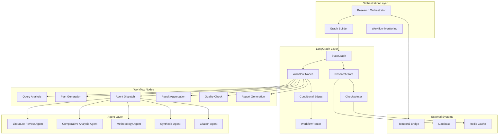

# LangGraph Integration Documentation

## Overview

The Multi-Agent Research Platform leverages LangGraph for sophisticated workflow orchestration, providing advanced agent coordination, conditional routing, and state management. This document details the LangGraph integration architecture, implementation patterns, and operational procedures.

## Architecture

### LangGraph in the Research Platform



### Core Components

**StateGraph**: The main workflow graph container
**ResearchState**: Immutable state object passed between nodes
**Workflow Nodes**: Individual processing units (query analysis, agent dispatch, etc.)
**Conditional Edges**: Dynamic routing logic based on state
**Checkpointer**: State persistence and recovery mechanism
**Router**: Intelligent workflow routing and parallel execution

## State Management

### ResearchState Structure

The `ResearchState` is an immutable dataclass that carries all workflow information:

```python
@dataclass(frozen=True)
class ResearchState:
    """Immutable state for research workflows."""
    
    # Core project information
    project_id: str
    research_query: str
    domains: list[str]
    
    # Workflow metadata
    workflow_id: str
    current_phase: WorkflowPhase
    created_at: datetime
    
    # Execution state
    agent_tasks: dict[str, AgentTaskState]
    completed_phases: set[WorkflowPhase]
    
    # Results and context
    context: dict[str, Any]
    intermediate_results: dict[str, Any]
    final_results: dict[str, Any] | None
    
    # Quality and error tracking
    quality_score: float
    errors: list[str]
    
    def with_phase(self, phase: WorkflowPhase) -> "ResearchState":
        """Create new state with updated phase."""
        return replace(self, current_phase=phase)
    
    def add_context(self, key: str, value: Any) -> "ResearchState":
        """Add context data, returning new state."""
        new_context = {**self.context, key: value}
        return replace(self, context=new_context)
    
    def complete_agent_task(self, task_id: str, result: AgentResult) -> "ResearchState":
        """Mark agent task as completed with result."""
        if task_id not in self.agent_tasks:
            raise ValueError(f"Task {task_id} not found")
        
        updated_task = self.agent_tasks[task_id].with_result(result)
        new_tasks = {**self.agent_tasks, task_id: updated_task}
        
        return replace(self, agent_tasks=new_tasks)
```

### Agent Task State

Individual agent execution state is tracked immutably:

```python
@dataclass(frozen=True)
class AgentTaskState:
    """Immutable state for individual agent tasks."""
    
    task_id: str
    agent_type: str
    status: AgentExecutionStatus
    input_data: dict[str, Any]
    result: AgentResult | None = None
    error: str | None = None
    retry_count: int = 0
    started_at: datetime | None = None
    completed_at: datetime | None = None
    
    def with_status(self, status: AgentExecutionStatus) -> "AgentTaskState":
        """Create new state with updated status."""
        return AgentTaskState(
            task_id=self.task_id,
            agent_type=self.agent_type,
            status=status,
            input_data=self.input_data,
            result=self.result,
            error=self.error,
            retry_count=self.retry_count,
            started_at=datetime.now(UTC) if status == AgentExecutionStatus.IN_PROGRESS else self.started_at,
            completed_at=self.completed_at,
        )
```

## Workflow Nodes

### Node Implementation Pattern

All workflow nodes follow a consistent pattern:

```python
async def workflow_node(state: ResearchState) -> ResearchState:
    """
    Standard workflow node pattern.
    
    Args:
        state: Current immutable state
        
    Returns:
        New immutable state with updates
    """
    logger.info(f"Executing {node_name}")
    
    try:
        # 1. Extract required data from state
        input_data = extract_node_inputs(state)
        
        # 2. Perform node logic
        result = await execute_node_logic(input_data)
        
        # 3. Update state immutably
        updated_state = state.add_context(f"{node_name}_result", result)
        updated_state = updated_state.with_phase(next_phase)
        
        logger.info(f"Node {node_name} completed successfully")
        return updated_state
        
    except Exception as e:
        logger.error(f"Node {node_name} failed: {e}")
        error_state = state.add_error(f"{node_name}: {str(e)}")
        return error_state.with_phase(WorkflowPhase.FAILED)
```

### Core Workflow Nodes

#### Query Analysis Node

Analyzes the research query to determine execution strategy:

```python
async def query_analysis_node(state: ResearchState) -> ResearchState:
    """
    Analyze the research query and determine execution strategy.
    
    This node:
    1. Parses the research query
    2. Identifies required agents
    3. Determines execution order
    4. Sets up initial context
    """
    logger.info("Analyzing research query")
    
    try:
        # Parse query components
        query_components = {
            "main_question": state.research_query,
            "domains": state.domains,
            "complexity": assess_query_complexity(state.research_query),
            "required_agents": determine_required_agents(state.domains),
            "estimated_duration": estimate_execution_time(state.research_query, state.domains)
        }
        
        # Create execution plan
        execution_plan = {
            "phases": determine_execution_phases(query_components),
            "parallel_groups": identify_parallel_opportunities(query_components),
            "dependencies": map_agent_dependencies(query_components["required_agents"])
        }
        
        # Update state with analysis results
        updated_state = state.add_context("query_analysis", query_components)
        updated_state = updated_state.add_context("execution_plan", execution_plan)
        updated_state = updated_state.with_phase(WorkflowPhase.PLAN_GENERATION)
        
        logger.info(f"Query analysis complete. Required agents: {query_components['required_agents']}")
        return updated_state
        
    except Exception as e:
        logger.error(f"Query analysis failed: {e}")
        return state.add_error(f"Query analysis: {str(e)}").with_phase(WorkflowPhase.FAILED)
```

#### Plan Generation Node

Creates a detailed research plan based on query analysis:

```python
async def plan_generation_node(state: ResearchState) -> ResearchState:
    """
    Generate detailed research plan based on query analysis.
    
    Creates a structured plan with phases, milestones, and resource allocation.
    """
    logger.info("Generating research plan")
    
    try:
        # Extract analysis results
        query_analysis = state.context.get("query_analysis", {})
        execution_plan = state.context.get("execution_plan", {})
        
        # Generate detailed research plan
        research_plan = {
            "title": f"Research Plan: {state.research_query}",
            "phases": create_detailed_phases(execution_plan.get("phases", [])),
            "resource_allocation": allocate_resources(query_analysis.get("required_agents", [])),
            "timeline": create_timeline(execution_plan.get("phases", [])),
            "quality_gates": define_quality_gates(state.domains),
            "contingency_plans": create_contingency_plans(query_analysis.get("complexity", "medium"))
        }
        
        # Initialize agent tasks based on plan
        agent_tasks = initialize_agent_tasks(research_plan, state)
        
        # Update state with plan and tasks
        updated_state = state.add_context("research_plan", research_plan)
        updated_state = replace(updated_state, agent_tasks=agent_tasks)
        updated_state = updated_state.with_phase(WorkflowPhase.LITERATURE_REVIEW)
        
        logger.info(f"Research plan generated with {len(agent_tasks)} agent tasks")
        return updated_state
        
    except Exception as e:
        logger.error(f"Plan generation failed: {e}")
        return state.add_error(f"Plan generation: {str(e)}").with_phase(WorkflowPhase.FAILED)
```

#### Agent Dispatch Node

Coordinates agent execution with intelligent parallel processing:

```python
async def agent_dispatch_node(state: ResearchState) -> ResearchState:
    """
    Dispatch and execute agent tasks with parallel coordination.
    
    This node:
    1. Identifies agents ready for execution
    2. Determines parallel execution opportunities
    3. Dispatches tasks to agents
    4. Collects and validates results
    """
    logger.info("Dispatching agent tasks")
    
    try:
        # Identify ready agents
        ready_agents = identify_ready_agents(state)
        if not ready_agents:
            logger.info("No agents ready for execution")
            return state.with_phase(WorkflowPhase.SYNTHESIS)
        
        logger.info(f"Dispatching {len(ready_agents)} agents")
        
        # Determine execution strategy
        can_parallel = can_execute_parallel(ready_agents, state)
        
        if can_parallel and len(ready_agents) > 1:
            # Execute agents in parallel
            results = await execute_agents_parallel(ready_agents, state)
        else:
            # Execute agents sequentially
            results = await execute_agents_sequential(ready_agents, state)
        
        # Update state with results
        updated_state = state
        for agent_type, result in results.items():
            if result["status"] == "success":
                task_id = result["task_id"]
                updated_state = updated_state.complete_agent_task(task_id, result["result"])
                logger.info(f"Agent {agent_type} completed successfully")
            else:
                task_id = result["task_id"]
                updated_state = updated_state.fail_agent_task(task_id, result["error"])
                logger.error(f"Agent {agent_type} failed: {result['error']}")
        
        # Determine next phase
        if all_critical_agents_complete(updated_state):
            next_phase = WorkflowPhase.SYNTHESIS
        else:
            next_phase = WorkflowPhase.LITERATURE_REVIEW  # Continue agent execution
        
        return updated_state.with_phase(next_phase)
        
    except Exception as e:
        logger.error(f"Agent dispatch failed: {e}")
        return state.add_error(f"Agent dispatch: {str(e)}").with_phase(WorkflowPhase.FAILED)
```

#### Result Aggregation Node

Combines results from multiple agents:

```python
async def result_aggregation_node(state: ResearchState) -> ResearchState:
    """
    Aggregate results from completed agent tasks.
    
    This node:
    1. Collects results from all completed agents
    2. Performs deduplication and merging
    3. Creates unified research dataset
    4. Calculates aggregate quality metrics
    """
    logger.info("Aggregating agent results")
    
    try:
        # Collect completed agent results
        completed_results = {}
        for task_id, task_state in state.agent_tasks.items():
            if task_state.status == AgentExecutionStatus.COMPLETED and task_state.result:
                completed_results[task_state.agent_type] = task_state.result
        
        if not completed_results:
            logger.warning("No completed agent results to aggregate")
            return state.add_error("No agent results available").with_phase(WorkflowPhase.FAILED)
        
        # Perform aggregation
        aggregated_data = {
            "sources": aggregate_sources(completed_results),
            "findings": aggregate_findings(completed_results),
            "insights": synthesize_insights(completed_results),
            "citations": collect_citations(completed_results),
            "metadata": calculate_aggregate_metadata(completed_results)
        }
        
        # Calculate quality score
        quality_score = calculate_aggregate_quality(completed_results, aggregated_data)
        
        # Update state with aggregated results
        updated_state = state.add_context("aggregated_results", aggregated_data)
        updated_state = replace(updated_state, quality_score=quality_score)
        updated_state = updated_state.with_phase(WorkflowPhase.QUALITY_CHECK)
        
        logger.info(f"Aggregation complete. Quality score: {quality_score:.2f}")
        return updated_state
        
    except Exception as e:
        logger.error(f"Result aggregation failed: {e}")
        return state.add_error(f"Result aggregation: {str(e)}").with_phase(WorkflowPhase.FAILED)
```

#### Quality Check Node

Validates research quality and determines if additional work is needed:

```python
async def quality_check_node(state: ResearchState) -> ResearchState:
    """
    Perform quality checks on aggregated results.
    
    This node:
    1. Validates result completeness
    2. Checks source quality and diversity
    3. Assesses methodological rigor
    4. Determines if re-work is needed
    """
    logger.info("Performing quality checks")
    
    try:
        aggregated_results = state.context.get("aggregated_results", {})
        
        # Perform quality assessments
        quality_checks = {
            "completeness": assess_completeness(aggregated_results),
            "source_quality": assess_source_quality(aggregated_results.get("sources", [])),
            "diversity": assess_source_diversity(aggregated_results.get("sources", [])),
            "methodology": assess_methodology_rigor(state.agent_tasks),
            "consistency": assess_result_consistency(aggregated_results.get("findings", [])),
            "citation_quality": assess_citation_quality(aggregated_results.get("citations", []))
        }
        
        # Calculate overall quality score
        overall_quality = calculate_overall_quality(quality_checks)
        quality_threshold = 0.7  # Configurable threshold
        
        # Determine next action
        if overall_quality >= quality_threshold:
            next_phase = WorkflowPhase.REPORT_GENERATION
            logger.info(f"Quality check passed. Score: {overall_quality:.2f}")
        else:
            # Identify specific improvements needed
            improvements_needed = identify_quality_improvements(quality_checks)
            
            # Check if we can retry
            retry_count = state.context.get("quality_retry_count", 0)
            max_retries = 2
            
            if retry_count < max_retries:
                # Schedule additional agent work
                additional_tasks = create_improvement_tasks(improvements_needed, state)
                updated_state = schedule_additional_work(state, additional_tasks)
                updated_state = updated_state.add_context("quality_retry_count", retry_count + 1)
                next_phase = WorkflowPhase.LITERATURE_REVIEW
                logger.info(f"Quality below threshold ({overall_quality:.2f}). Scheduling additional work.")
            else:
                # Accept current quality but note issues
                next_phase = WorkflowPhase.REPORT_GENERATION
                logger.warning(f"Quality below threshold ({overall_quality:.2f}) but max retries reached.")
        
        # Update state with quality assessment
        updated_state = state.add_context("quality_assessment", quality_checks)
        updated_state = replace(updated_state, quality_score=overall_quality)
        updated_state = updated_state.with_phase(next_phase)
        
        return updated_state
        
    except Exception as e:
        logger.error(f"Quality check failed: {e}")
        return state.add_error(f"Quality check: {str(e)}").with_phase(WorkflowPhase.FAILED)
```

#### Report Generation Node

Creates the final research report:

```python
async def report_generation_node(state: ResearchState) -> ResearchState:
    """
    Generate the final research report.
    
    This node:
    1. Compiles all research findings
    2. Generates structured report
    3. Formats citations and bibliography
    4. Creates executive summary
    """
    logger.info("Generating final research report")
    
    try:
        # Compile report data
        report_data = {
            "project_metadata": {
                "project_id": state.project_id,
                "research_query": state.research_query,
                "domains": state.domains,
                "execution_time": calculate_execution_time(state),
                "quality_score": state.quality_score
            },
            "research_plan": state.context.get("research_plan", {}),
            "aggregated_results": state.context.get("aggregated_results", {}),
            "quality_assessment": state.context.get("quality_assessment", {}),
            "agent_contributions": compile_agent_contributions(state.agent_tasks)
        }
        
        # Generate report using report service
        from src.services.report_generator import ReportGenerator
        from src.services.report_config import create_report_settings
        
        settings = create_report_settings()
        generator = ReportGenerator(settings)
        
        report_config = create_report_configuration(state)
        report_request = create_report_request(report_data, report_config)
        
        # Generate the report
        report_response = await generator.generate_report(report_request)
        
        if report_response.status == "completed":
            final_results = {
                "report_id": report_response.report_id,
                "report_content": report_response.content,
                "formats_generated": report_response.formats_generated,
                "quality_score": state.quality_score,
                "metadata": report_data["project_metadata"]
            }
            
            # Update state with final results
            updated_state = replace(state, final_results=final_results)
            updated_state = updated_state.with_phase(WorkflowPhase.COMPLETED)
            
            logger.info(f"Report generation completed. Report ID: {report_response.report_id}")
            return updated_state
        else:
            error_msg = f"Report generation failed: {report_response.errors}"
            logger.error(error_msg)
            return state.add_error(error_msg).with_phase(WorkflowPhase.FAILED)
        
    except Exception as e:
        logger.error(f"Report generation failed: {e}")
        return state.add_error(f"Report generation: {str(e)}").with_phase(WorkflowPhase.FAILED)
```

## Conditional Routing

### Workflow Router

The `WorkflowRouter` provides intelligent routing between nodes:

```python
class WorkflowRouter:
    """Intelligent routing for workflow transitions."""
    
    def __init__(self, config: RouterConfig):
        self.config = config
        self.routing_rules = self._build_routing_rules()
    
    def route_next_node(self, state: ResearchState) -> str:
        """Determine the next node based on current state."""
        
        current_phase = state.current_phase
        
        # Check for error conditions
        if len(state.errors) > self.config.max_errors:
            return "END"
        
        # Apply routing rules
        for rule in self.routing_rules:
            if rule.applies_to_state(state):
                next_node = rule.get_next_node(state)
                logger.info(f"Routing from {current_phase} to {next_node}")
                return next_node
        
        # Default routing
        return self._get_default_next_node(current_phase)
    
    def can_execute_parallel(self, agents: list[str], state: ResearchState) -> bool:
        """Determine if agents can execute in parallel."""
        
        if not self.config.enable_parallel_execution:
            return False
        
        # Check dependencies
        for agent in agents:
            dependencies = self._get_agent_dependencies(agent, state)
            if any(dep not in state.get_completed_agents() for dep in dependencies):
                return False
        
        return len(agents) <= self.config.max_parallel_agents
```

### Conditional Edges

LangGraph conditional edges enable dynamic workflow routing:

```python
def quality_gate(state: ResearchState) -> str:
    """
    Quality gate routing logic.
    
    Routes based on quality assessment results.
    """
    quality_score = state.quality_score
    quality_threshold = 0.7
    
    if quality_score >= quality_threshold:
        return "report_generation"
    else:
        retry_count = state.context.get("quality_retry_count", 0)
        max_retries = 2
        
        if retry_count < max_retries:
            return "additional_research"
        else:
            return "report_generation"  # Proceed despite low quality

def agent_completion_gate(state: ResearchState) -> str:
    """
    Agent completion routing logic.
    
    Routes based on agent task completion status.
    """
    # Check if all critical agents are complete
    critical_agents = ["literature_review", "synthesis"]
    completed_agents = state.get_completed_agents()
    
    critical_complete = all(agent in completed_agents for agent in critical_agents)
    
    if critical_complete:
        return "result_aggregation"
    else:
        # Check if more agents are ready
        ready_agents = identify_ready_agents(state)
        if ready_agents:
            return "agent_dispatch"
        else:
            return "result_aggregation"  # Proceed with available results

def error_handling_gate(state: ResearchState) -> str:
    """
    Error handling routing logic.
    
    Routes based on error conditions and recovery strategies.
    """
    if len(state.errors) == 0:
        return "continue"
    
    # Categorize errors
    critical_errors = [error for error in state.errors if "critical" in error.lower()]
    recoverable_errors = [error for error in state.errors if error not in critical_errors]
    
    if critical_errors:
        return "END"
    elif len(recoverable_errors) > 3:
        return "END"
    else:
        return "continue"
```

## Graph Construction

### ResearchGraphBuilder

The `ResearchGraphBuilder` provides a fluent interface for graph construction:

```python
class ResearchGraphBuilder:
    """Builder for constructing research workflow graphs."""
    
    def __init__(self, config: GraphConfig | None = None):
        self.config = config or GraphConfig()
        self.nodes: dict[str, NodeConfig] = {}
        self.edges: list[EdgeConfig] = []
        self.router = WorkflowRouter(self.config.router_config)
    
    def add_node(self, name: str, handler: Callable, phase: WorkflowPhase, **kwargs) -> "ResearchGraphBuilder":
        """Add a node to the graph."""
        node_config = NodeConfig(
            name=name,
            handler=handler,
            phase=phase,
            **kwargs
        )
        self.nodes[name] = node_config
        return self
    
    def add_edge(self, source: str, target: str, condition: Callable | None = None) -> "ResearchGraphBuilder":
        """Add an edge to the graph."""
        edge_config = EdgeConfig(
            source=source,
            target=target,
            condition=condition
        )
        self.edges.append(edge_config)
        return self
    
    def add_conditional_edges(self, source: str, path_map: dict[str, str], path_selector: Callable) -> "ResearchGraphBuilder":
        """Add conditional edges with routing logic."""
        for condition, target in path_map.items():
            edge_config = EdgeConfig(
                source=source,
                target=target,
                condition=lambda state: path_selector(state) == condition
            )
            self.edges.append(edge_config)
        return self
    
    def build(self) -> StateGraph:
        """Build the complete workflow graph."""
        
        # Create LangGraph StateGraph
        graph = StateGraph(ResearchState)
        
        # Add all nodes
        for name, node_config in self.nodes.items():
            graph.add_node(name, node_config.handler)
        
        # Add all edges
        for edge_config in self.edges:
            if edge_config.condition:
                # Conditional edge
                graph.add_conditional_edges(
                    edge_config.source,
                    edge_config.condition,
                    {True: edge_config.target, False: "END"}
                )
            else:
                # Simple edge
                graph.add_edge(edge_config.source, edge_config.target)
        
        # Set entry point
        graph.set_entry_point("query_analysis")
        
        return graph
    
    def build_default_research_graph(self) -> StateGraph:
        """Build the default research workflow graph."""
        
        return (self
            # Core workflow nodes
            .add_node("query_analysis", query_analysis_node, WorkflowPhase.QUERY_ANALYSIS)
            .add_node("plan_generation", plan_generation_node, WorkflowPhase.PLAN_GENERATION)
            .add_node("agent_dispatch", agent_dispatch_node, WorkflowPhase.LITERATURE_REVIEW)
            .add_node("result_aggregation", result_aggregation_node, WorkflowPhase.SYNTHESIS)
            .add_node("quality_check", quality_check_node, WorkflowPhase.QUALITY_CHECK)
            .add_node("report_generation", report_generation_node, WorkflowPhase.REPORT_GENERATION)
            
            # Sequential flow
            .add_edge("query_analysis", "plan_generation")
            .add_edge("plan_generation", "agent_dispatch")
            
            # Conditional routing for agent execution
            .add_conditional_edges(
                "agent_dispatch",
                {
                    "continue": "agent_dispatch",  # More agents to execute
                    "complete": "result_aggregation"  # All agents complete
                },
                agent_completion_gate
            )
            
            .add_edge("result_aggregation", "quality_check")
            
            # Quality gate routing
            .add_conditional_edges(
                "quality_check",
                {
                    "pass": "report_generation",
                    "retry": "agent_dispatch",
                    "fail": "report_generation"  # Proceed despite quality issues
                },
                quality_gate
            )
            
            .add_edge("report_generation", END)
            
            .build()
        )
```

## Checkpointing and Recovery

### Checkpoint Storage

LangGraph supports persistent checkpointing for workflow recovery:

```python
class WorkflowCheckpointer:
    """Manages workflow checkpoints for recovery."""
    
    def __init__(self, storage_type: str = "memory"):
        if storage_type == "memory":
            self.storage = MemoryCheckpointStorage()
        elif storage_type == "file":
            self.storage = FileCheckpointStorage()
        elif storage_type == "redis":
            self.storage = RedisCheckpointStorage()
        else:
            raise ValueError(f"Unknown storage type: {storage_type}")
    
    async def save_checkpoint(self, workflow_id: str, state: ResearchState) -> str:
        """Save workflow checkpoint."""
        checkpoint_id = f"checkpoint_{workflow_id}_{int(time.time())}"
        
        checkpoint_data = {
            "checkpoint_id": checkpoint_id,
            "workflow_id": workflow_id,
            "state": state,
            "timestamp": datetime.now(UTC),
            "phase": state.current_phase,
            "progress": calculate_progress(state)
        }
        
        await self.storage.save(checkpoint_id, checkpoint_data)
        logger.info(f"Checkpoint saved: {checkpoint_id}")
        
        return checkpoint_id
    
    async def load_checkpoint(self, checkpoint_id: str) -> ResearchState:
        """Load workflow checkpoint."""
        checkpoint_data = await self.storage.load(checkpoint_id)
        
        if not checkpoint_data:
            raise ValueError(f"Checkpoint {checkpoint_id} not found")
        
        logger.info(f"Checkpoint loaded: {checkpoint_id}")
        return checkpoint_data["state"]
    
    async def list_checkpoints(self, workflow_id: str) -> list[str]:
        """List available checkpoints for workflow."""
        return await self.storage.list_checkpoints(workflow_id)
```

### Recovery Strategies

```python
async def recover_workflow(
    orchestrator: ResearchOrchestrator,
    workflow_id: str,
    recovery_strategy: str = "latest"
) -> WorkflowResult:
    """
    Recover a failed or interrupted workflow.
    
    Args:
        orchestrator: Research orchestrator instance
        workflow_id: ID of workflow to recover
        recovery_strategy: Recovery strategy (latest, best_quality, specific)
    
    Returns:
        Result of recovered workflow execution
    """
    checkpointer = orchestrator.checkpointer
    
    # List available checkpoints
    checkpoints = await checkpointer.list_checkpoints(workflow_id)
    
    if not checkpoints:
        raise ValueError(f"No checkpoints found for workflow {workflow_id}")
    
    # Select checkpoint based on strategy
    if recovery_strategy == "latest":
        checkpoint_id = checkpoints[-1]
    elif recovery_strategy == "best_quality":
        checkpoint_id = await select_best_quality_checkpoint(checkpoints, checkpointer)
    else:
        checkpoint_id = recovery_strategy  # Specific checkpoint ID
    
    # Load checkpoint state
    recovered_state = await checkpointer.load_checkpoint(checkpoint_id)
    
    logger.info(f"Recovering workflow {workflow_id} from checkpoint {checkpoint_id}")
    
    # Resume workflow execution
    return await orchestrator.resume_workflow(recovered_state)
```

## Integration with Temporal

### Temporal Bridge

The LangGraph workflows integrate with Temporal through a bridge pattern:

```python
class TemporalLangGraphBridge:
    """Bridge between Temporal workflows and LangGraph."""
    
    def __init__(self, temporal_client, langgraph_orchestrator):
        self.temporal_client = temporal_client
        self.orchestrator = langgraph_orchestrator
    
    async def execute_langgraph_from_temporal(
        self,
        workflow_data: dict[str, Any],
        workflow_id: str
    ) -> dict[str, Any]:
        """Execute LangGraph workflow from Temporal activity."""
        
        # Create research state from Temporal data
        initial_state = self._create_initial_state(workflow_data, workflow_id)
        
        # Execute LangGraph workflow
        result = await self.orchestrator.execute_research(initial_state)
        
        # Convert result back to Temporal format
        return self._convert_result_for_temporal(result)
    
    def _create_initial_state(self, workflow_data: dict, workflow_id: str) -> ResearchState:
        """Create initial ResearchState from Temporal workflow data."""
        return ResearchState(
            project_id=workflow_data["project_id"],
            research_query=workflow_data["query"]["text"],
            domains=workflow_data["query"]["domains"],
            workflow_id=workflow_id,
            current_phase=WorkflowPhase.INITIALIZATION,
            created_at=datetime.now(UTC),
            agent_tasks={},
            completed_phases=set(),
            context={},
            intermediate_results={},
            final_results=None,
            quality_score=0.0,
            errors=[]
        )
```

### Hybrid Workflow Pattern

Combining Temporal's durability with LangGraph's intelligence:

```python
@workflow.defn
class HybridResearchWorkflow:
    """Temporal workflow that delegates to LangGraph."""
    
    @workflow.run
    async def run(self, project_data: dict[str, Any]) -> dict[str, Any]:
        """Execute hybrid workflow."""
        
        # Phase 1: Temporal initialization
        self._update_progress(5.0, "initialization")
        
        # Phase 2: LangGraph execution
        self._update_progress(10.0, "langgraph_execution")
        
        langgraph_result = await workflow.execute_activity(
            "execute_langgraph_workflow",
            project_data,
            start_to_close_timeout=timedelta(hours=1),
            retry_policy=RetryPolicy(maximum_attempts=3)
        )
        
        # Phase 3: Temporal finalization
        self._update_progress(90.0, "finalization")
        
        final_result = await workflow.execute_activity(
            "finalize_research_results",
            langgraph_result,
            start_to_close_timeout=timedelta(minutes=10)
        )
        
        self._update_progress(100.0, "completed")
        
        return final_result
```

## Monitoring and Observability

### Workflow Metrics

```python
from prometheus_client import Counter, Histogram, Gauge

# LangGraph metrics
langgraph_node_executions = Counter(
    'langgraph_node_executions_total',
    'Total node executions',
    ['node_name', 'status']
)

langgraph_node_duration = Histogram(
    'langgraph_node_duration_seconds',
    'Node execution duration',
    ['node_name']
)

langgraph_active_workflows = Gauge(
    'langgraph_active_workflows',
    'Number of active LangGraph workflows'
)

langgraph_quality_scores = Histogram(
    'langgraph_quality_scores',
    'Workflow quality scores'
)
```

### State Visualization

```python
def visualize_workflow_state(state: ResearchState) -> str:
    """Create visual representation of workflow state."""
    
    visualization = f"""
    Workflow State Visualization
    ===========================
    
    Project: {state.project_id}
    Query: {state.research_query}
    Phase: {state.current_phase.value}
    Quality Score: {state.quality_score:.2f}
    
    Agent Tasks:
    """
    
    for task_id, task_state in state.agent_tasks.items():
        status_icon = {
            AgentExecutionStatus.PENDING: "⏸",
            AgentExecutionStatus.IN_PROGRESS: "⟳",
            AgentExecutionStatus.COMPLETED: "✓",
            AgentExecutionStatus.FAILED: "✗",
            AgentExecutionStatus.SKIPPED: "⊘"
        }.get(task_state.status, "?")
        
        visualization += f"    {status_icon} {task_state.agent_type} ({task_state.status.value})\n"
    
    if state.errors:
        visualization += f"\n    Errors: {len(state.errors)}\n"
        for error in state.errors:
            visualization += f"      - {error}\n"
    
    return visualization
```

## Testing Strategies

### Unit Testing Nodes

```python
@pytest.mark.asyncio
async def test_query_analysis_node():
    """Test query analysis node functionality."""
    
    # Create test state
    initial_state = ResearchState(
        project_id="test-project",
        research_query="How does AI impact healthcare?",
        domains=["AI", "Healthcare"],
        workflow_id="test-workflow",
        current_phase=WorkflowPhase.INITIALIZATION,
        created_at=datetime.now(UTC),
        agent_tasks={},
        completed_phases=set(),
        context={},
        intermediate_results={},
        final_results=None,
        quality_score=0.0,
        errors=[]
    )
    
    # Execute node
    result_state = await query_analysis_node(initial_state)
    
    # Assertions
    assert result_state.current_phase == WorkflowPhase.PLAN_GENERATION
    assert "query_analysis" in result_state.context
    assert "execution_plan" in result_state.context
    assert len(result_state.errors) == 0
    
    # Verify analysis results
    query_analysis = result_state.context["query_analysis"]
    assert query_analysis["main_question"] == "How does AI impact healthcare?"
    assert "AI" in query_analysis["domains"]
    assert "Healthcare" in query_analysis["domains"]
```

### Integration Testing

```python
@pytest.mark.integration
async def test_complete_workflow_execution():
    """Test complete workflow execution."""
    
    # Create orchestrator
    config = OrchestratorConfig(
        enable_checkpointing=False,  # Disable for testing
        enable_parallel_execution=True,
        timeout_seconds=300
    )
    orchestrator = ResearchOrchestrator(config)
    
    # Create initial state
    initial_state = create_test_research_state()
    
    # Execute workflow
    result = await orchestrator.execute_research(initial_state)
    
    # Verify results
    assert result.success
    assert result.final_state.current_phase == WorkflowPhase.COMPLETED
    assert result.final_state.final_results is not None
    assert result.quality_score > 0.0
```

## Best Practices

### State Design

1. **Immutability**: Always use immutable state objects
2. **Minimal State**: Store only essential data in state
3. **Clear Structure**: Organize state data logically
4. **Type Safety**: Use proper type hints throughout

### Node Implementation

1. **Single Responsibility**: Each node should have one clear purpose
2. **Error Handling**: Comprehensive error handling in all nodes
3. **Logging**: Detailed logging for debugging and monitoring
4. **Idempotency**: Nodes should be safely re-executable

### Routing Logic

1. **Clear Conditions**: Make routing conditions explicit and testable
2. **Fallback Paths**: Always provide fallback routing options
3. **Error Routes**: Handle error conditions in routing
4. **Documentation**: Document routing logic clearly

### Performance Optimization

1. **Parallel Execution**: Use parallel execution where possible
2. **State Size**: Keep state objects reasonably sized
3. **Checkpointing**: Use checkpointing strategically
4. **Resource Management**: Properly manage resources in nodes

This comprehensive LangGraph integration documentation provides the foundation for understanding, implementing, and extending the sophisticated workflow orchestration capabilities in the Multi-Agent Research Platform.