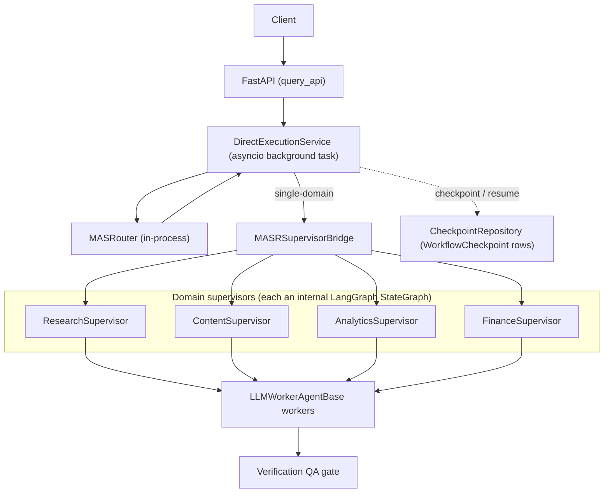
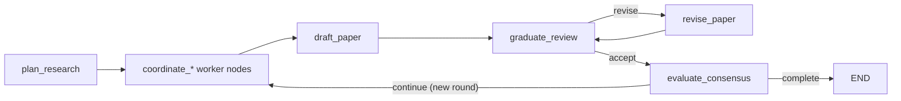

# LangGraph Integration

## Overview

Cerebro uses LangGraph (`langgraph>=0.2.0`, a hard dependency in `pyproject.toml`) **only inside its domain supervisors**. Each supervisor builds an internal `StateGraph` that drives its worker team through a coordinate-then-refine loop (the TalkHier protocol). There is no top-level LangGraph orchestrator: the former `src/orchestration/` subsystem (~8,961 lines) was removed in PR #50, and the Temporal integration it bridged to has been deleted along with it (`temporalio` is not a dependency; `TEMPORAL_HOST` / `TEMPORAL_NAMESPACE` remain in config as dead, vestigial settings).

The in-process execution engine that sits above the supervisors is `DirectExecutionService` (`src/api/services/direct_execution_service.py`), which replaced Temporal. This document describes where LangGraph actually lives, how requests reach it, and how checkpoint/resume works.

> **If you are looking for `ResearchState`, `ResearchGraphBuilder`, `WorkflowRouter`, `WorkflowCheckpointer`, `TemporalLangGraphBridge`, `HybridResearchWorkflow`, a global `orchestrator`, or nodes named `query_analysis_node` / `plan_generation_node` / `agent_dispatch_node` / etc. — none of these exist in the codebase.** They belonged to the deleted `src/orchestration/` subsystem.

## Where LangGraph lives

LangGraph is a per-supervisor implementation detail, not a platform-wide layer.

- Import and graph field: `src/agents/supervisors/base_supervisor.py` (`from langgraph.graph import StateGraph`, `self.workflow_graph`).
- Each concrete supervisor overrides `_build_workflow_graph()` to construct its own `StateGraph`: `research_supervisor.py`, `content_supervisor.py`, `analytics_supervisor.py`, `finance_supervisor.py`.
- The base class invokes the graph in `execute()` via `self.workflow_graph.ainvoke(langgraph_state)` (`base_supervisor.py`).

There are four domain supervisors — **Research, Content, Analytics, Finance** — and LangGraph exists inside each of them. Supervisor workers all derive from `LLMWorkerAgentBase`; they are prompt-driven LLM-reasoning agents, not coded decision engines.

## Request flow (what actually runs)

```mermaid
graph TB
    CLIENT["Client"]
    API["FastAPI (query_api)"]
    DES["DirectExecutionService (asyncio background task)"]
    MASR["MASRouter (in-process)"]
    BRIDGE["MASRSupervisorBridge"]

    subgraph SUPS["Domain supervisors (each an internal LangGraph StateGraph)"]
        RS["ResearchSupervisor"]
        CS["ContentSupervisor"]
        AS["AnalyticsSupervisor"]
        FS["FinanceSupervisor"]
    end

    WORKERS["LLMWorkerAgentBase workers"]
    VERIFY["Verification QA gate"]
    CKPT["CheckpointRepository (WorkflowCheckpoint rows)"]

    CLIENT --> API
    API --> DES
    DES --> MASR
    MASR --> DES
    DES -->|"single-domain"| BRIDGE
    BRIDGE --> RS
    BRIDGE --> CS
    BRIDGE --> AS
    BRIDGE --> FS
    RS --> WORKERS
    CS --> WORKERS
    AS --> WORKERS
    FS --> WORKERS
    WORKERS --> VERIFY
    DES -.->|"checkpoint / resume"| CKPT
```

1. `POST /api/v1/query/research` (and the `/analyze`, `/synthesize`, `/literature`, `/methodology`, `/comparison` wrappers) hands off to `DirectExecutionService.start_research_execution`, which spawns an **asyncio background task** (`_execute_research_workflow`) and returns immediately.
2. The immediate HTTP response contains **hardcoded placeholders**, not real routing output: `selected_agents=[]`, `estimated_cost=0.015`, `estimated_quality=0.85`, `confidence=0.85`, `routing_time_ms=50.0`. Real routing data is only available afterward via the execution-status endpoints (below).
3. The background task runs the true pipeline: MASR routing → one of three branches.

### The three execution branches

`_execute_research_workflow` calls `self.masr_router.route(query, context)` (the in-process `MASRouter`, `src/ai_brain/router/masr.py` — the standalone `masr-router` container on `:9100` is legacy and not on this path), then dispatches:

- **FAST_PATH** — when `routing_decision.collaboration_mode == CollaborationMode.FAST_PATH`, `_execute_fast_path` makes a **single LLM call that bypasses supervisors entirely** (no LangGraph). If its minimal quality gate rejects the response, the code mutates the collaboration mode to `DIRECT` and falls through to the supervisor path, so one request can incur both a fast-path call and a full supervisor run.
- **Multi-domain** — when the decomposition is multi-domain, domain subqueries run **concurrently** under an `asyncio.Semaphore` (default parallelism 4), gathered with `return_exceptions=True`; each domain re-routes and runs its own supervisor. Results are merged (`concat` by default, or `llm` via the SynthesisAgent). Partial success is supported: the run is still `completed` if any domain succeeds.
- **Single-domain** — builds an `AgentTask` and calls `MASRSupervisorBridge.execute_routing_decision(...)`, which maps the MASR routing decision to a supervisor (defaulting to `research`) and invokes that supervisor's LangGraph `StateGraph`.

`CollaborationMode` values are `FAST_PATH`, `DIRECT`, `PARALLEL`, `HIERARCHICAL`, `DEBATE`, `ENSEMBLE`. MASR never selects Chain-of-Agents or Mixture-of-Agents; CoA/MoA exist only as bypass endpoints (`POST /api/v1/agents/chain`, `POST /api/v1/agents/mixture`).

## Inside a supervisor's StateGraph

Each supervisor's graph implements a coordinate-then-refine loop rather than a fixed linear pipeline. For example, `ResearchSupervisor._build_workflow_graph()` builds a `StateGraph(dict)` with nodes such as `plan_research`, `coordinate_literature`, `validate_sources`, `coordinate_methodology`, `coordinate_analysis`, `coordinate_synthesis`, `coordinate_citation`, `draft_paper`, `graduate_review`, `revise_paper`, and `evaluate_consensus`. Two distinct loops operate here: `graduate_review` gates paper revision — it routes to `revise_paper` (which loops back to `graduate_review`) or, on `"accept"`, to `evaluate_consensus`; `evaluate_consensus` then gates round-level refinement, routing to `coordinate_literature` for a full new round (`"continue"`) or to `END` (`"complete"`) once consensus or a round cap is reached. (`accept`/`continue`/`complete` are conditional-edge labels, not nodes.)

```mermaid
graph LR
    PLAN["plan_research"]
    COORD["coordinate_* worker nodes"]
    DRAFT["draft_paper"]
    REVIEW["graduate_review"]
    REVISE["revise_paper"]
    EVAL["evaluate_consensus"]

    PLAN --> COORD
    COORD --> DRAFT
    DRAFT --> REVIEW
    REVIEW -->|"revise"| REVISE
    REVISE --> REVIEW
    REVIEW -->|"accept"| EVAL
    EVAL -->|"continue (new round)"| COORD
    EVAL -->|"complete"| END["END"]
```

Key facts about supervisor execution:

- Workers subclass `LLMWorkerAgentBase`; `verification` and `financial_calculator` are cross-cutting agents, not registered to any supervisor's worker team.
- The **verification QA gate** runs after worker aggregation (`base_supervisor._run_verification`), with MAST failure labels stored in supervision metadata; it allows one revision (`MAX_VERIFICATION_REVISION_ROUNDS=2`, i.e. initial attempt plus one revision).
- **Quality/confidence values are hardcoded heuristics, not model-reported quality**: worker confidence is 0.85 on success and 0.3 on empty output (`llm_worker_base.py`); the fast path emits a fixed `quality_score` of 0.8 (`direct_execution_service.py`) rather than a confidence value.

## Checkpointing and resume

Checkpoint/resume is handled by `DirectExecutionService` and `CheckpointRepository` writing `WorkflowCheckpoint` rows — **not** by LangGraph's own checkpointer.

- `DirectExecutionService._checkpoint(execution_status, phase)` writes a checkpoint at each of these phases: `masr_routing`, `supervisor_execution`, `completed`, and `fast_path_completed`.
- It degrades gracefully when no DB session factory is configured (logs and continues).
- `DirectExecutionService.resume_execution(project_id)` restores from the latest checkpoint and is exposed at `POST /api/v1/query/execution/{project_id}/resume`.

There is **no** top-level `WorkflowPhase` linear state machine and no `WorkflowCheckpointer` class; phase is a plain string set on the in-memory execution status and persisted per checkpoint.

### Execution status endpoints

Because `/research` returns placeholders, real progress and results come from:

- `GET /api/v1/query/execution/{execution_id}/status`
- `GET /api/v1/query/execution/{execution_id}/results`
- `POST /api/v1/query/execution/{project_id}/resume`

## Providers

Runtime is **Gemini-only by default** (`GEMINI_DEFAULT_MODEL=gemini-pro`). OpenRouter multi-provider routing (DeepSeek for the simple tier, Claude Sonnet for the complex tier) is **flag-gated OFF**: it requires both `MULTI_PROVIDER_ROUTING_ENABLED=True` and `OPENROUTER_API_KEY`. `DEEPSEEK_ENABLED`, `LLAMA_ENABLED`, and `OPENROUTER_ENABLED` all default to `False`. This gate is checked identically in the fast path and inside `LLMWorkerAgentBase`.

## What was removed (do not document as current)

| Item | Status |
|---|---|
| `src/orchestration/` top-level LangGraph orchestrator | Deleted (PR #50, ~8,961 lines). LangGraph survives **only** inside supervisors. |
| Temporal integration (`TemporalLangGraphBridge`, `HybridResearchWorkflow`, Temporal worker) | Removed. No `temporalio` dependency; `TEMPORAL_HOST` / `TEMPORAL_NAMESPACE` are dead settings; the k8s worker deployment is a Temporal-era vestige. |
| `ResearchState`, `AgentTaskState`, `ResearchGraphBuilder`, `WorkflowRouter`, `WorkflowCheckpointer`, global `orchestrator` | Do not exist. Real state is the in-memory `ExecutionStatus` plus `WorkflowCheckpoint` rows; real routing is `MASRSupervisorBridge` + per-supervisor `StateGraph`. |
| `query_analysis_node` / `plan_generation_node` / `agent_dispatch_node` / `result_aggregation_node` / `quality_check_node` / `report_generation_node` | Do not exist. Supervisor graphs use their own coordinate/refine nodes (see above). |

## Related documentation

- `docs/multi-agent-architecture.md` — supervisor and worker topology.
- `docs/agent-domains.md` — the domain worker teams and the bypass agent API.
- `docs/configuration-reference.md` — provider, MASR, and routing flags.
