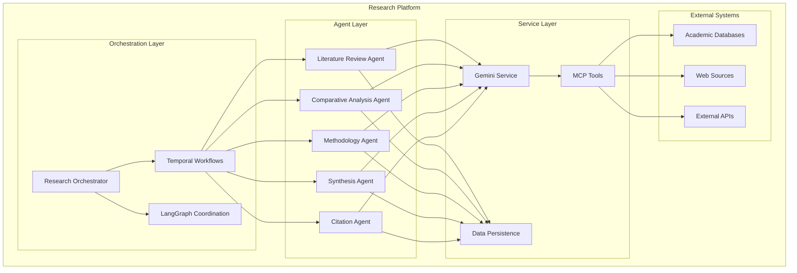

# Multi-Agent Research Architecture

## Overview

The Multi-Agent Research Platform orchestrates 5 specialized AI agents working together to conduct comprehensive research. This document details the agent architecture, implementation patterns, and orchestration mechanisms.

## Architecture Diagram



## Agent Specifications

### 1. Literature Review Agent

**Purpose**: Searches academic databases and extracts key findings from research literature.

**Capabilities**:
- Academic database search (PubMed, arXiv, Google Scholar, IEEE)
- Paper relevance scoring and filtering
- Key finding extraction and summarization
- Trend identification across publications
- Author and citation network analysis

**Implementation**:
```python
class LiteratureReviewAgent(BaseAgent):
    async def execute(self, task: AgentTask) -> AgentResult:
        # Search academic databases
        search_results = await self._search_databases(task.query)
        
        # Score and filter papers
        relevant_papers = await self._score_relevance(search_results)
        
        # Extract key findings
        findings = await self._extract_findings(relevant_papers)
        
        # Generate synthesis
        synthesis = await self._synthesize_literature(findings)
        
        return AgentResult(
            agent_type="literature_review",
            content=synthesis,
            metadata={"papers_reviewed": len(relevant_papers)}
        )
```

**MCP Tool Integration**:
- `academic_search_tool`: Search multiple academic databases
- `citation_tool`: Format citations and build bibliography
- `knowledge_graph_tool`: Build knowledge graphs from papers

### 2. Comparative Analysis Agent

**Purpose**: Compares theories, approaches, and methodologies to identify patterns and contrasts.

**Capabilities**:
- Multi-dimensional comparison matrices
- Theoretical framework analysis
- Approach effectiveness evaluation
- Trade-off identification
- Best practice recommendations

**Implementation**:
```python
class ComparativeAnalysisAgent(BaseAgent):
    async def execute(self, task: AgentTask) -> AgentResult:
        # Extract approaches from literature findings
        approaches = await self._extract_approaches(task.input_data)
        
        # Create comparison dimensions
        dimensions = await self._identify_dimensions(approaches)
        
        # Build comparison matrix
        matrix = await self._build_comparison_matrix(approaches, dimensions)
        
        # Generate insights
        insights = await self._analyze_patterns(matrix)
        
        return AgentResult(
            agent_type="comparative_analysis",
            content={
                "comparison_matrix": matrix,
                "key_insights": insights,
                "recommendations": await self._generate_recommendations(insights)
            }
        )
```

**Analysis Types**:
- Quantitative comparisons (metrics, performance data)
- Qualitative comparisons (theoretical foundations)
- Temporal comparisons (evolution over time)
- Contextual comparisons (domain-specific considerations)

### 3. Methodology Agent

**Purpose**: Recommends research methods and identifies potential biases and limitations.

**Capabilities**:
- Research method recommendation
- Bias identification and mitigation strategies
- Validity assessment
- Data collection strategy optimization
- Statistical approach selection

**Implementation**:
```python
class MethodologyAgent(BaseAgent):
    async def execute(self, task: AgentTask) -> AgentResult:
        # Analyze research context
        context = await self._analyze_context(task.research_query)
        
        # Recommend methods
        methods = await self._recommend_methods(context)
        
        # Identify biases
        biases = await self._identify_biases(methods, context)
        
        # Suggest mitigations
        mitigations = await self._suggest_mitigations(biases)
        
        return AgentResult(
            agent_type="methodology",
            content={
                "recommended_methods": methods,
                "identified_biases": biases,
                "mitigation_strategies": mitigations,
                "validity_considerations": await self._assess_validity(methods)
            }
        )
```

**Method Categories**:
- Experimental designs
- Observational studies
- Meta-analysis approaches
- Survey methodologies
- Qualitative research methods

### 4. Synthesis Agent

**Purpose**: Integrates findings from all agents into coherent narratives and conclusions.

**Capabilities**:
- Multi-source information integration
- Narrative structure generation
- Conclusion synthesis
- Gap identification
- Future research direction suggestion

**Implementation**:
```python
class SynthesisAgent(BaseAgent):
    async def execute(self, task: AgentTask) -> AgentResult:
        # Collect all agent outputs
        agent_outputs = task.input_data.get("agent_outputs", {})
        
        # Identify themes and patterns
        themes = await self._identify_themes(agent_outputs)
        
        # Resolve contradictions
        resolved = await self._resolve_contradictions(themes)
        
        # Generate narrative
        narrative = await self._generate_narrative(resolved)
        
        # Identify gaps
        gaps = await self._identify_gaps(agent_outputs)
        
        return AgentResult(
            agent_type="synthesis",
            content={
                "main_narrative": narrative,
                "key_themes": themes,
                "research_gaps": gaps,
                "conclusions": await self._draw_conclusions(narrative)
            }
        )
```

**Integration Strategies**:
- Thematic synthesis
- Framework synthesis
- Meta-aggregation
- Critical interpretive synthesis

### 5. Citation & Verification Agent

**Purpose**: Verifies sources, formats citations, and ensures academic integrity.

**Capabilities**:
- Source verification and fact-checking
- Citation formatting (APA, MLA, Chicago, IEEE)
- Plagiarism detection
- Reference quality assessment
- Bibliography generation

**Implementation**:
```python
class CitationAgent(BaseAgent):
    async def execute(self, task: AgentTask) -> AgentResult:
        # Extract citations from content
        citations = await self._extract_citations(task.input_data)
        
        # Verify sources
        verified = await self._verify_sources(citations)
        
        # Format citations
        formatted = await self._format_citations(verified, task.citation_style)
        
        # Check for issues
        issues = await self._check_citation_issues(formatted)
        
        return AgentResult(
            agent_type="citation",
            content={
                "formatted_citations": formatted,
                "bibliography": await self._generate_bibliography(formatted),
                "verification_status": verified,
                "issues_found": issues
            }
        )
```

**Citation Standards**:
- APA (American Psychological Association)
- MLA (Modern Language Association)
- Chicago Manual of Style
- IEEE (Institute of Electrical and Electronics Engineers)
- Harvard Referencing

## Agent Base Architecture

### BaseAgent Abstract Class

All agents inherit from the `BaseAgent` abstract base class:

```python
from abc import ABC, abstractmethod
from typing import Any, Dict, Optional
from uuid import UUID

class BaseAgent(ABC):
    def __init__(self, config: AgentConfig):
        self.config = config
        self.gemini_service = GeminiService(config.gemini_config)
        self.mcp_client = MCPClient()
        self.metrics = AgentMetrics()
    
    @abstractmethod
    async def execute(self, task: AgentTask) -> AgentResult:
        """Execute the agent's primary function."""
        pass
    
    async def validate_result(self, result: AgentResult) -> bool:
        """Validate the agent's output."""
        pass
    
    async def get_capabilities(self) -> List[str]:
        """Return list of agent capabilities."""
        pass
```

### Agent Task Model

```python
class AgentTask(BaseModel):
    id: UUID
    agent_type: str
    task_type: str
    research_query: str
    input_data: Dict[str, Any]
    priority: int = 1
    dependencies: List[UUID] = []
    configuration: Dict[str, Any] = {}
    created_at: datetime
    
    class Config:
        json_encoders = {
            UUID: str,
            datetime: lambda v: v.isoformat()
        }
```

### Agent Result Model

```python
class AgentResult(BaseModel):
    agent_type: str
    task_id: UUID
    content: Dict[str, Any]
    confidence_score: Optional[float] = None
    metadata: Dict[str, Any] = {}
    execution_time: Optional[float] = None
    sources: List[str] = []
    created_at: datetime = Field(default_factory=lambda: datetime.now(UTC))
```

## Agent Factory Pattern

The `AgentFactory` manages agent instantiation and registration:

```python
class AgentFactory:
    _agents: Dict[str, Type[BaseAgent]] = {
        "literature_review": LiteratureReviewAgent,
        "comparative_analysis": ComparativeAnalysisAgent,
        "methodology": MethodologyAgent,
        "synthesis": SynthesisAgent,
        "citation": CitationAgent,
    }
    
    @classmethod
    def create_agent(cls, agent_type: str, config: AgentConfig) -> BaseAgent:
        """Create an agent instance by type."""
        if agent_type not in cls._agents:
            raise ValueError(f"Unknown agent type: {agent_type}")
        
        agent_class = cls._agents[agent_type]
        return agent_class(config)
    
    @classmethod
    def register_agent(cls, agent_type: str, agent_class: Type[BaseAgent]):
        """Register a new agent type."""
        if not issubclass(agent_class, BaseAgent):
            raise ValueError(f"{agent_class} must inherit from BaseAgent")
        
        cls._agents[agent_type] = agent_class
```

## Orchestration Patterns

### Sequential Orchestration

Basic linear workflow where agents execute in sequence:

```python
async def sequential_research_workflow(project_data: Dict) -> Dict:
    """Execute agents in sequence."""
    
    # 1. Literature Review
    lit_task = create_literature_task(project_data)
    lit_result = await execute_agent("literature_review", lit_task)
    
    # 2. Comparative Analysis
    comp_task = create_comparative_task(project_data, lit_result)
    comp_result = await execute_agent("comparative_analysis", comp_task)
    
    # 3. Methodology
    method_task = create_methodology_task(project_data, lit_result, comp_result)
    method_result = await execute_agent("methodology", method_task)
    
    # 4. Synthesis
    synth_task = create_synthesis_task(project_data, lit_result, comp_result, method_result)
    synth_result = await execute_agent("synthesis", synth_task)
    
    # 5. Citation
    cite_task = create_citation_task(project_data, synth_result)
    cite_result = await execute_agent("citation", cite_task)
    
    return compile_final_result(synth_result, cite_result)
```

### Parallel Orchestration

Advanced workflow with parallel agent execution:

```python
async def parallel_research_workflow(project_data: Dict) -> Dict:
    """Execute independent agents in parallel."""
    
    # Phase 1: Initial research (parallel)
    lit_task = create_literature_task(project_data)
    method_task = create_methodology_task(project_data)
    
    lit_result, method_result = await asyncio.gather(
        execute_agent("literature_review", lit_task),
        execute_agent("methodology", method_task)
    )
    
    # Phase 2: Analysis (depends on literature)
    comp_task = create_comparative_task(project_data, lit_result)
    comp_result = await execute_agent("comparative_analysis", comp_task)
    
    # Phase 3: Synthesis (depends on all previous)
    synth_task = create_synthesis_task(project_data, lit_result, comp_result, method_result)
    synth_result = await execute_agent("synthesis", synth_task)
    
    # Phase 4: Citation (parallel with synthesis refinement)
    cite_task = create_citation_task(project_data, synth_result)
    cite_result = await execute_agent("citation", cite_task)
    
    return compile_final_result(synth_result, cite_result)
```

### LangGraph Integration

LangGraph provides advanced coordination capabilities:

```python
from langgraph import StateGraph, END
from src.orchestration.state import ResearchState

def build_research_graph() -> StateGraph:
    """Build LangGraph workflow."""
    
    workflow = StateGraph(ResearchState)
    
    # Add nodes
    workflow.add_node("query_analysis", query_analysis_node)
    workflow.add_node("plan_generation", plan_generation_node)
    workflow.add_node("literature_review", agent_dispatch_node("literature_review"))
    workflow.add_node("methodology", agent_dispatch_node("methodology"))
    workflow.add_node("comparative_analysis", agent_dispatch_node("comparative_analysis"))
    workflow.add_node("synthesis", agent_dispatch_node("synthesis"))
    workflow.add_node("citation", agent_dispatch_node("citation"))
    workflow.add_node("quality_check", quality_check_node)
    workflow.add_node("report_generation", report_generation_node)
    
    # Add edges
    workflow.add_edge("query_analysis", "plan_generation")
    workflow.add_edge("plan_generation", "literature_review")
    workflow.add_edge("plan_generation", "methodology")
    workflow.add_edge(["literature_review", "methodology"], "comparative_analysis")
    workflow.add_edge(["literature_review", "comparative_analysis", "methodology"], "synthesis")
    workflow.add_edge("synthesis", "citation")
    workflow.add_edge(["synthesis", "citation"], "quality_check")
    workflow.add_conditional_edges(
        "quality_check",
        quality_gate,
        {
            "continue": "report_generation",
            "retry": "synthesis",
            "fail": END
        }
    )
    workflow.add_edge("report_generation", END)
    
    # Set entry point
    workflow.set_entry_point("query_analysis")
    
    return workflow.compile()
```

## Agent Communication

### Message Passing

Agents communicate through structured messages:

```python
class AgentMessage(BaseModel):
    from_agent: str
    to_agent: str
    message_type: str
    content: Dict[str, Any]
    correlation_id: UUID
    timestamp: datetime
```

### Shared State

Agents access shared research state:

```python
class ResearchState(BaseModel):
    project_id: UUID
    research_query: str
    current_phase: str
    agent_results: Dict[str, AgentResult]
    context: Dict[str, Any]
    metadata: Dict[str, Any]
    
    def get_agent_result(self, agent_type: str) -> Optional[AgentResult]:
        """Get result from specific agent."""
        return self.agent_results.get(agent_type)
    
    def add_agent_result(self, result: AgentResult):
        """Add agent result to shared state."""
        self.agent_results[result.agent_type] = result
```

## Error Handling and Recovery

### Agent-Level Error Handling

```python
class AgentExecutionError(Exception):
    def __init__(self, agent_type: str, task_id: UUID, error: str):
        self.agent_type = agent_type
        self.task_id = task_id
        self.error = error
        super().__init__(f"Agent {agent_type} failed: {error}")

async def execute_agent_with_retry(agent_type: str, task: AgentTask, max_retries: int = 3) -> AgentResult:
    """Execute agent with retry logic."""
    for attempt in range(max_retries):
        try:
            agent = AgentFactory.create_agent(agent_type, config)
            result = await agent.execute(task)
            
            # Validate result
            if await agent.validate_result(result):
                return result
            else:
                raise AgentExecutionError(agent_type, task.id, "Result validation failed")
                
        except Exception as e:
            if attempt == max_retries - 1:
                raise AgentExecutionError(agent_type, task.id, str(e))
            
            # Exponential backoff
            await asyncio.sleep(2 ** attempt)
    
    raise AgentExecutionError(agent_type, task.id, "Max retries exceeded")
```

### Workflow-Level Recovery

```python
async def handle_agent_failure(state: ResearchState, failed_agent: str, error: Exception):
    """Handle agent failure with recovery strategies."""
    
    # Log failure
    logger.error(f"Agent {failed_agent} failed", error=str(error), project_id=state.project_id)
    
    # Determine recovery strategy
    if failed_agent == "literature_review":
        # Critical failure - cannot proceed
        raise WorkflowExecutionError("Literature review is required")
    
    elif failed_agent == "comparative_analysis":
        # Optional agent - proceed with warning
        state.context["warnings"].append(f"Comparative analysis failed: {error}")
        return state
    
    elif failed_agent == "methodology":
        # Try simplified methodology
        fallback_task = create_fallback_methodology_task(state)
        result = await execute_agent("methodology", fallback_task)
        state.add_agent_result(result)
        return state
    
    else:
        # Unknown failure
        raise WorkflowExecutionError(f"Unhandled agent failure: {failed_agent}")
```

## Performance Optimization

### Agent Caching

```python
class AgentCache:
    def __init__(self, redis_client):
        self.redis = redis_client
    
    async def get_cached_result(self, agent_type: str, task_hash: str) -> Optional[AgentResult]:
        """Get cached agent result."""
        key = f"agent_result:{agent_type}:{task_hash}"
        cached = await self.redis.get(key)
        if cached:
            return AgentResult.parse_raw(cached)
        return None
    
    async def cache_result(self, agent_type: str, task_hash: str, result: AgentResult, ttl: int = 3600):
        """Cache agent result."""
        key = f"agent_result:{agent_type}:{task_hash}"
        await self.redis.setex(key, ttl, result.json())
```

### Parallel Execution

```python
async def execute_independent_agents(tasks: List[Tuple[str, AgentTask]]) -> Dict[str, AgentResult]:
    """Execute multiple independent agents in parallel."""
    
    async def execute_single(agent_type: str, task: AgentTask) -> Tuple[str, AgentResult]:
        result = await execute_agent_with_retry(agent_type, task)
        return agent_type, result
    
    # Create tasks
    coroutines = [execute_single(agent_type, task) for agent_type, task in tasks]
    
    # Execute in parallel
    results = await asyncio.gather(*coroutines, return_exceptions=True)
    
    # Process results
    agent_results = {}
    for result in results:
        if isinstance(result, Exception):
            logger.error(f"Agent execution failed: {result}")
        else:
            agent_type, agent_result = result
            agent_results[agent_type] = agent_result
    
    return agent_results
```

## Monitoring and Metrics

### Agent Metrics

```python
class AgentMetrics:
    def __init__(self):
        self.execution_time = Histogram(
            'agent_execution_duration_seconds',
            'Time spent executing agent',
            ['agent_type']
        )
        self.success_rate = Counter(
            'agent_executions_total',
            'Total agent executions',
            ['agent_type', 'status']
        )
        self.confidence_score = Histogram(
            'agent_confidence_score',
            'Agent result confidence',
            ['agent_type']
        )
    
    def record_execution(self, agent_type: str, duration: float, success: bool, confidence: float = None):
        self.execution_time.labels(agent_type=agent_type).observe(duration)
        status = 'success' if success else 'failure'
        self.success_rate.labels(agent_type=agent_type, status=status).inc()
        if confidence is not None:
            self.confidence_score.labels(agent_type=agent_type).observe(confidence)
```

### Health Checks

```python
async def check_agent_health(agent_type: str) -> Dict[str, Any]:
    """Check if agent is healthy."""
    try:
        # Create test task
        test_task = AgentTask(
            id=uuid4(),
            agent_type=agent_type,
            task_type="health_check",
            research_query="Test query",
            input_data={}
        )
        
        # Execute with timeout
        start_time = time.time()
        result = await asyncio.wait_for(
            execute_agent(agent_type, test_task),
            timeout=30
        )
        execution_time = time.time() - start_time
        
        return {
            "status": "healthy",
            "response_time": execution_time,
            "confidence": result.confidence_score
        }
        
    except asyncio.TimeoutError:
        return {"status": "timeout", "error": "Agent response timeout"}
    except Exception as e:
        return {"status": "error", "error": str(e)}
```

## Testing Strategy

### Unit Testing

```python
import pytest
from unittest.mock import AsyncMock, patch

class TestLiteratureReviewAgent:
    @pytest.fixture
    async def agent(self):
        config = AgentConfig(gemini_config=mock_gemini_config)
        return LiteratureReviewAgent(config)
    
    @pytest.mark.asyncio
    async def test_execute_success(self, agent):
        # Mock dependencies
        with patch.object(agent, '_search_databases') as mock_search, \
             patch.object(agent, '_extract_findings') as mock_extract:
            
            mock_search.return_value = [mock_paper_1, mock_paper_2]
            mock_extract.return_value = mock_findings
            
            # Create test task
            task = AgentTask(
                id=uuid4(),
                agent_type="literature_review",
                task_type="research",
                research_query="AI in healthcare",
                input_data={}
            )
            
            # Execute
            result = await agent.execute(task)
            
            # Assertions
            assert result.agent_type == "literature_review"
            assert "findings" in result.content
            assert result.confidence_score > 0.7
```

### Integration Testing

```python
@pytest.mark.integration
async def test_agent_workflow_integration():
    """Test complete agent workflow integration."""
    
    # Setup
    project_data = {
        "project_id": str(uuid4()),
        "research_query": "Impact of AI on employment",
        "domains": ["AI", "Economics"]
    }
    
    # Execute workflow
    orchestrator = ResearchOrchestrator()
    result = await orchestrator.execute_research(project_data)
    
    # Verify all agents executed
    assert "literature_review" in result.agent_results
    assert "comparative_analysis" in result.agent_results
    assert "methodology" in result.agent_results
    assert "synthesis" in result.agent_results
    assert "citation" in result.agent_results
    
    # Verify data flow
    lit_result = result.agent_results["literature_review"]
    synth_result = result.agent_results["synthesis"]
    assert lit_result.content["findings"] is not None
    assert synth_result.content["main_narrative"] is not None
```

## Configuration Management

### Agent Configuration

```python
class AgentConfig(BaseModel):
    gemini_config: GeminiConfig
    mcp_config: MCPConfig
    cache_config: CacheConfig
    retry_config: RetryConfig
    
    class Config:
        env_prefix = "AGENT_"
```

### Environment Variables

```bash
# Agent Configuration
AGENT_MAX_RETRIES=3
AGENT_TIMEOUT_SECONDS=300
AGENT_CACHE_TTL=3600

# Gemini Configuration
GEMINI_API_KEY=your-api-key
GEMINI_MODEL=gemini-1.5-pro
GEMINI_MAX_TOKENS=4096

# MCP Configuration
MCP_ACADEMIC_SEARCH_ENDPOINT=http://localhost:8001
MCP_CITATION_TOOL_ENDPOINT=http://localhost:8002
```

## Future Enhancements

### Planned Features

1. **Agent Learning**: Implement feedback loops for agent improvement
2. **Dynamic Agent Selection**: Choose optimal agents based on research type
3. **Custom Agent Development**: Framework for domain-specific agents
4. **Agent Collaboration**: Direct agent-to-agent communication
5. **Performance Auto-tuning**: Automatic parameter optimization

### Extension Points

- Custom agent implementations
- Specialized prompt engineering
- Domain-specific knowledge bases
- Integration with additional AI services
- Advanced coordination strategies

This multi-agent architecture provides a robust, scalable foundation for conducting comprehensive research across multiple domains while maintaining flexibility for future enhancements and customizations.