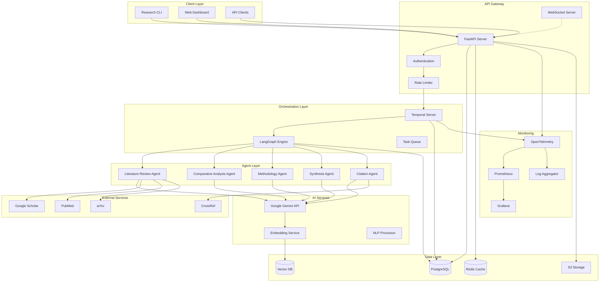
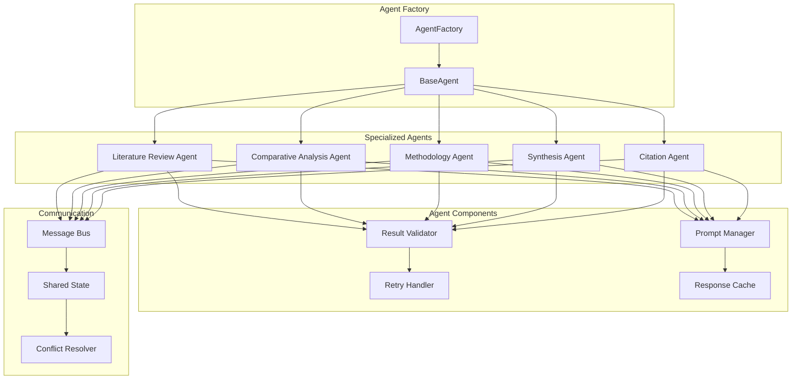
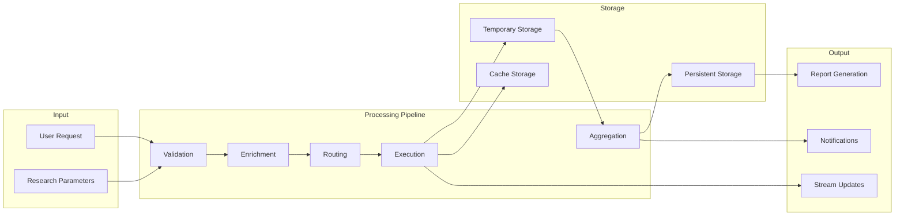
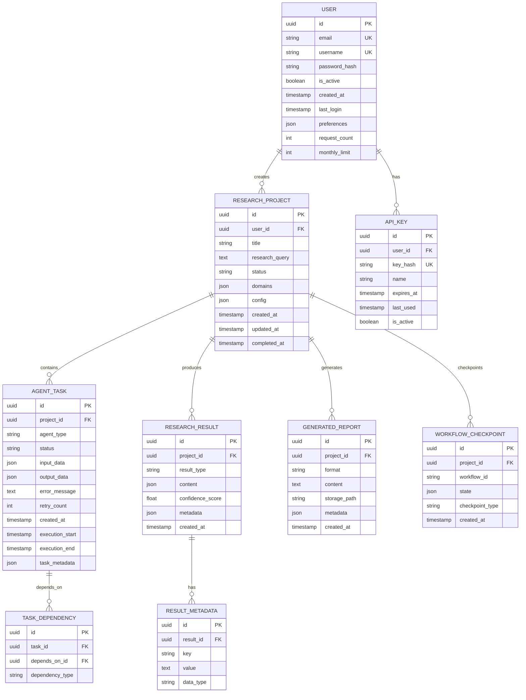
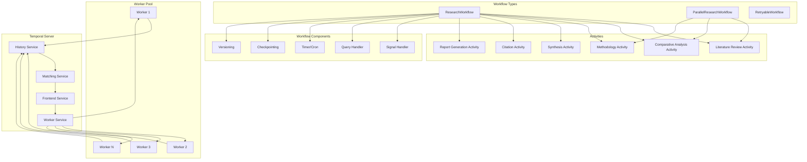
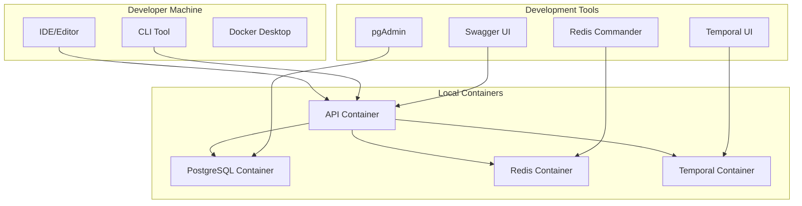
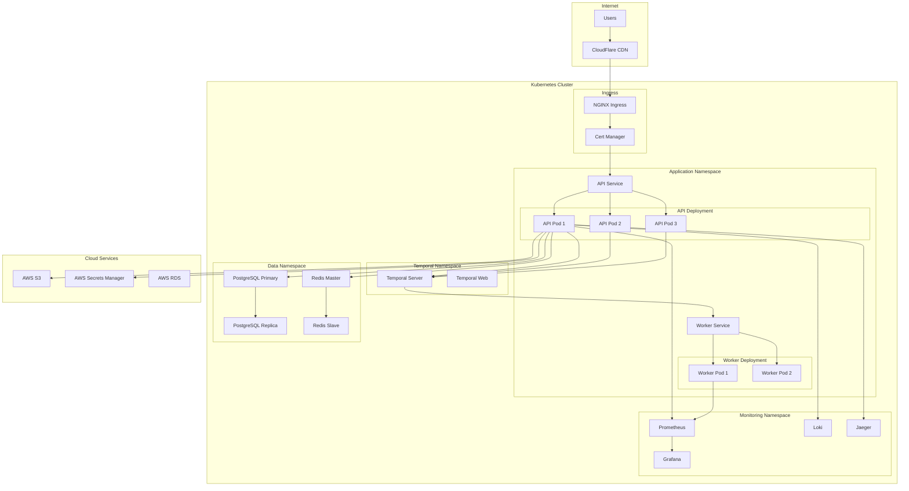
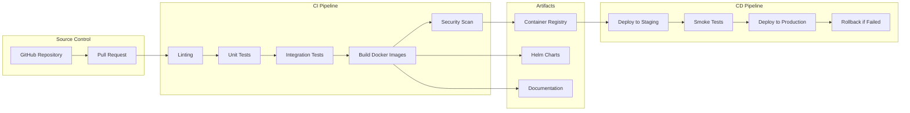

# System Architecture Diagrams

This document contains comprehensive architectural diagrams for the Multi-Agent Research Platform using Mermaid syntax.

## Table of Contents
- [High-Level System Architecture](#high-level-system-architecture)
- [Multi-Agent Architecture](#multi-agent-architecture)
- [Data Flow Architecture](#data-flow-architecture)
- [API Layer Architecture](#api-layer-architecture)
- [Database Schema](#database-schema)
- [Temporal Workflow Architecture](#temporal-workflow-architecture)
- [Deployment Architecture](#deployment-architecture)

## High-Level System Architecture



## Multi-Agent Architecture



## Data Flow Architecture



## API Layer Architecture

```mermaid
graph TB
    subgraph "API Endpoints"
        HEALTH[/health]
        PROJECTS[/api/v1/projects]
        TASKS[/api/v1/tasks]
        RESULTS[/api/v1/results]
        REPORTS[/api/v1/reports]
        USERS[/api/v1/users]
        WS_EP[/ws]
    end
    
    subgraph "Middleware Stack"
        CORS[CORS Middleware]
        AUTH_MW[Auth Middleware]
        RATE_MW[Rate Limit MW]
        LOG_MW[Logging MW]
        ERROR_MW[Error Handler MW]
    end
    
    subgraph "Business Logic"
        PROJ_SVC[Project Service]
        TASK_SVC[Task Service]
        RESULT_SVC[Result Service]
        REPORT_SVC[Report Service]
        USER_SVC[User Service]
    end
    
    subgraph "Repositories"
        PROJ_REPO[Project Repository]
        TASK_REPO[Task Repository]
        RESULT_REPO[Result Repository]
        REPORT_REPO[Report Repository]
        USER_REPO[User Repository]
    end
    
    PROJECTS --> CORS
    TASKS --> CORS
    RESULTS --> CORS
    REPORTS --> CORS
    USERS --> CORS
    WS_EP --> CORS
    
    CORS --> AUTH_MW
    AUTH_MW --> RATE_MW
    RATE_MW --> LOG_MW
    LOG_MW --> ERROR_MW
    
    ERROR_MW --> PROJ_SVC
    ERROR_MW --> TASK_SVC
    ERROR_MW --> RESULT_SVC
    ERROR_MW --> REPORT_SVC
    ERROR_MW --> USER_SVC
    
    PROJ_SVC --> PROJ_REPO
    TASK_SVC --> TASK_REPO
    RESULT_SVC --> RESULT_REPO
    REPORT_SVC --> REPORT_REPO
    USER_SVC --> USER_REPO
```

## Database Schema



## Temporal Workflow Architecture



## Deployment Architecture

### Development Environment


### Production Environment (Kubernetes)


### CI/CD Pipeline
