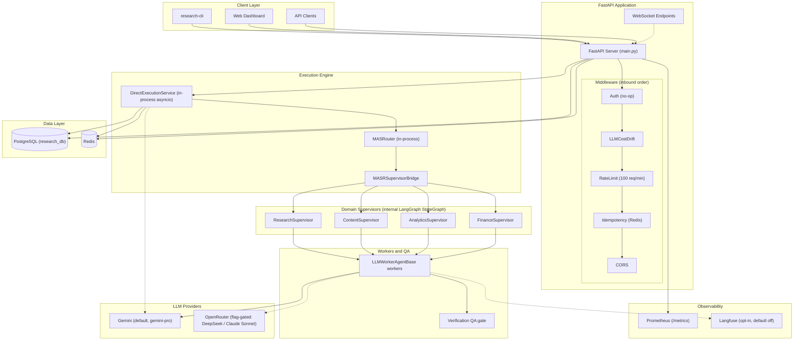
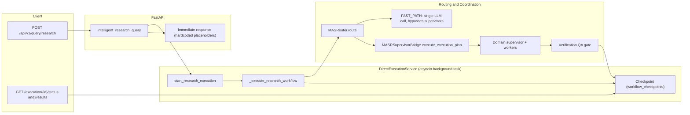
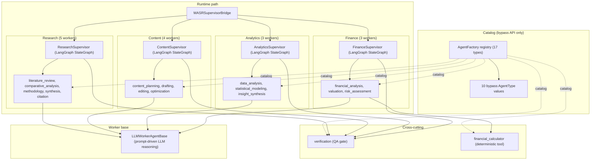
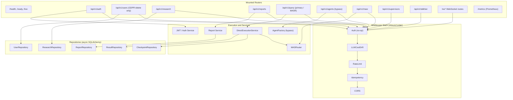
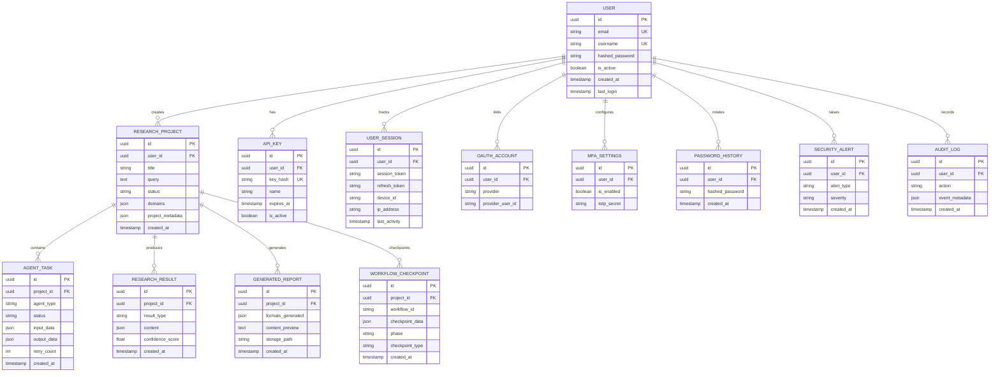
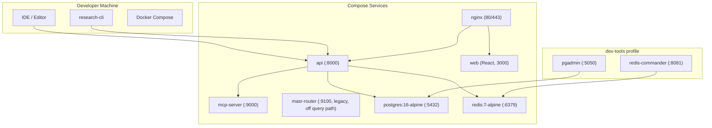
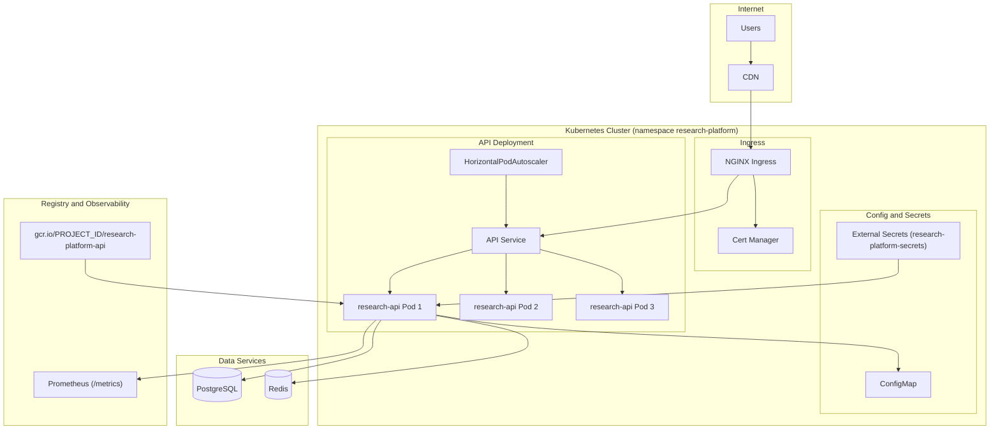

# System Architecture Diagrams

Canonical architecture-diagram reference for **Cerebro**, the multi-agent
runtime behind the general research-workflow workbench. Diagrams use Mermaid
and are drawn from the live code, not aspirational design.

> **Product vs. infra naming.** The product is **Cerebro**. The deployment
> artifacts still carry the pre-rebrand **"research-platform"** identity verbatim
> — FastAPI title `Research Platform API`, k8s namespace `research-platform`,
> images `gcr.io/PROJECT_ID/research-platform-api`, database `research_db`, CLI
> `research-platform` / `research-cli`. Those infra names are kept as-is; Cerebro
> is the product name everywhere else.

## Table of Contents
- [High-Level System Architecture](#high-level-system-architecture)
- [Request Flow (Execution Path)](#request-flow-execution-path)
- [Multi-Agent Architecture](#multi-agent-architecture)
- [API Layer Architecture](#api-layer-architecture)
- [Database Schema](#database-schema)
- [Deployment Architecture](#deployment-architecture)

## High-Level System Architecture

Client requests enter FastAPI, pass through the middleware stack, and are executed
by the in-process **DirectExecutionService** (an asyncio background task that
replaced Temporal). Routing decisions come from the in-process **MASRouter**,
which the **MASRSupervisorBridge** maps onto one of four domain supervisors. Each
supervisor runs an internal LangGraph `StateGraph` over `LLMWorkerAgentBase`
workers, then a verification QA gate. Persistence is Postgres + Redis;
checkpoints live in the `workflow_checkpoints` table.

```mermaid
graph TB
    subgraph "Client Layer"
        CLI["research-cli"]
        WEB["Web Dashboard"]
        API_CLIENT["API Clients"]
    end

    subgraph "FastAPI Application"
        FASTAPI["FastAPI Server (main.py)"]
        WS["WebSocket Endpoints"]
        subgraph "Middleware (inbound order)"
            AUTHMW["Auth (no-op)"]
            DRIFT["LLMCostDrift"]
            RATE["RateLimit (100 req/min)"]
            IDEMP["Idempotency (Redis)"]
            CORS["CORS"]
        end
    end

    subgraph "Execution Engine"
        DES["DirectExecutionService (in-process asyncio)"]
        MASR["MASRouter (in-process)"]
        BRIDGE["MASRSupervisorBridge"]
    end

    subgraph "Domain Supervisors (internal LangGraph StateGraph)"
        SUP_R["ResearchSupervisor"]
        SUP_C["ContentSupervisor"]
        SUP_A["AnalyticsSupervisor"]
        SUP_F["FinanceSupervisor"]
    end

    subgraph "Workers and QA"
        WORKERS["LLMWorkerAgentBase workers"]
        VERIFY["Verification QA gate"]
    end

    subgraph "LLM Providers"
        GEMINI["Gemini (default, gemini-pro)"]
        OPENROUTER["OpenRouter (flag-gated: DeepSeek / Claude Sonnet)"]
    end

    subgraph "Data Layer"
        PG[("PostgreSQL (research_db)")]
        REDIS[("Redis")]
    end

    subgraph "Observability"
        PROM["Prometheus (/metrics)"]
        LANGFUSE["Langfuse (opt-in, default off)"]
    end

    CLI --> FASTAPI
    WEB --> FASTAPI
    API_CLIENT --> FASTAPI

    FASTAPI --> AUTHMW
    AUTHMW --> DRIFT
    DRIFT --> RATE
    RATE --> IDEMP
    IDEMP --> CORS

    FASTAPI --> DES
    DES --> MASR
    MASR --> BRIDGE
    BRIDGE --> SUP_R
    BRIDGE --> SUP_C
    BRIDGE --> SUP_A
    BRIDGE --> SUP_F

    SUP_R --> WORKERS
    SUP_C --> WORKERS
    SUP_A --> WORKERS
    SUP_F --> WORKERS
    WORKERS --> VERIFY

    WORKERS --> GEMINI
    WORKERS -.-> OPENROUTER
    DES -.-> GEMINI

    DES --> PG
    DES --> REDIS
    FASTAPI --> PG
    FASTAPI --> REDIS

    FASTAPI --> PROM
    WORKERS -.-> LANGFUSE
    WS -.-> FASTAPI
```

**Notes.**
- **Provider default is Gemini-only** (`GEMINI_DEFAULT_MODEL=gemini-pro`).
  OpenRouter multi-provider routing (DeepSeek for the `simple` tier, Claude
  Sonnet for `balanced`/`complex`) is flag-gated OFF: it requires both
  `MULTI_PROVIDER_ROUTING_ENABLED=True` and `OPENROUTER_API_KEY`.
  `DEEPSEEK_ENABLED` / `LLAMA_ENABLED` / `OPENROUTER_ENABLED` all default False.
- **AuthMiddleware is a no-op** — it sets `request.state.user=None` and validates
  nothing. Auth is enforced per-endpoint via `Depends`; `/api/v1/query`,
  `/api/v1/agents`, and `/api/v1/masr` are effectively unauthenticated.
- **Observability** is Prometheus at `/metrics` (`src/core/observability.py`:
  `llm_call_duration_seconds`, `llm_tokens_total`, `llm_cost_usd_total`,
  `llm_request_cost_drift_ratio`, `llm_cost_drift_events_total`) plus structlog,
  with optional Langfuse tracing (`LANGFUSE_ENABLED` default False). There is no
  OpenTelemetry backbone and no Grafana / Loki / Jaeger wiring.
- **No vector DB / embedding service is wired.** `src/memory` is a stub (4-tier
  memory is config-only), so it is not shown.

## Request Flow (Execution Path)

The real request pipeline: the immediate HTTP response to
`POST /api/v1/query/research` returns **hardcoded placeholders**
(`selected_agents=[]`, `estimated_cost=0.015`, `estimated_quality=0.85`,
`confidence=0.85`, `routing_time_ms=50.0`); the actual routing and results are
produced asynchronously and read back via the execution-status endpoints.

```mermaid
graph LR
    subgraph "Client"
        REQ["POST /api/v1/query/research"]
        POLL["GET /execution/{id}/status and /results"]
    end

    subgraph "FastAPI"
        HANDLER["intelligent_research_query"]
        PLACEHOLDER["Immediate response (hardcoded placeholders)"]
    end

    subgraph "DirectExecutionService (asyncio background task)"
        START["start_research_execution"]
        WORKFLOW["_execute_research_workflow"]
        CKPT["Checkpoint (workflow_checkpoints)"]
    end

    subgraph "Routing and Coordination"
        ROUTE["MASRouter.route"]
        FAST["FAST_PATH: single LLM call, bypasses supervisors"]
        BRIDGE2["MASRSupervisorBridge.execute_execution_plan"]
        SUPS["Domain supervisor + workers"]
        QA["Verification QA gate"]
    end

    REQ --> HANDLER
    HANDLER --> START
    HANDLER --> PLACEHOLDER
    START --> WORKFLOW
    WORKFLOW --> ROUTE
    ROUTE --> FAST
    ROUTE --> BRIDGE2
    BRIDGE2 --> SUPS
    SUPS --> QA
    WORKFLOW --> CKPT
    QA --> CKPT
    POLL --> CKPT
```

**CollaborationMode** values selected by MASR: `FAST_PATH`, `DIRECT`, `PARALLEL`,
`HIERARCHICAL`, `DEBATE`, `ENSEMBLE`. `FAST_PATH` is a single LLM call that
bypasses the supervisors entirely; if its quality gate fails, the routing
decision is mutated to `DIRECT` and re-run through the supervisor path.
Chain-of-Agents and Mixture-of-Agents are **not** MASR-selectable — they exist
only as bypass endpoints (`POST /api/v1/agents/chain` and `/mixture`).

Multi-domain queries run their per-domain subqueries concurrently under an
`asyncio.Semaphore` (default parallelism 4) and merge the results
(`concat` by default). Checkpoints are written at the `masr_routing`,
`supervisor_execution`, `fast_path_completed`, and `completed` phases, enabling
`POST /api/v1/query/execution/{project_id}/resume`.

## Multi-Agent Architecture

Two distinct surfaces sit over the same worker code:

- **AgentFactory registry** — a catalog of **17 agent types** across 4 domains
  plus 2 cross-cutting agents. It serves the **bypass** agent API
  (`/api/v1/agents`); it is **not** the MASR-routed runtime path.
- **Domain supervisors** — each instantiates its own workers from its own
  `WorkerDefinition` table (15 domain workers total), runs them through an
  internal LangGraph `StateGraph`, and applies a verification QA gate.

LangGraph exists **only inside supervisors**; the former top-level
`src/orchestration/` subsystem was deleted (PR #50, ~8,961 lines).

```mermaid
graph TD
    subgraph "Catalog (bypass API only)"
        FACTORY["AgentFactory registry (17 types)"]
        BYPASS["10 bypass AgentType values"]
    end

    subgraph "Runtime path"
        BRIDGE3["MASRSupervisorBridge"]
        subgraph "Research (5 workers)"
            R_SUP["ResearchSupervisor (LangGraph StateGraph)"]
            R_W["literature_review, comparative_analysis, methodology, synthesis, citation"]
        end
        subgraph "Content (4 workers)"
            C_SUP["ContentSupervisor (LangGraph StateGraph)"]
            C_W["content_planning, drafting, editing, optimization"]
        end
        subgraph "Analytics (3 workers)"
            A_SUP["AnalyticsSupervisor (LangGraph StateGraph)"]
            A_W["data_analysis, statistical_modeling, insight_synthesis"]
        end
        subgraph "Finance (3 workers)"
            F_SUP["FinanceSupervisor (LangGraph StateGraph)"]
            F_W["financial_analysis, valuation, risk_assessment"]
        end
    end

    subgraph "Cross-cutting"
        VERI["verification (QA gate)"]
        CALC["financial_calculator (deterministic tool)"]
    end

    subgraph "Worker base"
        WBASE["LLMWorkerAgentBase (prompt-driven LLM reasoning)"]
    end

    FACTORY --> BYPASS
    FACTORY -.catalog.-> R_W
    FACTORY -.catalog.-> C_W
    FACTORY -.catalog.-> A_W
    FACTORY -.catalog.-> F_W
    FACTORY -.catalog.-> VERI
    FACTORY -.catalog.-> CALC

    BRIDGE3 --> R_SUP
    BRIDGE3 --> C_SUP
    BRIDGE3 --> A_SUP
    BRIDGE3 --> F_SUP

    R_SUP --> R_W
    C_SUP --> C_W
    A_SUP --> A_W
    F_SUP --> F_W

    R_W --> WBASE
    C_W --> WBASE
    A_W --> WBASE
    F_W --> WBASE

    R_SUP --> VERI
    C_SUP --> VERI
    A_SUP --> VERI
    F_SUP --> VERI
    F_W --> CALC
```

**Registry accounting.**
- **17-agent registry** = 15 domain workers (Research 5, Content 4, Analytics 3,
  Finance 3) + `verification` + `financial_calculator` (`factory.py:48-66`).
- **15 domain workers** are what the supervisors actually instantiate;
  `verification` and `financial_calculator` are not on any supervisor team.
- **10 bypass `AgentType` values** are callable via `/api/v1/agents`:
  `literature-review`, `citation`, `methodology`, `comparative-analysis`,
  `synthesis`, `financial-analysis`, `valuation`, `risk-assessment`,
  `financial-calculator`, `verification`. Content and Analytics workers are **not**
  bypass-callable.

**Worker semantics.** Workers subclass `LLMWorkerAgentBase` and are
prompt-driven LLM reasoners, not coded decision engines. Reported confidence
scores are **hardcoded heuristics** (0.85 on success, 0.3 on empty output, 0.8
fast-path), not real quality signals. The one deterministic exception is the
`financial_calculator` tool (`src/agents/tools/finance_math.py`: DCF, NPV,
ratios, amortization, descriptive stats) — pure functions, no LLM, no external
data; its exact values are injected into Finance worker prompts.

## API Layer Architecture

Only the routers actually mounted in `main.py` are shown. There are **no**
`/api/v1/projects`, `/api/v1/tasks`, or `/api/v1/results` routers. Several route
modules exist in the source tree but are never mounted (`benchmarks`, `costs`,
`experiments`, `improvement`, `memory`, `qa`, a duplicate `masr`) — those are
unreachable and are not documented here.

```mermaid
graph TB
    subgraph "Mounted Routers"
        HEALTH["/health, /ready, /live"]
        AUTH_R["/api/v1/auth"]
        USERS_R["/api/v1/users (GDPR delete only)"]
        RESEARCH_R["/api/v1/research"]
        REPORTS_R["/api/v1/reports"]
        QUERY_R["/api/v1/query (primary / MASR)"]
        AGENTS_R["/api/v1/agents (bypass)"]
        MASR_R["/api/v1/masr"]
        SUP_R2["/api/v1/supervisors"]
        TALK_R["/api/v1/talkhier"]
        WS_R["/ws* WebSocket routes"]
        METRICS_R["/metrics (Prometheus)"]
    end

    subgraph "Middleware Stack (inbound order)"
        M_AUTH["Auth (no-op)"]
        M_DRIFT["LLMCostDrift"]
        M_RATE["RateLimit"]
        M_IDEMP["Idempotency"]
        M_CORS["CORS"]
    end

    subgraph "Execution and Services"
        DES2["DirectExecutionService"]
        MASR2["MASRouter"]
        FACT2["AgentFactory (bypass)"]
        REPORT_SVC["Report Service"]
        AUTH_SVC["JWT / Auth Service"]
    end

    subgraph "Repositories (async SQLAlchemy)"
        RESEARCH_REPO["ResearchRepository"]
        RESULT_REPO["ResultRepository"]
        REPORT_REPO["ReportRepository"]
        CKPT_REPO["CheckpointRepository"]
        USER_REPO["UserRepository"]
    end

    QUERY_R --> M_AUTH
    AGENTS_R --> M_AUTH
    MASR_R --> M_AUTH
    RESEARCH_R --> M_AUTH
    REPORTS_R --> M_AUTH
    AUTH_R --> M_AUTH
    USERS_R --> M_AUTH
    SUP_R2 --> M_AUTH
    TALK_R --> M_AUTH
    WS_R --> M_AUTH

    M_AUTH --> M_DRIFT
    M_DRIFT --> M_RATE
    M_RATE --> M_IDEMP
    M_IDEMP --> M_CORS

    QUERY_R --> DES2
    DES2 --> MASR2
    AGENTS_R --> FACT2
    MASR_R --> MASR2
    RESEARCH_R --> RESEARCH_REPO
    REPORTS_R --> REPORT_SVC
    AUTH_R --> AUTH_SVC
    USERS_R --> USER_REPO

    DES2 --> CKPT_REPO
    DES2 --> RESULT_REPO
    REPORT_SVC --> REPORT_REPO
```

**Key endpoints.**
- **Primary (MASR):** `POST /api/v1/query/research` (plus `/analyze`,
  `/synthesize`, `/literature`, `/methodology`, `/comparison` wrappers);
  `GET /api/v1/query/execution/{id}/status`, `.../results`;
  `POST /api/v1/query/execution/{id}/resume`.
- **Bypass:** `GET /api/v1/agents`, `GET /api/v1/agents/{type}`,
  `POST /api/v1/agents/{type}/execute`, `POST /api/v1/agents/chain`,
  `POST /api/v1/agents/mixture`.
- **Users:** `DELETE /api/v1/users/{user_id}/gdpr` (single endpoint).
- **WebSocket (only these):** `/ws`, `/ws/projects/{project_id}`,
  `/ws/cli/{project_id}`, `GET /ws/health`,
  `/api/v1/supervisors/coordination/ws`, `/api/v1/supervisors/{type}/ws`,
  `/api/v1/talkhier/sessions/{id}/live`, `/api/v1/talkhier/interactive`,
  `/api/v1/talkhier/coordination`. There is no MASR WebSocket (commented out), no
  SSE, and no `/ws/experiments`.

**Auth reality.** JWT RS256, 15-minute access / 7-day refresh, keys at
`/secrets/jwt_private.pem` and `/secrets/jwt_public.pem`, bcrypt 12 rounds,
`PASSWORD_MIN_LENGTH=12`. `AuthMiddleware` is a no-op; protection is per-endpoint
`Depends`, so `/api/v1/query`, `/api/v1/agents`, and `/api/v1/masr` are
effectively unauthenticated. Rate limiting is a single global limiter at
100 requests/minute (no tiers, no burst, no per-endpoint config).

## Database Schema

Real SQLAlchemy tables in `src/models/db/`. The former `TASK_DEPENDENCY` and
`RESULT_METADATA` tables do not exist and have been dropped from this diagram.
Checkpoints are stored in `workflow_checkpoints`.

```mermaid
erDiagram
    USER ||--o{ RESEARCH_PROJECT : creates
    USER ||--o{ API_KEY : has
    USER ||--o{ USER_SESSION : tracks
    USER ||--o{ OAUTH_ACCOUNT : links
    USER ||--o{ MFA_SETTINGS : configures
    USER ||--o{ PASSWORD_HISTORY : rotates
    USER ||--o{ SECURITY_ALERT : raises
    USER ||--o{ AUDIT_LOG : records
    RESEARCH_PROJECT ||--o{ AGENT_TASK : contains
    RESEARCH_PROJECT ||--o{ RESEARCH_RESULT : produces
    RESEARCH_PROJECT ||--o{ GENERATED_REPORT : generates
    RESEARCH_PROJECT ||--o{ WORKFLOW_CHECKPOINT : checkpoints

    USER {
        uuid id PK
        string email UK
        string username UK
        string hashed_password
        boolean is_active
        timestamp created_at
        timestamp last_login
    }

    API_KEY {
        uuid id PK
        uuid user_id FK
        string key_hash UK
        string name
        timestamp expires_at
        boolean is_active
    }

    USER_SESSION {
        uuid id PK
        uuid user_id FK
        string session_token
        string refresh_token
        string device_id
        string ip_address
        timestamp last_activity
    }

    OAUTH_ACCOUNT {
        uuid id PK
        uuid user_id FK
        string provider
        string provider_user_id
    }

    MFA_SETTINGS {
        uuid id PK
        uuid user_id FK
        boolean is_enabled
        string totp_secret
    }

    PASSWORD_HISTORY {
        uuid id PK
        uuid user_id FK
        string hashed_password
        timestamp created_at
    }

    SECURITY_ALERT {
        uuid id PK
        uuid user_id FK
        string alert_type
        string severity
        timestamp created_at
    }

    AUDIT_LOG {
        uuid id PK
        uuid user_id FK
        string action
        json event_metadata
        timestamp created_at
    }

    RESEARCH_PROJECT {
        uuid id PK
        uuid user_id FK
        string title
        text query
        string status
        json domains
        json project_metadata
        timestamp created_at
    }

    AGENT_TASK {
        uuid id PK
        uuid project_id FK
        string agent_type
        string status
        json input_data
        json output_data
        int retry_count
        timestamp created_at
    }

    RESEARCH_RESULT {
        uuid id PK
        uuid project_id FK
        string result_type
        json content
        float confidence_score
        timestamp created_at
    }

    GENERATED_REPORT {
        uuid id PK
        uuid project_id FK
        json formats_generated
        text content_preview
        string storage_path
        timestamp created_at
    }

    WORKFLOW_CHECKPOINT {
        uuid id PK
        uuid project_id FK
        string workflow_id
        json checkpoint_data
        string phase
        string checkpoint_type
        timestamp created_at
    }
```

## Deployment Architecture

### Development Environment

`docker-compose.yml` services: `api` (:8000), `mcp-server` (:9000), `masr-router`
(:9100), `postgres` (postgres:16-alpine, :5432), `redis` (redis:7-alpine, :6379),
`nginx` (80/443), `web` (React, 3000→8080), and dev-tools profile `pgadmin`
(:5050) / `redis-commander` (:8081). There is **no worker service** — Temporal is
removed.

> The `masr-router` container (:9100) is **legacy/standalone** and is **not on the
> query path**. The verified request flow uses the in-process `MASRouter()` Python
> object inside `DirectExecutionService`; `MASR_SERVICE_URL` is not read anywhere
> in `src/`.

```mermaid
graph TB
    subgraph "Developer Machine"
        IDE["IDE / Editor"]
        CLI_DEV["research-cli"]
        DOCKER_DEV["Docker Compose"]
    end

    subgraph "Compose Services"
        API_LOCAL["api (:8000)"]
        MCP_LOCAL["mcp-server (:9000)"]
        MASR_LOCAL["masr-router (:9100, legacy, off query path)"]
        PG_LOCAL["postgres:16-alpine (:5432)"]
        REDIS_LOCAL["redis:7-alpine (:6379)"]
        NGINX_LOCAL["nginx (80/443)"]
        WEB_LOCAL["web (React, 3000)"]
    end

    subgraph "dev-tools profile"
        PGADMIN["pgadmin (:5050)"]
        REDIS_CMD["redis-commander (:8081)"]
    end

    IDE --> API_LOCAL
    CLI_DEV --> API_LOCAL
    NGINX_LOCAL --> API_LOCAL
    NGINX_LOCAL --> WEB_LOCAL
    API_LOCAL --> PG_LOCAL
    API_LOCAL --> REDIS_LOCAL
    API_LOCAL --> MCP_LOCAL
    PGADMIN --> PG_LOCAL
    REDIS_CMD --> REDIS_LOCAL
```

### Production Environment (Kubernetes)

Kustomize under `k8s/`, namespace `research-platform`. The API deployment
(`research-api`) runs the image `gcr.io/PROJECT_ID/research-platform-api` behind an
NGINX ingress. Secrets are sourced via the External Secrets Operator (ESO) from
`research-platform-secrets`.

> The k8s `research-worker` deployment is a **Temporal-era vestige** — it has no
> worker entrypoint module and its liveness probe is a no-op `python -c`. It is
> not part of the live execution path and is omitted from the request flow below.

```mermaid
graph TB
    subgraph "Internet"
        USERS["Users"]
        CDN["CDN"]
    end

    subgraph "Kubernetes Cluster (namespace research-platform)"
        subgraph "Ingress"
            NGINX["NGINX Ingress"]
            CERT["Cert Manager"]
        end

        subgraph "API Deployment"
            API_POD1["research-api Pod 1"]
            API_POD2["research-api Pod 2"]
            API_POD3["research-api Pod 3"]
            API_SVC["API Service"]
            HPA["HorizontalPodAutoscaler"]
        end

        subgraph "Config and Secrets"
            CONFIGMAP["ConfigMap"]
            ESO["External Secrets (research-platform-secrets)"]
        end
    end

    subgraph "Data Services"
        PG_PRIMARY[("PostgreSQL")]
        REDIS_MASTER[("Redis")]
    end

    subgraph "Registry and Observability"
        GCR["gcr.io/PROJECT_ID/research-platform-api"]
        PROM_K8S["Prometheus (/metrics)"]
    end

    USERS --> CDN
    CDN --> NGINX
    NGINX --> CERT
    NGINX --> API_SVC
    API_SVC --> API_POD1
    API_SVC --> API_POD2
    API_SVC --> API_POD3
    HPA --> API_SVC

    API_POD1 --> PG_PRIMARY
    API_POD1 --> REDIS_MASTER
    API_POD1 --> CONFIGMAP
    ESO --> API_POD1
    GCR --> API_POD1
    API_POD1 --> PROM_K8S
```

### CI/CD Pipeline

`.github/workflows/ci.yml`: lint (ruff + mypy), a test matrix (py3.11 / py3.12
with postgres:16 + redis:7), a CLI test job, a security job (bandit non-blocking
+ pip-audit), and Docker / k8s validation. The **coverage gate is
`--fail-under=25`** — there is no 80%/85% enforcement.

```mermaid
graph LR
    subgraph "Source Control"
        GIT["GitHub Repository"]
        PR["Pull Request"]
    end

    subgraph "CI Pipeline (ci.yml)"
        LINT["Lint (ruff + mypy)"]
        TEST["Test matrix (py3.11/3.12, postgres + redis)"]
        CLI_TEST["CLI test"]
        SEC["Security (bandit + pip-audit)"]
        COV["Coverage gate (fail-under=25)"]
        VALIDATE["Validate Docker + k8s"]
    end

    subgraph "Artifacts"
        REGISTRY["gcr.io/PROJECT_ID/research-platform-api"]
    end

    GIT --> PR
    PR --> LINT
    LINT --> TEST
    TEST --> CLI_TEST
    CLI_TEST --> SEC
    SEC --> COV
    COV --> VALIDATE
    VALIDATE --> REGISTRY
```
