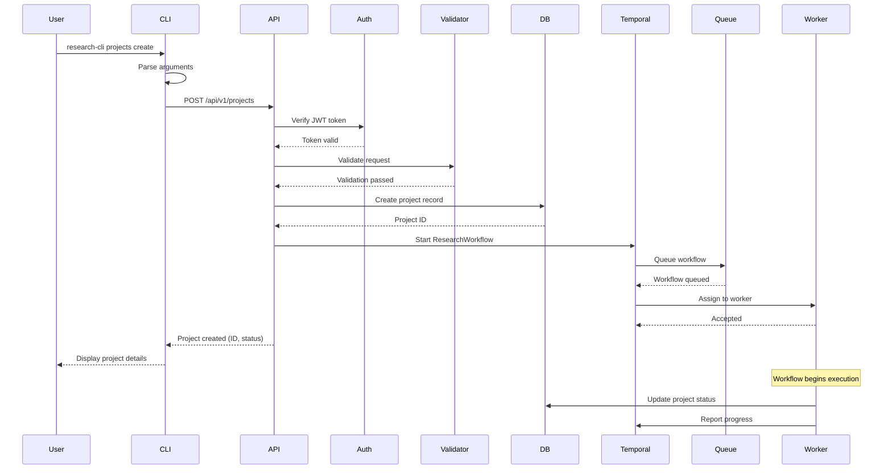
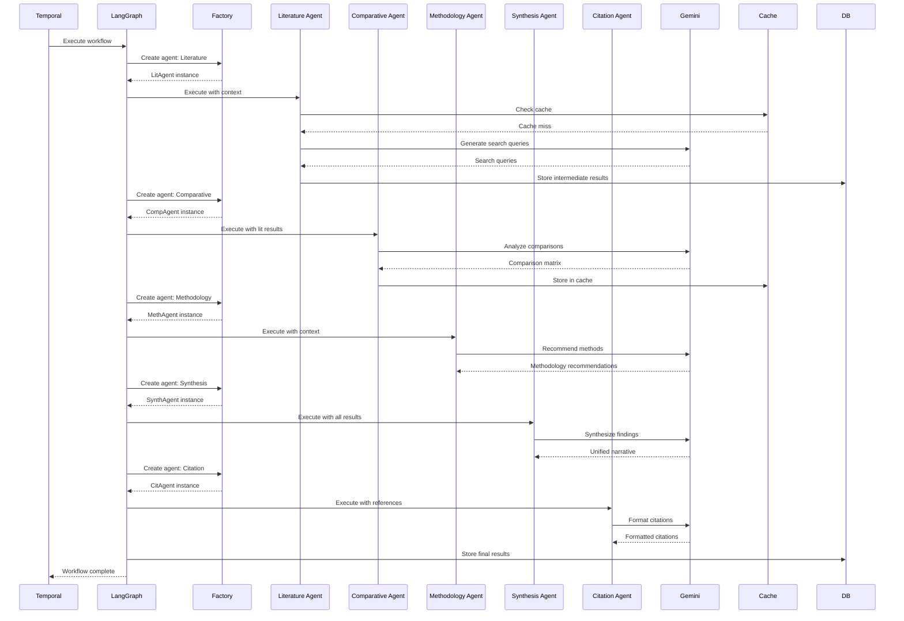
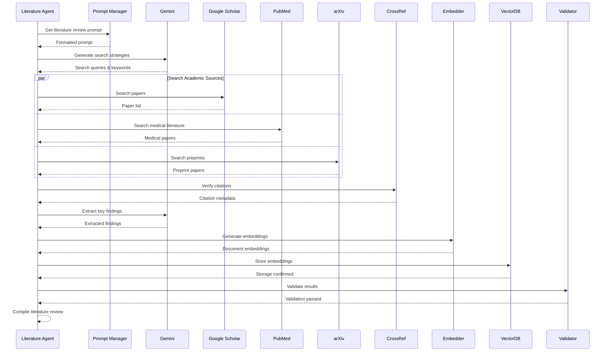
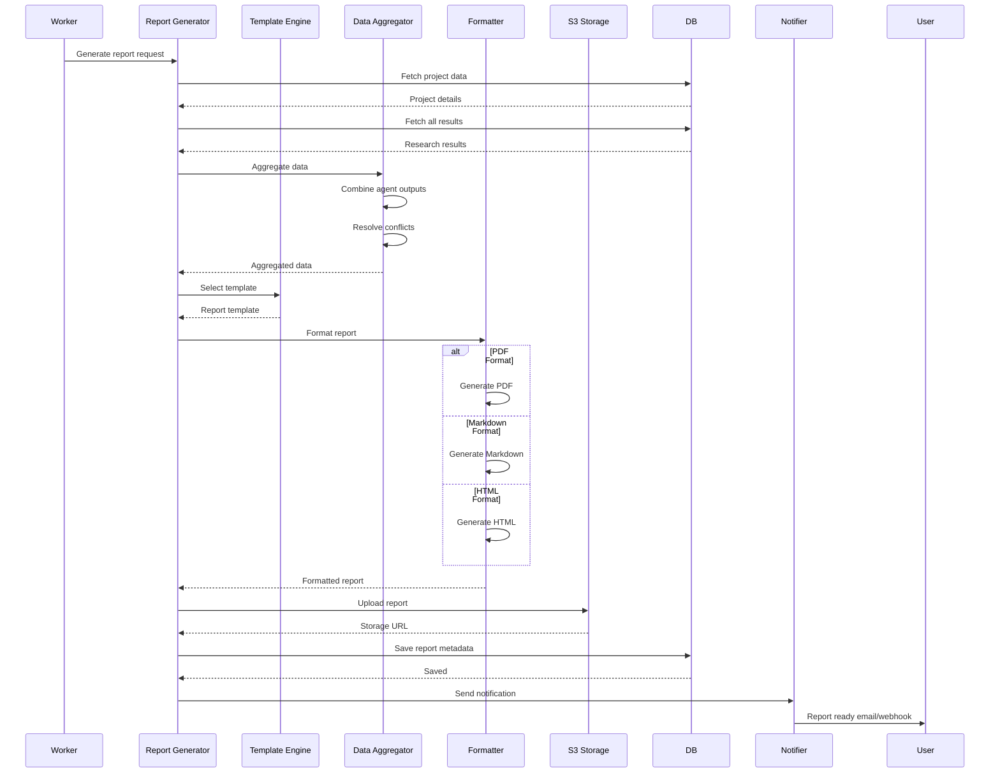
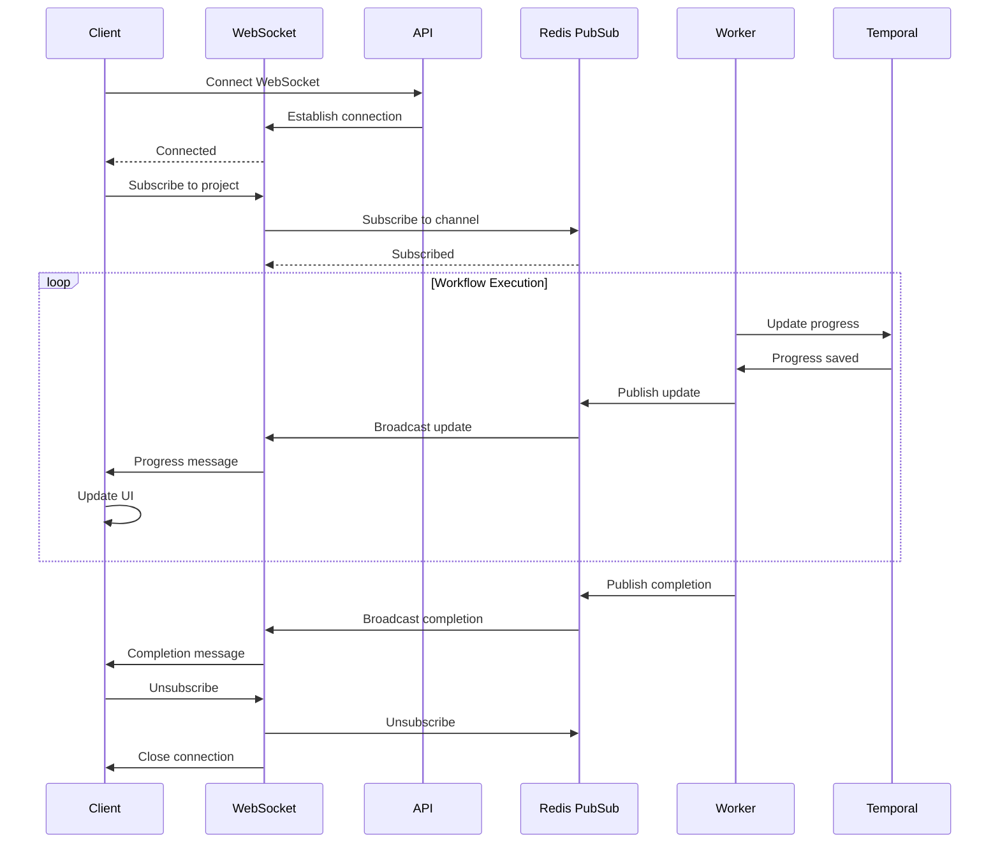
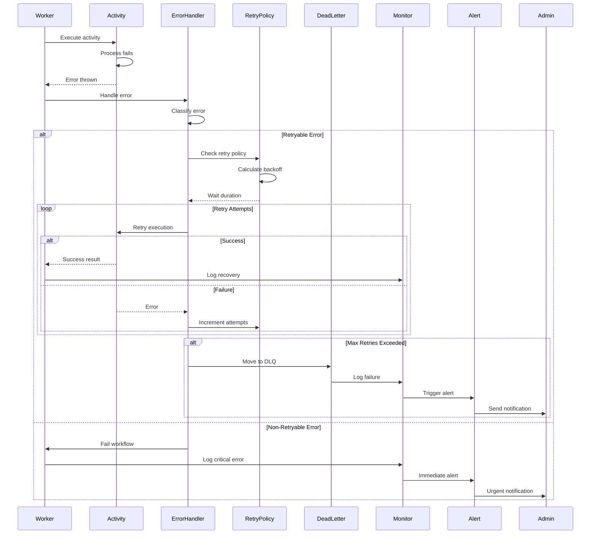
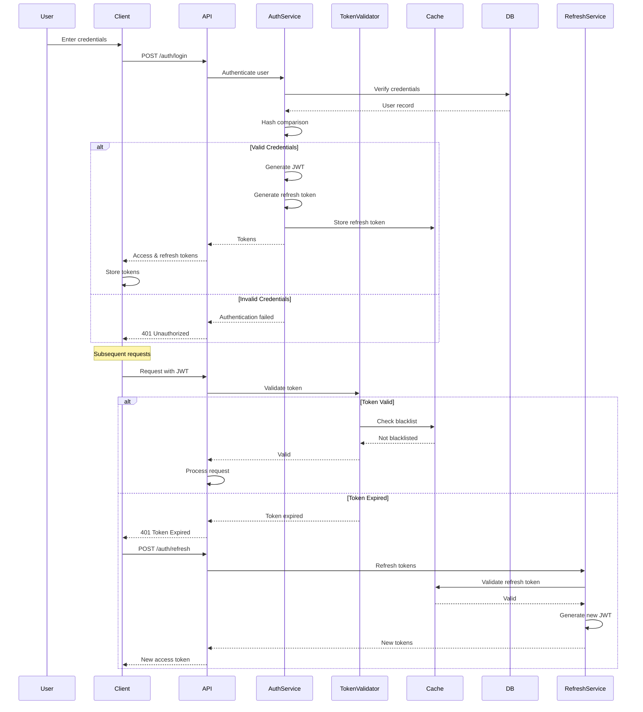
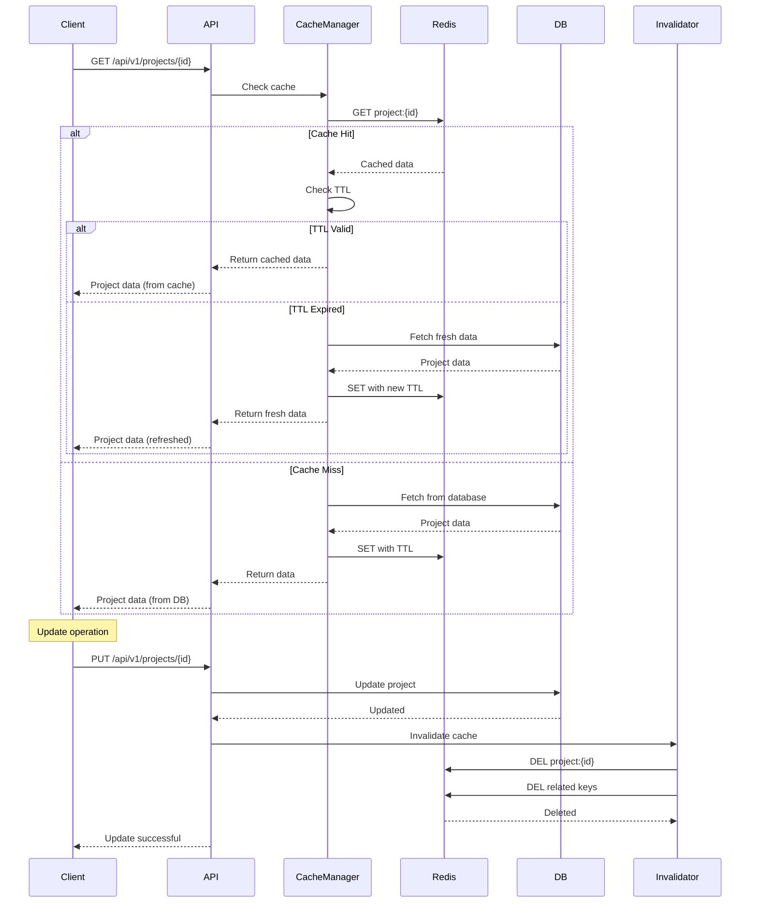
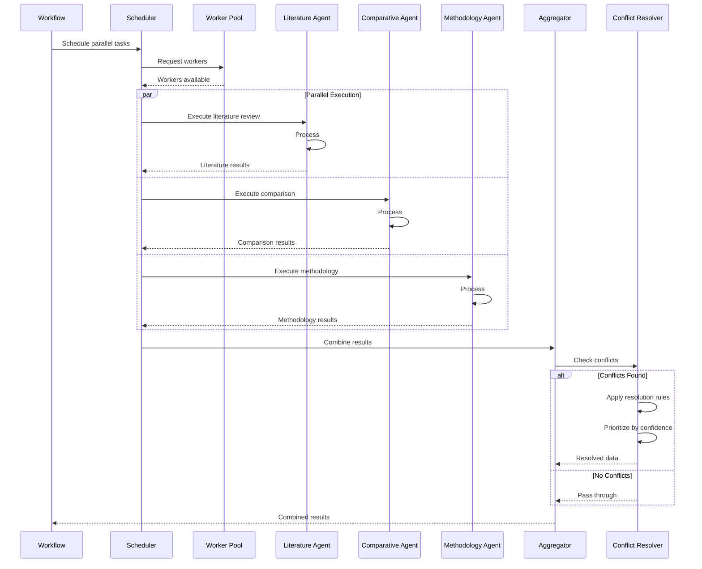
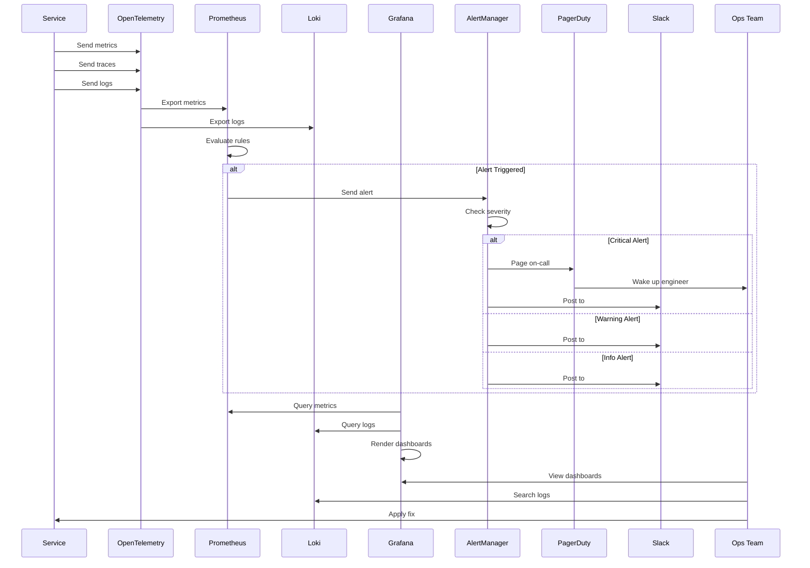

# Workflow Sequence Diagrams

This document contains detailed sequence diagrams for key workflows in the Multi-Agent Research Platform.

## Table of Contents
- [Research Project Creation Workflow](#research-project-creation-workflow)
- [Agent Orchestration Workflow](#agent-orchestration-workflow)
- [Literature Review Process](#literature-review-process)
- [Report Generation Workflow](#report-generation-workflow)
- [Real-time Progress Updates](#real-time-progress-updates)
- [Error Handling and Retry Workflow](#error-handling-and-retry-workflow)
- [Authentication Flow](#authentication-flow)
- [Caching Strategy](#caching-strategy)

## Research Project Creation Workflow

## Agent Orchestration Workflow

## Literature Review Process

## Report Generation Workflow

## Real-time Progress Updates

## Error Handling and Retry Workflow

## Authentication Flow

## Caching Strategy

## Parallel Agent Execution

## Monitoring and Alerting Flow

