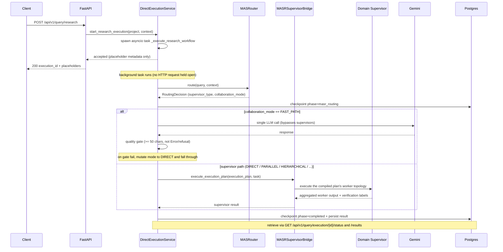
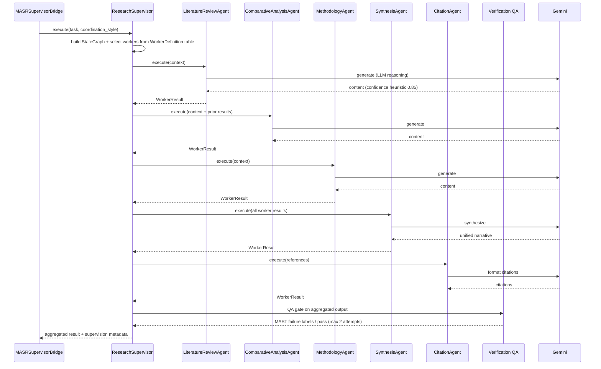
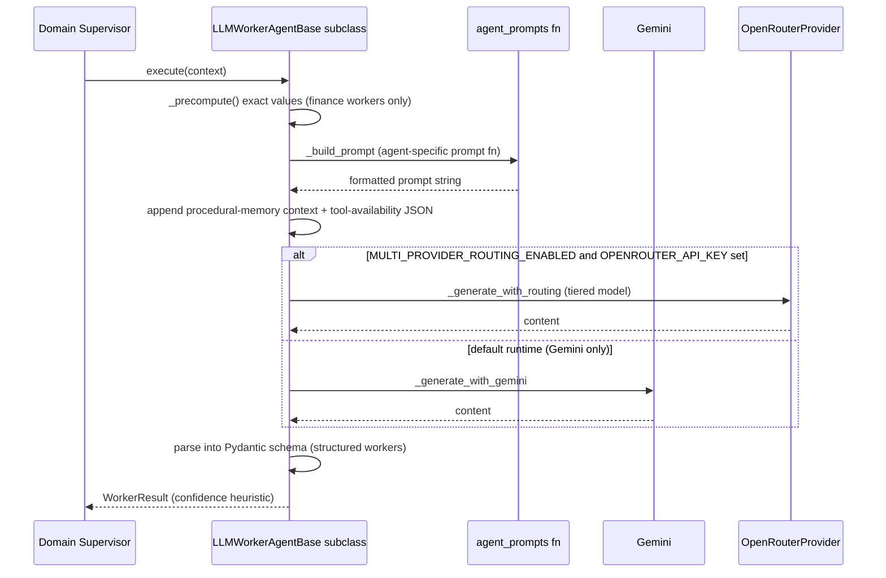
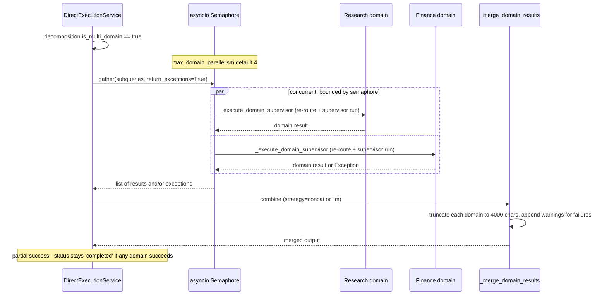
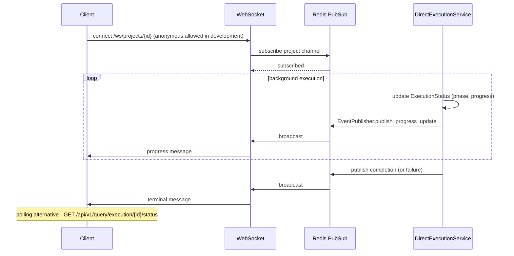
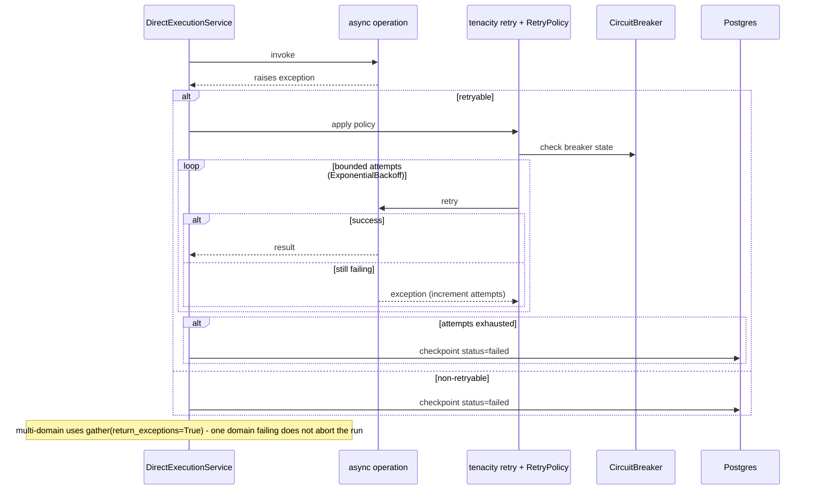
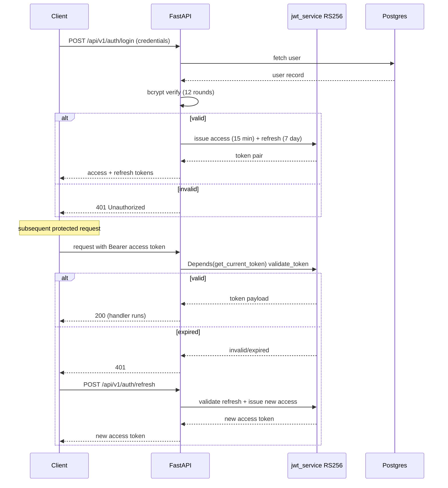
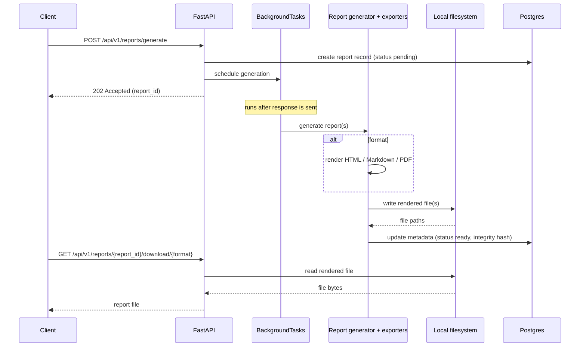
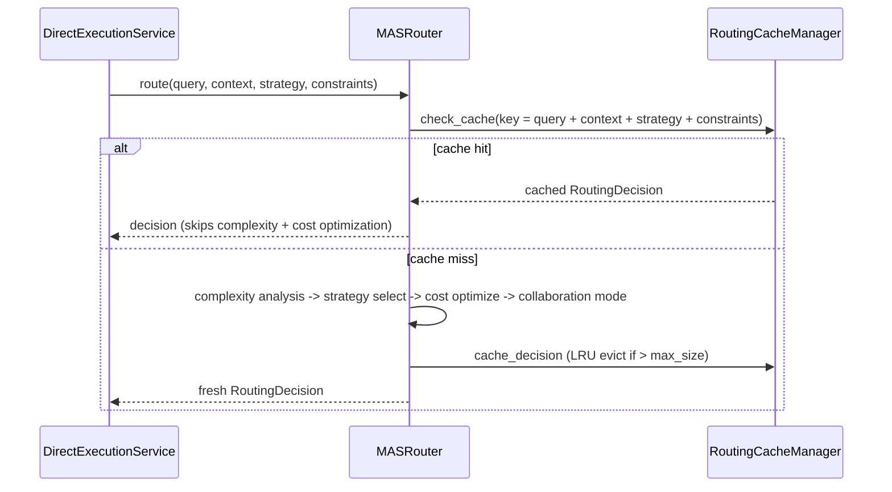
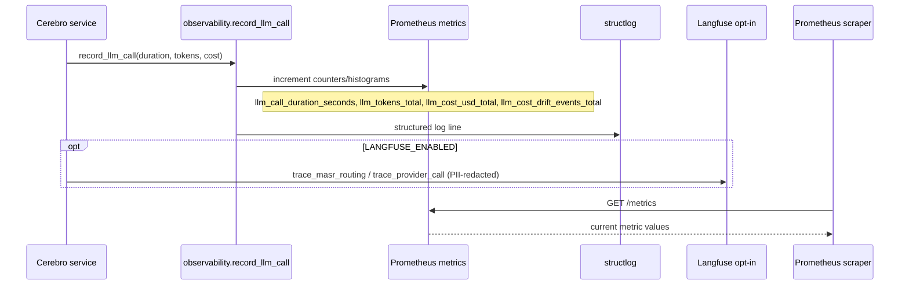

# Workflow Sequence Diagrams

This document contains sequence diagrams for the key workflows in **Cerebro**,
the multi-agent runtime behind the general research-workflow workbench.

These diagrams describe the **real, verified request path**: a FastAPI application
that hands work to the in-process `DirectExecutionService` (an asyncio execution
engine that replaced Temporal), which routes queries through the `MASRouter`, the
`MASRSupervisorBridge`, and hierarchical **domain supervisors**. LangGraph lives
only *inside* each supervisor (as an internal `StateGraph`); there is no top-level
orchestrator and no external worker/queue tier. Agents are LLM-reasoning
(prompt-driven) workers backed by Gemini (default provider) with flag-gated
OpenRouter multi-provider routing.

> Naming note: the deployment artifacts (FastAPI title "Research Platform API",
> the `research-platform` Kubernetes namespace, `research_db`, `research-cli`) keep
> the pre-rebrand **research-platform** identity. Those are infra names; the product
> is Cerebro.

## Table of Contents
- [Query Creation and Execution](#query-creation-and-execution)
- [Domain Supervisor and Worker Coordination](#domain-supervisor-and-worker-coordination)
- [Domain Worker LLM Reasoning](#domain-worker-llm-reasoning)
- [Multi-Domain Parallel Execution](#multi-domain-parallel-execution)
- [Real-time Progress Updates](#real-time-progress-updates)
- [Retry and Error Handling](#retry-and-error-handling)
- [Authentication Flow](#authentication-flow)
- [Report Generation Workflow](#report-generation-workflow)
- [MASR Routing Cache](#masr-routing-cache)
- [Observability](#observability)

## Query Creation and Execution

The primary entry point is `POST /api/v1/query/research`. The handler starts an
asyncio background task and returns immediately with **hardcoded placeholder**
metadata (`selected_agents=[]`, `estimated_cost=0.015`, `estimated_quality=0.85`,
`confidence=0.85`, `routing_time_ms=50.0`). Real routing output is only available
later via the execution status/results endpoints.

```mermaid
sequenceDiagram
    participant Client
    participant API as FastAPI
    participant DES as DirectExecutionService
    participant MASR as MASRouter
    participant Bridge as MASRSupervisorBridge
    participant Sup as Domain Supervisor
    participant Gemini
    participant DB as Postgres

    Client->>API: POST /api/v1/query/research
    API->>DES: start_research_execution(project, context)
    DES->>DES: spawn asyncio task _execute_research_workflow
    DES-->>API: accepted (placeholder metadata only)
    API-->>Client: 200 execution_id + placeholders

    Note over DES: background task runs (no HTTP request held open)

    DES->>MASR: route(query, context)
    MASR-->>DES: RoutingDecision (supervisor_type, collaboration_mode)
    DES->>DB: checkpoint phase=masr_routing

    alt collaboration_mode == FAST_PATH
        DES->>Gemini: single LLM call (bypasses supervisors)
        Gemini-->>DES: response
        DES->>DES: quality gate (>= 50 chars, not Error/refusal)
        Note over DES: on gate fail, mutate mode to DIRECT and fall through
    else supervisor path (DIRECT / PARALLEL / HIERARCHICAL / ...)
        DES->>Bridge: execute_execution_plan(execution_plan, task)
        Bridge->>Sup: execute the compiled plan's worker topology
        Sup-->>Bridge: aggregated worker output + verification labels
        Bridge-->>DES: supervisor result
    end

    DES->>DB: checkpoint phase=completed + persist result
    Note over DES,DB: retrieve via GET /api/v1/query/execution/{id}/status and /results
```

The supervisor registry is a local dict literal
(`{research, content, analytics, finance}`); the bridge defaults unknown
supervisor types to `research`. A single request can incur **two** LLM executions:
a rejected fast-path call followed by a full supervisor run.

## Domain Supervisor and Worker Coordination

Each domain supervisor builds and runs its **own internal LangGraph `StateGraph`**.
It instantiates workers lazily from its own `WorkerDefinition` table — not from
`AgentFactory` at runtime (the factory is a catalog that backs the bypass agent
API, not the routed execution path). After workers finish, the supervisor invokes a
cross-cutting **verification QA gate** (`base_supervisor._run_verification`,
`MAX_VERIFICATION_REVISION_ROUNDS = 2`, i.e. initial + 1 revision). The example below uses
the Research domain (5 workers).

```mermaid
sequenceDiagram
    participant Bridge as MASRSupervisorBridge
    participant Sup as ResearchSupervisor
    participant Lit as LiteratureReviewAgent
    participant Comp as ComparativeAnalysisAgent
    participant Meth as MethodologyAgent
    participant Synth as SynthesisAgent
    participant Cit as CitationAgent
    participant Verify as Verification QA
    participant Gemini

    Bridge->>Sup: execute(task, coordination_style)
    Sup->>Sup: build StateGraph + select workers from WorkerDefinition table

    Sup->>Lit: execute(context)
    Lit->>Gemini: generate (LLM reasoning)
    Gemini-->>Lit: content (confidence heuristic 0.85)
    Lit-->>Sup: WorkerResult

    Sup->>Comp: execute(context + prior results)
    Comp->>Gemini: generate
    Gemini-->>Comp: content
    Comp-->>Sup: WorkerResult

    Sup->>Meth: execute(context)
    Meth->>Gemini: generate
    Gemini-->>Meth: content
    Meth-->>Sup: WorkerResult

    Sup->>Synth: execute(all worker results)
    Synth->>Gemini: synthesize
    Gemini-->>Synth: unified narrative
    Synth-->>Sup: WorkerResult

    Sup->>Cit: execute(references)
    Cit->>Gemini: format citations
    Gemini-->>Cit: citations
    Cit-->>Sup: WorkerResult

    Sup->>Verify: QA gate on aggregated output
    Verify-->>Sup: MAST failure labels / pass (max 2 attempts)
    Sup-->>Bridge: aggregated result + supervision metadata
```

`verification` is excluded from normal worker aggregation and is not a member of
any supervisor's worker team. Coordination style is derived from the collaboration
mode (DIRECT to sequential, PARALLEL to parallel, HIERARCHICAL to hybrid, etc.).
Confidence values are **hardcoded heuristics** (0.85 success / 0.3 empty), not real
quality signals.

## Domain Worker LLM Reasoning

Domain workers subclass `LLMWorkerAgentBase` and are purely prompt-driven. There is
**no integration with external academic databases** (no Google Scholar / PubMed /
arXiv / CrossRef) and **no embedder or vector store** on the execution path
(`src/memory` is a stub returning empties; `src/qa` fact-check stubs return empty
results). A worker's `execute()` optionally precomputes exact values (finance
workers only), builds its prompt via `_build_prompt`, which each agent overrides
using an agent-specific prompt function from `src/services/prompts/agent_prompts.py`
(e.g. `generate_literature_agent_prompt`) — not the `PromptManager` YAML templates,
which are used only by the supervisor layer for refinement prompts. It then appends
procedural-memory context and a tool-availability JSON block, then calls the model.

```mermaid
sequenceDiagram
    participant Sup as Domain Supervisor
    participant Worker as LLMWorkerAgentBase subclass
    participant Prompt as agent_prompts fn
    participant Gemini
    participant OR as OpenRouterProvider

    Sup->>Worker: execute(context)
    Worker->>Worker: _precompute() exact values (finance workers only)
    Worker->>Prompt: _build_prompt (agent-specific prompt fn)
    Prompt-->>Worker: formatted prompt string
    Worker->>Worker: append procedural-memory context + tool-availability JSON

    alt MULTI_PROVIDER_ROUTING_ENABLED and OPENROUTER_API_KEY set
        Worker->>OR: _generate_with_routing (tiered model)
        OR-->>Worker: content
    else default runtime (Gemini only)
        Worker->>Gemini: _generate_with_gemini
        Gemini-->>Worker: content
    end

    Worker->>Worker: parse into Pydantic schema (structured workers)
    Worker-->>Sup: WorkerResult (confidence heuristic)
```

Multi-provider routing is **flag-gated OFF** by default: it requires both
`MULTI_PROVIDER_ROUTING_ENABLED=True` and a set `OPENROUTER_API_KEY`. Otherwise
every worker call goes to Gemini (`GEMINI_DEFAULT_MODEL=gemini-pro`).

## Multi-Domain Parallel Execution

When the query decomposer flags a query as multi-domain
(`decomposition.is_multi_domain`), domain subqueries run **concurrently** under an
`asyncio.Semaphore(max_domain_parallelism)` (default 4), gathered with
`return_exceptions=True`. Results are combined by `_merge_domain_results` using
`MULTI_DOMAIN_MERGE_STRATEGY` (default `concat`; `llm` uses the `SynthesisAgent`),
with each domain's output truncated to
`MULTI_DOMAIN_MERGE_PER_DOMAIN_CHAR_LIMIT` (4000 chars). This is a **merge/concat
step, not a confidence-based conflict resolver** — the confidence numbers are
hardcoded heuristics.

```mermaid
sequenceDiagram
    participant DES as DirectExecutionService
    participant Sem as asyncio Semaphore
    participant D1 as Research domain
    participant D2 as Finance domain
    participant Merge as _merge_domain_results

    DES->>DES: decomposition.is_multi_domain == true
    Note over Sem: max_domain_parallelism default 4
    DES->>Sem: gather(subqueries, return_exceptions=True)

    par concurrent, bounded by semaphore
        Sem->>D1: _execute_domain_supervisor (re-route + supervisor run)
        D1-->>Sem: domain result
    and
        Sem->>D2: _execute_domain_supervisor (re-route + supervisor run)
        D2-->>Sem: domain result or Exception
    end

    Sem-->>DES: list of results and/or exceptions
    DES->>Merge: combine (strategy=concat or llm)
    Merge->>Merge: truncate each domain to 4000 chars, append warnings for failures
    Merge-->>DES: merged output

    Note over DES: partial success - status stays 'completed' if any domain succeeds
```

## Real-time Progress Updates

`DirectExecutionService` publishes progress through `EventPublisher`, which writes
to **Redis pub/sub**; the WebSocket layer broadcasts to subscribers of
`/ws/projects/{project_id}`. Clients may alternatively poll
`GET /api/v1/query/execution/{execution_id}/status`. There is no worker or Temporal
tier emitting progress — the background asyncio task publishes directly.

```mermaid
sequenceDiagram
    participant Client
    participant WS as WebSocket
    participant Redis as Redis PubSub
    participant DES as DirectExecutionService

    Client->>WS: connect /ws/projects/{id} (anonymous allowed in development)
    WS->>Redis: subscribe project channel
    Redis-->>WS: subscribed

    loop background execution
        DES->>DES: update ExecutionStatus (phase, progress)
        DES->>Redis: EventPublisher.publish_progress_update
        Redis->>WS: broadcast
        WS->>Client: progress message
    end

    DES->>Redis: publish completion (or failure)
    Redis->>WS: broadcast
    WS->>Client: terminal message

    Note over Client: polling alternative - GET /api/v1/query/execution/{id}/status
```

## Retry and Error Handling

Reliability is in-process. Individual operations use tenacity `@retry` decorators
plus the primitives in `src/reliability/retry_strategies.py`
(`CircuitBreaker`, `ExponentialBackoff`, `RetryPolicy`, `BulkheadExecutor`). There
is **no dead-letter queue**: an unrecoverable failure surfaces as execution status
`failed`, and multi-domain runs degrade gracefully via `return_exceptions=True`
(partial success stays `completed` with warnings).

```mermaid
sequenceDiagram
    participant DES as DirectExecutionService
    participant Op as async operation
    participant Retry as tenacity retry + RetryPolicy
    participant CB as CircuitBreaker
    participant DB as Postgres

    DES->>Op: invoke
    Op-->>DES: raises exception

    alt retryable
        DES->>Retry: apply policy
        Retry->>CB: check breaker state
        loop bounded attempts (ExponentialBackoff)
            Retry->>Op: retry
            alt success
                Op-->>DES: result
            else still failing
                Op-->>Retry: exception (increment attempts)
            end
        end
        alt attempts exhausted
            DES->>DB: checkpoint status=failed
        end
    else non-retryable
        DES->>DB: checkpoint status=failed
    end

    Note over DES: multi-domain uses gather(return_exceptions=True) - one domain failing does not abort the run
```

The historical bug where `@retry` re-ran the entire `_execute_research_workflow`
(caused by a naive/aware datetime subtraction in a `finally` block) is fixed with
`datetime.now(UTC)`.

## Authentication Flow

Auth is enforced **per-endpoint** via `Depends(get_current_token)` calling
`jwt_service.validate_token` (RS256). The registered `AuthMiddleware` is a
**no-op** (it sets request state to `None` and validates nothing), so
`/api/v1/query/*`, `/api/v1/agents/*`, and `/api/v1/masr/*` are effectively
unauthenticated; only endpoints that declare an auth dependency are protected —
namely the auth router (`src/api/auth/auth_router.py`) and the research endpoints,
which pull `get_tenant_context` (`Depends(get_current_token)`). The users GDPR
endpoint and the reports endpoints declare no auth dependency and are **not**
protected. Access tokens live 15 minutes, refresh tokens 7 days.

```mermaid
sequenceDiagram
    participant Client
    participant API as FastAPI
    participant JWT as jwt_service RS256
    participant DB as Postgres

    Client->>API: POST /api/v1/auth/login (credentials)
    API->>DB: fetch user
    DB-->>API: user record
    API->>API: bcrypt verify (12 rounds)

    alt valid
        API->>JWT: issue access (15 min) + refresh (7 day)
        JWT-->>API: token pair
        API-->>Client: access + refresh tokens
    else invalid
        API-->>Client: 401 Unauthorized
    end

    Note over Client: subsequent protected request

    Client->>API: request with Bearer access token
    API->>JWT: Depends(get_current_token) validate_token
    alt valid
        JWT-->>API: token payload
        API-->>Client: 200 (handler runs)
    else expired
        JWT-->>API: invalid/expired
        API-->>Client: 401
        Client->>API: POST /api/v1/auth/refresh
        API->>JWT: validate refresh + issue new access
        JWT-->>API: new access token
        API-->>Client: new access token
    end
```

## Report Generation Workflow

`POST /api/v1/reports/generate` accepts the request, schedules generation on
FastAPI `BackgroundTasks`, and returns `202 Accepted` with a report ID. The
background job runs the exporters, writes the rendered files to the **local
filesystem**, and persists report metadata to Postgres. Reports are retrieved via
`GET /api/v1/reports/{report_id}/download/{format}`. There is **no S3 upload and no
notification subsystem** (no email/webhook).

```mermaid
sequenceDiagram
    participant Client
    participant API as FastAPI
    participant BG as BackgroundTasks
    participant Gen as Report generator + exporters
    participant FS as Local filesystem
    participant DB as Postgres

    Client->>API: POST /api/v1/reports/generate
    API->>DB: create report record (status pending)
    API->>BG: schedule generation
    API-->>Client: 202 Accepted (report_id)

    Note over BG: runs after response is sent

    BG->>Gen: generate report(s)
    alt format
        Gen->>Gen: render HTML / Markdown / PDF
    end
    Gen->>FS: write rendered file(s)
    FS-->>Gen: file paths
    Gen->>DB: update metadata (status ready, integrity hash)

    Client->>API: GET /api/v1/reports/{report_id}/download/{format}
    API->>FS: read rendered file
    FS-->>API: file bytes
    API-->>Client: report file
```

## MASR Routing Cache

The only cache on the query path is the MASR **routing-decision cache**
(`RoutingCacheManager`), enabled by `MASR_ENABLE_CACHING=True`. It is an
**in-process dict** with LRU-style eviction (`max_size` 1000) — not Redis, and with
no TTL. On a cache hit, `MASRouter.route` returns the cached `RoutingDecision` and
skips complexity analysis and cost optimization. (Redis is used elsewhere — for the
idempotency and rate-limit middleware and for `EventPublisher` pub/sub — but not for
routing decisions. Research-project reads go straight to Postgres via the repository
layer; there is no read-through project cache.)

```mermaid
sequenceDiagram
    participant DES as DirectExecutionService
    participant MASR as MASRouter
    participant Cache as RoutingCacheManager

    DES->>MASR: route(query, context, strategy, constraints)
    MASR->>Cache: check_cache(key = query + context + strategy + constraints)

    alt cache hit
        Cache-->>MASR: cached RoutingDecision
        MASR-->>DES: decision (skips complexity + cost optimization)
    else cache miss
        MASR->>MASR: complexity analysis -> strategy select -> cost optimize -> collaboration mode
        MASR->>Cache: cache_decision (LRU evict if > max_size)
        MASR-->>DES: fresh RoutingDecision
    end
```

## Observability

There is no OpenTelemetry backbone and no Grafana / Loki / Jaeger / AlertManager /
PagerDuty pipeline. Real observability is **Prometheus metrics + structlog**, with
**optional Langfuse tracing** (off by default). The `LLMCostDriftMiddleware`
compares MASR-estimated vs actual provider cost and emits drift metrics.

```mermaid
sequenceDiagram
    participant Svc as Cerebro service
    participant Obs as observability.record_llm_call
    participant Prom as Prometheus metrics
    participant Log as structlog
    participant LF as Langfuse opt-in
    participant Scrape as Prometheus scraper

    Svc->>Obs: record_llm_call(duration, tokens, cost)
    Obs->>Prom: increment counters/histograms
    Note over Prom: llm_call_duration_seconds, llm_tokens_total, llm_cost_usd_total, llm_cost_drift_events_total
    Obs->>Log: structured log line

    opt LANGFUSE_ENABLED
        Svc->>LF: trace_masr_routing / trace_provider_call (PII-redacted)
    end

    Scrape->>Prom: GET /metrics
    Prom-->>Scrape: current metric values
```

`ENABLE_TRACING` in config is a separate, unrelated flag — it does **not** enable
Langfuse (that is `LANGFUSE_ENABLED`, default `False`).
